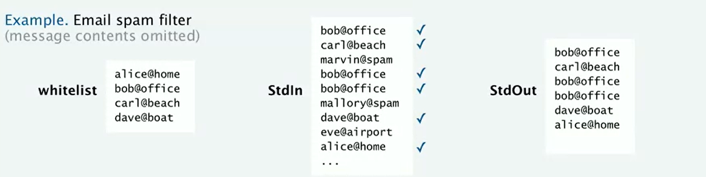
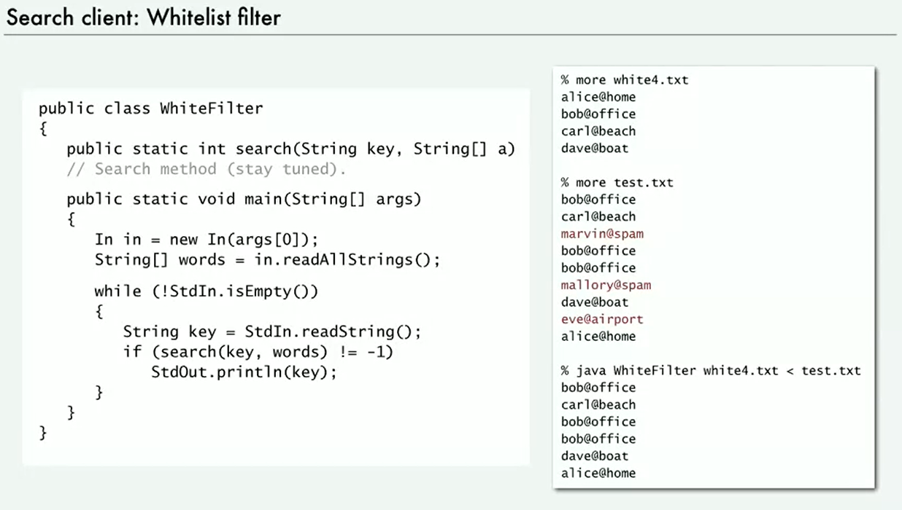
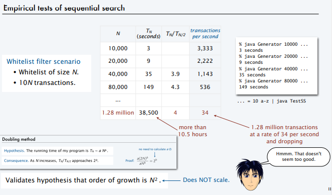
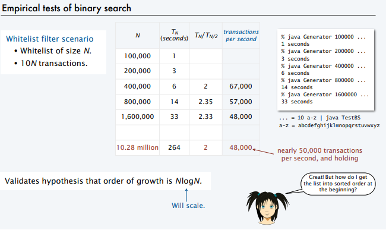

## SEMANA 1: Sorting and Searching:

### 1.1. Whitelist filter.
En muchas situaciones en informática es interesante filtrar elementos de un conjunto de entidades según un criterio puntual. Una de las formas de hacerlo es usando un "filtro de lista blanca uno de lista negra rspectivamente. Veamos que es esto:

- **Blacklist:** Una lista negra es un archivo de texto que contiene una lista de entidades nombradas, las cuales queremos rechazar para nuestro servicio.
- **Whitelist:** La lista blanca, en contraste con su hermana es una lista de entidades que queremos aceptar para nuestro servicio.

Luego el filtrado se realiza con un programa que leerá un listado con todas las entradas y los comparará con los elementos de las listas blancas o negras respectivamente. En un filtro de lista blanca solo de devolverán los elementos que hagan match con algún elemento de la lista blanca. Y en el caso de un filtro de lista negra o "Blacklist Filter", se devolverán todos los elementos, exceptuando aquellos que hagan match con la lista.



Un uso práctico de esto podria implementarse por ejemplo en una casilla de emails. Podemos utilizar una "Lista Blanca" para definir correos permitidos de todo el universo, y a continuación utilizar una "Lista Negra" para bloquear elementos específicos.

Esta acción que resulta bastante sencilla de comprender se torna complicada cuando tenemos que filtrar grandes volumenes de entradas. Por lo que nuestra tarea es diseñar un algoritmo que pueda trabajar cuando nuestras entradas y nuestras listas sean potencialmente grandes.

Veamos diferentes algoritmos de filtrado en Java: 

Primero debemos definir nuestro entorno de trabajo
```java
//Creamos una clase de filtro de lista blanca.
public class WhiteFilter {

    //nombramos el método de busqueda que luego definiremos más adelante con diferentes algoritmos.
    public static int search(String key, String[] a)

    //Creamos el método main en donde
    public static void main(String[] args) {

        //Lee un documento de entrada que será la whitelist y lo agrega a una variable llamada words
        In in = new In(args[0]);
        String[] words = in.readAllStrings();

        //Luego desde la entrada estándar, si esta no es vacia (no hay palabras), va a leer una clave.
        while (!StdIn.isEmpty()) {
            String key = StdIn.readString();

            //Usamos nuestro método search, el cual en su interfaz devuelve -1 si la palabra no coincide con la clave. El método leerá la clave que le pasemos y verá si esta en nuestra entrada estandar, si lo está se agregará a la salida, sino se ignorará el elemento.
            if(search(key, words) != -1)
            StdOut.println(key);
        }
    }
}
```


Este es el código con el que trabajaremos, ahora toca definir un método search que pueda realizar el trabajo y que especialmente sea escalable en casos de muchas entradas.

## 1.2 Sequential Search:
En un primer intento para lograr una busqueda pensaremos en un método de búsqueda secuencial.

- Este método funciona chequeando cada elemento del array (0,1,2,3, ...) y busca una coincidencia con un string de búsqueda.
- Si se halla un match devuelve el índice del elemento.
- Si no halla una coincidencia retorna -1.

```Java
public static int search(String key, String[] arr) {
    for (int i = 0; i < arr.length; i++) {
        if (arr[i] == key) {
            return i;
        } 
        return -1;
    }
}

public static int search(String key, String[] arr) {
    for (int i = 0; i < arr.length; i++) {
        if (arr[i].compareTo(key) == 0) {
            return i;
        } 
        return -1;
    }
}
```
Notesé que escribimos dos métodos idénticos para realizar este trabajo, la diferencia es que uno utiliza el operador equals y el otro el método `compareTo(key)`. La diferencia está en que equals compara si las referencias a las variables, y compareTo analiza las cadenas lexicográficamente. Por lo que en estas aplicaciones se debe usar compareTO para que el programa funcione correctamente.

Ahora deberíamos probar la performance de este algoritmo frente a entradas de datos grandes. 

Para ello sabemos que tendremos:
- N cadenas en la lista blanca.
- c*N transacciones con una constante "c".
- La longitud de la cadena no será demasiado larga en comparacion con N.

- Sabemos que si el elemento está en la lista blanca pasará que en una búsqueda aleatoria tendremos que ir hasta la mitad de la lista en promedio.
- Si no se encuentra el elemento el algoritmo recorrerá toda la lista en promedio.

Por lo que con lo anterior podemos esperar que el orden de crecimiento del tiempo empleado será proporcional a N^2. Es un algoritmo cuadrático.

En la siguiente imagen se puede ver el tiempo que se tarda en ejecutar el programa (Tn) para un número de "N" entradas. Adicionalmente se agregan las transacciones por segundo que el programa realiza.



El crecimiento del tiempo de ejecucion es cuadrático por lo que el algoritmo no se comportará bien en situaciones de muchas entradas. Es decir no será escalable.

### 1.3. Binary Search:
Aquí hay un mejor método para resolver el problema, es un método muy conocido llamado búsqueda binaria. 

El funcionamiento es simple cuando se llega a entenderlo. Partimos de un array ordenado de mayor a menor, y en el caso de cadenas de manera alfabética. Hecho esto nos paramos en la mitad exacta del array y nos preguntamos, ¿la clave coincide con el elemento encontrado? Si se produce un matcho, hemos realizado nuesta búsqueda, si no lo hace nos preguntamos, ¿el índice del elemento es mayor o menor que la clave que tenemos? En el caso de que sea mayor podemos eliminar la mitad inferior del array y solo buscar en la parte superior, con lo que hemos reducido a la mitad las posibilidades.

Hecho esto repetimos el proceso las veces que sea necesario hasta que se produzca un match a la primera o eventualmente nos quedemos con una lista de longitud uno, en donde habremos encontrado el elemento si se produce el match, o en caso contrario concluiremos que el elemento no existe en la lista.


```Java
public static int earch(String key, String[] arr) {
    for (int i = 0; i < arr.length; i++) {
        if (arr[i].compareTo(key) == 0) {
            return i;
        }
        return -1;
    }
}

public static int search(String key, String[] arr, int lo, int hi) {
  //Comprobamos que el array no esté vacio preguntando si los límites hi y lo del array no son iguales o hi es menor a lo.
  if (hi <= lo) {
    return -1;
  }

  //Hallamos el centro del array haciendo la mitad de la distancia entre hi y lo.
  int mid = lo + (hi - lo) / 2;

  //Comparamos si el elemento es igual a su llave.
  int cmp = arr[mid].compareTo(key);

  //Si cmp es mayor a cero, entonces el elemento se encontrará en la parte inferior por lo que solo devolvemos esa mitad.
  if (cmp > 0) {
    return search(key, arr, lo, mid);
  } 
  //Si cmp es menor a cero el elemento se encuentra en la mitad superior y solo devolvemos esa parte
  else if (cmp < 0) { 
    return search(key, arr, mid+1, hi);
  }
  //Si no sucede lo anterior entonces el elemento buscado es el elemento medio.
  else { return mid;}
}
```


Este método tiene un rendimiento del tipo logarítmico ya que en cada llamada a la busqueda el array se divide en la mitad menos uno, con lo que la cantidad "n" de llamadas será de aproximadamente el lg(N), con "N" el tamaño de nuestra lista. Veamos una validación de esto de manera empírica en la siguiente imágen.




Algoritmos de Ordenamiento:
Algo de lo que tambien es interesante hablar son los algoritmos de ordenamiento.

Inserion sort:

Mergesort:

---

## 2. COLECCIONES
Al manejar grandes volúmenes de datos se hace necesario implementar alguna estructura de datos, pero no todas las estructuras son útiles para los mismos propósitos. Por lo que aparece una nueva cuestión, el desafio aquí será poder saber que estructura debemos utilizar para optimizar esa tarea.

Luego, en la elección entran en juego dos factores de suma importancia:
- ¿Cuanta memoria se necesita?
- ¿Cuanto tiempo consumen los métodos de cada tipo de dato, dada esa estructura de datos?

La correcta elección de la estructura de datos nos permitirá ahorrarnos problemas al tener que procesar una cantidad significativa de datos.

Uno de los primeras estructuras de datos que veremos son las colecciones, una colección se define como **_una estructura de datos donde todos sus elementos son del mismo tipo de dato_**. 

En este apartado nos ocuparemos de las pilas y las colas especificamente (que son un tipo especial de coleccion o lista), las cuales solo difieren esencialmente en los tipos de operaciones que pueden realizar.

### 2.1. Pilas (Stacks):
La interfaz básica (API) para una pila contiene cuatro operaciones principales:
- Push: Inserta un nuevo elemento al tope de la colección.
- Pop: Remueve y retorna el elemento al tope de la pila, es decir el que haya sido añadido recientemente.
- Test: Testear si la colección esta vacia.
- Count: Retorna el tamaño de la colección.

A esta forma de agregar elementos se la llama LIFO (last in, first out), por sus siglas en inglés, y quiere decir que el último elemento que sea agregado, será el primero en salir.

Un ejemplo de un uso de una pila es cuando estás visitando una web en internet y te dirijes a otra y luego a otra y sucesivamente. Todo lo que el sistema esta haciendo es guardar los enlaces en una pila para así cuando se presione el botón de regresar en el navegador, este te lleve a la página más reciente.

Veamos ahora otro ejemplo de uso implementado en código, para ello hablaremos un poco de las expresiones postfix.

La notación polaca inversa o "postfix", nos permite trabajar los cálculos combinados sin utilizar paréntesis como controles de flujo, lo cual es muy importante porque permite tratar las expresiones de forma lineal y de izquierda a derecha. Esta notación funciona, a diferencia de la tradicional o "infix", escribiendo el operador (suma, resta, raíz, potencia), luego de los operandos. Por ejemplo:

- Notación Infix: __(1+(2+3)*(4*5)) = 1 + 5 * 20 = 101__
- Notación Postfix: __1 2 3 + 4 5 * * + = 101__

Luego, el algoritmo para evaluar en la expresión es el siguiente:

Con la expresión postfix como una coleccion de entrada y una pila como soporte para realizar los cálculos.
- Si la lista de entrada no está vacia, leer el primer elemento que se encuentre.
- Si este elemento es un operando, colocarlo en la pila.
- Si este elemento es un operador, tomar los dos últimos elementos de la pila, realizar el cálculo e insertár el resultado en la pila.

Código en Java:
```Java
public class Postfix {
    public static void main(String[] args){

        //Creamos una pila que almacene datos de tipo "double".
        Stack<Double> stack = new Stack<Double>();

        //Si la entrada estándar no es vacia se ingresa a la siguiente estructura condicional.
        while (!StdIn.isEmpty()){
            String token = StdIn.readString();
            if (token.equals("*"))
                stack.push(stack.pop() * stack.pop());
            else if (token.equals("+"))
                stack.push(stack.pop() + stack.pop());
            else if (token.equals("-"))
                stack.push(-stack.pop() + stack.pop());
            else if (token.equals("/"))
                stack.push((1.0/stack.pop()) * stack.pop());
            else if (token.equals("sqrt"))
                stack.push(Math.sqrt(stack.pop()));
            else
                stack.push(Double.parseDouble(token));
        }

        //Imprimimos la salida.
        StdOut.println(stack.pop());
    }
}
```

### 2.2. Colas (Queues):
Para una colección de tipo cola, poseemos la siguiente interfaz:
- Push: Añade un elemento al final de la colección.
- Pop: Remueve y retorna el primer elemento que se haya agregado a la cola.
- Test: Testear si la colección se encuentra vacia.
- Count: Retorna el tamaño de la colección.

Esta disciplina de manipular elementos se llama FIFO (first in, first out), por sus siglas en inglés, y quiere decir que el primer elemento agregado, será el primero en salir.

Algunas implementaciones para las colas pueden ser las siguientes: recordemos que una cola es una asinación de prioridad por orden de llegada.

Se utilizan por ejemplo para la transferencia asíncrona de datos

A continuación veremos un ejemplo de uso:

Realizar una lectura de todos los strings de una entrada estandar (stdIn) y colocarlos en un array.

El desafio aquí es que no podemos guardar los elementos en un array sin antes crearlo, y para crearlo debemos saber el número de strings con los que contamos. 

La solución es utilizar una cola, donde guardamos los elementos de forma ordenada sin importar cuantos sean. Implementada la cola utilizamos `count` para definir el tamaño de nuestro futuro array y lo creamos. Por último solo bastará extraer los elementos uno a uno, sirviendonos de la disciplina LIFO y agregarlos al array.

```Java
public class QueueExample {

    //Creamos el método readAllStrings() que nos resuelve el problema.
    public static String[] readAllStrings() {

        //Creamos una cola "q" que trabaje con datos string.
        Queue <String> q = new Queue<String>();

        //Si la cola es distinto a vacio, usamos "enqueue" para agregar uno a uno (en bucle), todos los elementos de la entrada "StdIn"
        while (!StdIn.isEmpty()){
            q.enqueue(StdIn.readString());
        }

        //Guardamos el tamaño de la cola
        int N = q.size();

        //Creamos el array "words" y lo llenamos con los elementos de la cola.
        String[] words = new String[N];
        for (int i = 0; i < N; i++) {
            words[i] = q.dequeue();
        }

        //Retornamos el array.
        return words;
    }

    //Implementamos el método "readAllStrings()" en el main.
    public static void main(String[] args) {
        String[] words = readAllStrings();

        for (int i = 0; i < words.length; i++) {
            StdOut.println(words[i]);
        }
    }
}
```

## Autoboxing & Wrapper Types:
Por muchas razones, en Java existe para cada tipo de dato, un objeto asociado (wrapper type) con mayores funcionalidades que el dato primitivo. Entre otros, los contenedores proporcionan una forma de utilizar tipos de datos primitivos ( int, boolean, etc.) como objetos.

En Java existe una funcionalidad llamada autoboxing, en donde se realiza automaticamente el casting de dato primitivo a objeto contenedor.

A veces, debe usar clases contenedoras, por ejemplo, cuando trabaja con objetos de colección, como ArrayList, donde no se pueden usar tipos primitivos (la lista solo puede almacenar objetos).

## 2.3. El rendimiento Importa:
Luego si queremos que nuestro código sea escalable debemos seguir los siguientes requerimientos:
- Para pilas y colas todas las operaciones deberian tomar un tiempo constante.
- El uso de la memoria deberia ser lineal con el tamaño de la colección cuando esta no sea vacia.
- No deben existir límites en el código de acuerdo al tamaño de la colección.

### 2.4. Listas Enlazadas (Linked Lists):
Las listas enlazadas se construyen con elementos de memoria que están repartidos de forma arbitraria por ella, en una secuencia. Aquí, cada nodo de memoria se conecta con el siguiente a través de un enlace que apunta a su posición, para en el caso de las listas enlazadas simples. En el caso de las listas enlazadas dobles contamos con dos enlaces o punteros, uno al elemento previo y otro al siguiente.

La creación u eliminación de elementos resultará sencila, simplemente se necesitará crear o eliminar nodos y modificar punteros, por lo que las inserciones y eliminaciones son en tiempo constante.

De este modo, teniendo la referencia del principio de la lista podemos acceder a todos los elementos de la misma, esto resulta en una implementación sencilla pero con un coste de búsqueda del tipo lineal, ya que para acceder a un elemento i-ésimo en la lista, deberemos iterar elemento a elemento desde el inicio.

Una implementación para las listas enlazadas es como alternativa al uso de estructuras de datos secuenciales, en especial de las pilas donde con un poco de código podemos simular una de ellas, cumpliendo además la especificaciones de rendimiento, que son:
- El tiempo para todas las operaciones es una constante.
- El espacio en memoria es proporcional al número de objetos.

Veamos una estructura de tipo pila implementada dentro de una lista enlazada.
```Java
public class Stack<Item> {
    private Node first = null;
    private int N = 0;

    //Clase Anidada.
    private class Node {
        private Item item;
        private Node next;
    }

    //Método isEmpty.
    public boolean isEmpty() { return first == null;  }

    //Método push(item).
    public void push(Item item) {
        Node second = first;
        first = new Node();
        first.item = item;
        first.next = second;
        N++;
    }

    //Método pop().
    public Item pop() {
        Item item = first.item;
        first = first.next;
        N--;
        return item;
    }

    //Método size().
    public int size() { return N; }

    //Método main().
    public static void main(String[] args) {
        Stack<String> stack = new Stack<String>();

        while (!StdIn.isEmpty()) {
            String item = StdIn.readString();
            if (item.equals("-"))
                stack.push(item);
            else
                System.out.print(stack.pop());
            }
        StdOut.println();
    }
}
```

# SEMANA 3

## APIs & Clients:

Una tabla de símbolos o diccionario es una estructura de datos abstracta donde los valores son sets de pares clave-valor, y en donde todas las claves (keys) son diferentes.

Las operaciones básicas serán:
- asociar una clave dada con un valor dado. Si la clave no está en la tabla, se agrega a ella. Si la clave está en la tabla, se modifica el valor.
- Retornar el valor asociado a una clave en la tabla.
- Verificar si una clave dada existe en la tabla.
- Iterar a traves de las claves.

Luego, algunas consideraciones adicionales:
- Las llaves serán comparables e iterables en orden (sorting order).
- No debe haber un límite para los pares "key-value" que queramos ingresar.
- Todas las claves que no estén en la clave serán asociadas con el valor `null`.

Una aplicación de los diccionarios es contar la frecuencia con que aparece una determinada cadena de texto en una entrada estándar o StdIn. Es decir una aplicación de Benchmark.

Veamos ahora como implementar esto en Java.
```Java
public class ST

```

## A design Challenge:
Una aplicación de los diccionarios o "symbol tables" es el Benchmark y el análisis lingüistico.

Veamos por ejemplo un programa que aplique la ley de Zipf. Esta es una ley empírica formulada por el lingüista George Zipf y según la cual, en una determinada lengua, la frecuencia de aparición de distintas palabras sigue una distribución que puede aproximarse por:

Pn es aproximadamente igual a 1/n^a

Donde "Pn" representa la frecuencia de la n-ésima palabra más frecuente y el exponente "a" es un número real positivo, en general ligeramente superior a 1.1​ Esto significa que el segundo elemento se repetirá aproximadamente con una frecuencia de 1⁄2 de la del primero, el tercer elemento con una frecuencia de 1⁄3 del primero y así sucesivamente.

Por lo tanto los linguistas están interesados en probar esta ley en texto de lenguaje natural real. Así que podemos utilizar nuestro programa de análisis de frecuencia que acabamos de diseñar.

## INFORMÁTICA TEÓRICA
A partir de aquí vamos a comenzar a hablar de informática teórica, actualmente es muy usual que los programadores e informáticos descarten la teoria como algo no muy relevante para lo que hcen diariamente. Esto es un gran error ya que conllevará a muchos errores a futuro.

En computación la teoría es una parte integral de la disciplina y toda persona que trabaje en ello debería tener una comprensión basica como la que este curso abarca.

### **1.1. Búsqueda de Patrones**


### **1.2. Expresiones Regulares**
La herramienta que utilizamos para poder dar solucion a este tipo de problemas son las _expresiones regulares_. 

Una expresión regular es una secuencia de caracteres que conforma un patrón de búsqueda. Es decir son patrones utilizados para encontrar una determinada combinación de caracteres dentro de una cadena de texto.

|Operación|¿Que hace?|Ejemplo de Uso|Coincidencias|No coinciden|
|:---:|---|:---:|:---:|:---:|
|*One of more* `+` (una coincidencia o más)|AAAA|`a(bc)+de`|"abcde", "abcbcde"|"ade", "bcde"|

Minuto 12:53


## Anexo:
### **Generador de N cadenas aleatorias de carácteres con longitud "L"**
Este es un programa corto que se utiliza para generar cadenas aleatorias de una longitud dada y un alfabeto dado y este nos dará la flexibilidad para probar nuestros programas en muchas situaciones diferentes.
```Java
public class Generator {
    //Método que genera una cadena aleatoria de long "L" dado un alfabeto "alpha".
    public static String randomString(int L, String alpha) {
        //Creamos un array de datos char de longitud "L"
        char[] = new Char[L];

        for (int i=0; i<L; i++) {
            int t = StdRandom.uniform(alpha.lenght());
            a[i] = alpha.charAt(t);
        }
        return new String(a);
    }

    //Método main que imprime N cadenas aleatorias.
    public static void main(String[] args) {
        int N = Integer.parseInt(args[0]);
        int L = Integer.parseInt(args[1]);
        String alpha = args[2];

        for (int i=0; i<N; i++) {
            StdOut.println(randomString(L, alpha));
        }
    }
}
```
