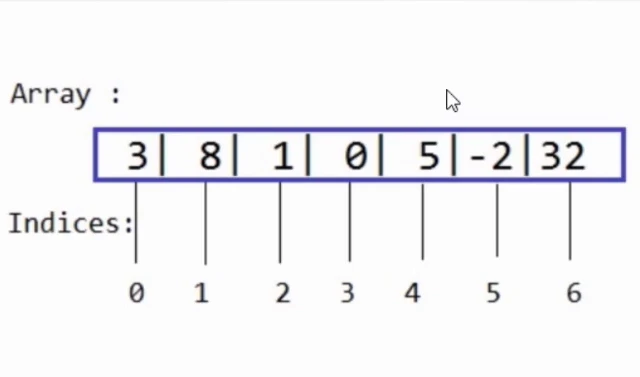
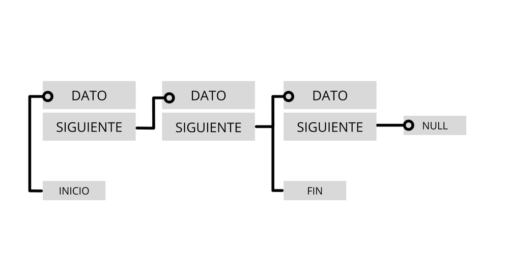
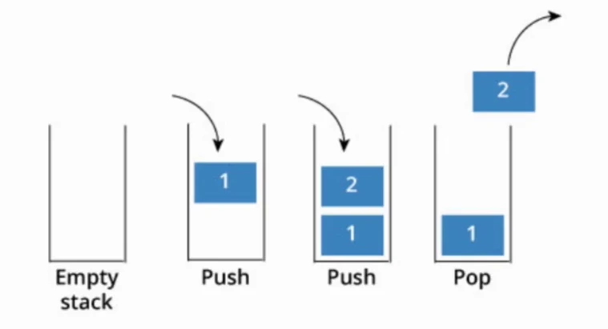
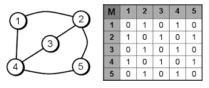
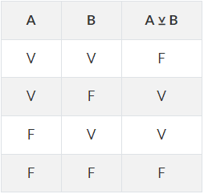
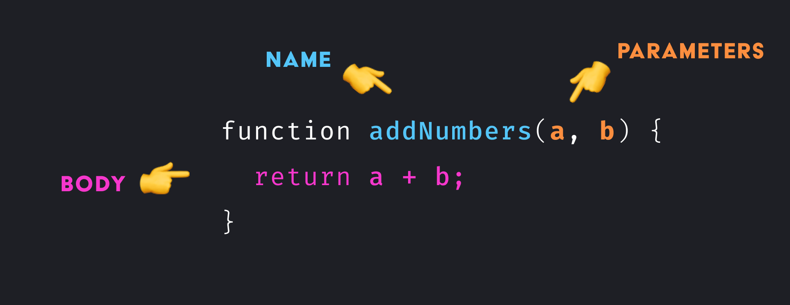
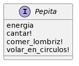

# FUNDAMENTOS DE PROGRAMACIÓN
El presente archivo trata de dar una lección concisa, pero a la vez profunda, acerca de todo lo necesario para introducirse en la programación. Aquí se encontrarán los temas seccionados y explicados de forma fiel y práctica, intentando abarcar la mayoria de ellos como son operadores, tipos de datos y programación orientada a objetos.

Esperamos sea de mucha utilidad. 😃😃

---

## 1. DEFINICIONES
### **1.1. ¿Que es la programación?**
La "Programación", en su sentido más amplio, es la acción de programar, que implica ***ordenar, estructurar o componer una serie de acciones cronológicas para cumplir un objetivo***. De esta definición tan amplia podemos decir que la programación se puede aplicar en ámbitos tan diversos como los eventos sociales, los medios de comunicación, la resolución de cualquier tipo de problemas y, por supuestro, el mundo informático y las computadoras.

Ya entrando en una definición más formal, y sobre todo más útil a lo que venimos a estudiar. Podemos decir que en informática, ***la programación es el uso de lenguajes informáticos para darle instrucciones a un ordenador***. Estás instrucciones estarán enfocadas en lograr que la computadora realice distintas tareas por nosotros, como cálculos matemáticos, decisiones lógicas, almacenamiento de datos, etc.

Luego, el fin de la programación será generar al final un resultado útil para el hombre. Otra definición acerca de la programación deja esto bien en claro, ***el fin último de la programación resulta en crear soluciones informáticas a problemas del mundo real***.

Para poner lo anterior en resumen, dejo esta pequeña definición elaborada por mi:
>“La Programación es la acción de dar órdenes a una máquina en pos de crear soluciones con software a problemas reales del hombre.”

### **1.2. ¿Qué es un Algoritmo y un Programa?**
Como _algoritmo_ denominamos un conjunto ordenado y finito de operaciones e instrucciones simples a través de las cuales podemos hallar la solución a un problema. Así, dado un estado inicial y una entrada, y siguiendo los sucesivos pasos indicados, se llega al estado final y se obtiene una solución.

Un conjunto de algoritmos constituye un _programa_. En general la palabra programa tambien se suele usar para llamar al producto informático terminado y listo para usar.

A continuación dejamos un [pequeño enlace](https://es.wikipedia.org/wiki/Algoritmo) para aquellos que deseen profundizar en los algoritmos.

### **1.3. Lenguajes de Programación**
Las instrucciones que se envian a la máquina no se pueden dar de cualquier manera, existe una estandarización de ellas para que puedan ser entendidas de forma general. Con este fin se crearon los __lenguajes de programación__, que proporcionan una _sintaxis_ especifica de los comandos.

Hay muchos lenguajes de programación dependiendo de quien los haya creado y el fin especifico para el que se quieran usar, en general, los más conocidos tienen una sintaxis similar entre ellos.

Al hablar de **sintaxis** hablamos de una serie de palabras clave que indican ordenes para la computadora. Estas palabras clave no se podrán usar para otra cosa que no sea el fin que se dispuso, caso contrario confundiriamos al ordenador, es por eso que tambien se llaman _palabras reservadas_.

Viendo lo anterior con un ejemplo en el lenguaje "Java", para almacenar un dato debemos declarar que es lo que se va a guardar con la palabra reservada `int`, asignar un nombre al dato y luego utilizar el símbolo `=` para asignar el valor. Finalmente debemos cerrar la instrucción con el símbolo `;`. 
```JAVA
int datoNumerico = 1;
```
De este modo se establece una estructura rígida que define la instrucción, en una suerte de codifiación que la máquina entiende. Por ello tambien a los comandos de un lenguaje se los denomina _código_.

### **1.4. Compilación e Interpretación**
Tambien se debe tener en cuenta es que las máquinas trabajan sobre la base "[0,1]", es decir solo entienden valores binarios. Lo que implica que todo el código que podamos escribir se deberá traducir a "lenguaje máquina" para ser usado. A la acción de traducir un lenguaje a código máquila la llamamos _compilar_, y los programas que realizan la tarea se llaman _compiladores_.

Últimamente gracias a los avances en rendimiento de los ordenadores se ha optado por otra alternativa a los lenguajes compilados, los lenguajes interpretados. Aquí el código se compila en tiempo real y se ejecuta al mismo tiempo eliminando así la necesidad de un archivo intermedio. Esto es una ventaja para el desarrollo de software y la simplicidad de uso, pero trae aparejado el problema de un mayor consumo de recursos. Además, la velocidad de ejecución del programa nunca será tan rápida como la de los lenguajes compilados a binario.


### **1.5 Paradigmas de Programación**
Un paradigma de programación es una manera o estilo de programación de software. Los lenguajes de programación adoptan uno o varios paradigmas en función del tipo de órdenes que permiten implementar. Los hay muchos, pero aquí veremos solo dos:

- **Paradigma imperativo:** Los programas consisten en una sucesión de instrucciones o conjunto de sentencias, como si el programador diera órdenes concretas. El desarrollador describe en el código paso por paso todo lo que hará su programa. El programa tiene un flujo de lectura en orden descendente y hay algunas sentencias que nos permiten controlar el flujo de este.

    Es el paradigma de programación más antiguo y en él se fundan todos los demás.

- **Programación orientada a objetos:** En este modelo se construyen funciones y métodos que realicen tareas específicas y luego se los va agrupando en colecciones afines las cuales se llamarán "objetos".
Permite separar los diferentes componentes de un programa (modularizar el código), simplificando así su creación, depuración y posteriores mejoras. La programación orientada a objetos disminuye los errores y promociona la reutilización del código. Es una manera especial de programar, que se acerca de alguna manera a cómo expresaríamos las cosas en la vida real.

    Podemos definir un objeto como una estructura abstracta que, de manera más fiable, describe un posible objeto del mundo real y su relación con el resto del mundo que lo rodea a través de interfaces (conjuntos de acciones que puede realizar). Ejemplos de lenguajes de programación orientados a objetos serían Java, Python o C#.

- **Programación Modular:** Este es otro paradigma de programación que se basa en construir programas complejos a partir de modulos de código simple. 

    Uno de los métodos fundamentales para resolver un problema es dividirlo en problemas más pequeños, llamados subproblemas. Estos problemas pueden a su vez dividirse repetidamente en problemas más pequeños hasta que los problemas sean de fácil solución. Cada subproblema es deseable que sea independiente de los demás y se denomina _módulo_. El problema original se resuelve con un programa principal (llamado también _driver_ o _main_), y los subproblemas (módulos) mediante subprogramas. El proceso de descomposición de un problema en módulos se denomina _modularización_.

---

## 2. VARIABLES Y TIPOS DE DATOS
Las *variables* son espacios reservados en la memoria de  nuestro ordenador que se utilizan para poder guardar datos de manera temporal y usarlos en el programa. Los datos pueden ser numeros, cadenas de texto, o incluso cosas más complejas, siempre se debe especificar que es lo que se va a almacenar.

Especificar que tipo de información se va a almacenar se denomina _definir el tipo de dato_, y se debe realizar con una palabra clave reservada. En general los lenguajes comparten varias de las palabras clave que identifican cada tipo de dato. A continuación dejamos una lista de algunos de ellos:

|Tipo de Dato|Descripción|
|:---:|:---|
|`Integer`| Almacena números enteros.|
|`Float`| Almacena números reales con coma flotante.|
|`String`| Almacena cadenas de texto y carácteres unicode|
|`Boolean`| Almacena valores booleanos, es decir `True` o `False`|
|`Char`| Almacena un caracter de texto|

Luego, puede darse el caso en que se necesite cambiar el tipo de dato de una variable, es decir _hacer un Casting_. 

_Castear_ en programación es una operación para cambiar el tipo de dato del valor resultante de una expresión. Es útil en situaciones especificas. Por ejemplo, si queremos sumar dos valores numéricos, nos deberíamos asegurar que el lenguaje reconoce estos dos valores cómo números y no como un String.

---

## 3. TIPADO FUERTE, DEBIL Y DINÁMICO
- **Tipado fuerte:** Un lenguaje de programación es fuertemente tipado si no se permiten violaciones de los tipos de datos, es decir, al definir una variable se debe definir el tipo de dato y inicializada la misma no se puede usar como si fuera de otro tipo distinto a menos que se haga una conversión.

    Sus ventajas son:
    - La ejecución es más veloz, ya que la inferencia de los tipos es anterior y el lenguaje no necesita verificarlos a la hora de ejecutarlos.

    Sus desventajas son:
    - A la hora de programar es mucho más estricto y necesitas escribir más código, lo que alarga el tiempo de trabajo.
    - El compilador debe ejecutar una disciplina de tipos concreta. Es decir, se siguen unas normas concretas de asignación de variables, argumentos de funciones o valores de retorno.

    El tipado fuerte se usa en lenguajes de programación como C, C#, Java y Ruby.

- **Tipado débil:** En los lenguajes con tipado debil no se necesita declarar el tipo de dato a almacenar, el tipo de dato es inferido por la computadora cuando se inicializa la variable con un valor.

    Sus ventajas son:
    - Es muy rápido de desarrollar.
    - Su flexibilidad ayuda a que los programas funcionen sin necesidad de utilizar tanto código.

    Presenta desventajas como:
    - Favorece la aparición de errores como el que se pierde al comparar números mezclando algunos tipados como los strings, que no son detectables anteriormente.
    - Es necesario _castear_ de manera periódica el programa para conseguir el resultado esperado.

    Un lenguaje de tipado debil es PHP.

- **Tipado Dinámico:** Los lenguajes de tipado dinámico son aquellos (como JavaScript) donde el intérprete asigna a las variables un tipo de dato durante el tiempo de ejecución basado en su valor en ese momento.

---

## 4. ESTRUCTURAS DE DATOS
En ciencias de la computación, una estructura de datos​ es una forma particular de organizar datos en una computadora para que puedan ser utilizados de manera eficiente. Diferentes tipos de estructuras de datos son adecuados para diferentes tipos de aplicaciones, y algunos son altamente especializados para tareas específicas.

En función de cual estructura utilicemos y para qué propósito, nuestros algoritmos en nuestro programa correrán más rápido o más lento. Para medir que tan buena es una estructura de datos y según en que situaciónes, se utiliza una herramienta llamada _notación asintótica_. Esta herramienta mide a que ritmo aumenta el tiempo o el espacio en memoria, a medida que aumenta el tamaño de la estructura. Esto también se conoce como la tasa de crecimiento. Esta notación merece un capítulo aparte por lo que nos quedaremos simplemente con el resultado que nos genere, ya sea constante, lineal, cuadrático, exponencial, etc.

Luego, las estructuras de datos se estudian como conceptos sobre programación, y no sobre un lenguaje en específico, por lo que cada lenguaje puede tener diferentes implementaciones de estructuras de datos.

### **4.1. ¿Cuáles son los tipos de estructuras de datos?**
Primero, debemos diferenciar entre estructura de dato estática y estructura de dato dinámica. Las **estructuras de datos estáticas**, son aquellas en las que el tamaño ocupado en memoria se define antes de que el programa se ejecute y no puede modificarse dicho tamaño durante la ejecución del programa, mientras que una **estructura de datos dinámica** es aquella en la que el tamaño ocupado en memoria puede modificarse durante la ejecución del programa.

Cada tipo de estructura dependerá del tipo de aplicación que se requiera. Existen una multitud de estructuras dedicadas al almacenamiento de datos, por lo que dejamos adjuntada una [lista de estructuras de datos](https://en.wikipedia.org/wiki/List_of_data_structures) para aquellos que deseen profundizar en el tema. Aquí veremos solo algunas que es imprescindible conocer.

### **4.2. Arrays**
Un _vector_ o _array_ en inglés, es una estructura de datos que permite almacenar un conjunto ordenado de datos de forma contigua. Es decir, se guardan las porciones de espacio físico que almacenan los datos, "una al lado de la otra", luego el acceso a las mismas se realiza por medio de un índice.



Lo bueno de esta estructura es que el acceso por índice es de tiempo constante, la desventaja es que en ocasiones donde el array es muy grande, el ordenador debe buscar una sección de la memoria donde el mismo quepa completo y en el peor de los casos copiar el array a una nueva posición. Por ello en muchos lenguajes de programación de bajo nivel como C, se debe definir la longitud del array de antemano (conformandose una estructura de datos del tipo estática). Lo anterior define un coste de implementación que, en el peor de los casos, será del tipo lineal, es decir, en el peor de los casos el coste de busqueda de un elemento crecerá linealmente con el tamaño del array.

Tambien se pueden construir matrices usando la estructura de los arrays. Esto se consigue insertando un vector dentro de cada espacio de un nuevo vector. El array mayor hará de fila u columna de la matriz, y el conjunto de arrays menores serán las lineas de la matriz.

### **4.3. Listas Enlazadas:**
Las listas enlazadas se construyen con elementos de memoria que están repartidos de forma arbitraria por ella, en una secuencia. Aquí, cada nodo de memoria se conecta con el siguiente a través de un enlace que apunta a su posición, para en el caso de las listas enlazadas simples. En el caso de las listas enlazadas dobles contamos con dos enlaces o punteros, uno al elemento previo y otro al siguiente.

La creación u eliminación de elementos resultará sencila, simplemente se necesitará crear o eliminar nodos y modificar punteros, por lo que las insercciones y eliminaciones son en tiempo constante.

De este modo, teniendo la referencia del principio de la lista podemos acceder a todos los elementos de la misma, esto resulta en una implementación sencilla pero con un coste de búsqueda del tipo lineal, ya que para acceder a un elemento i-ésimo en la lista, deberemos iterar elemento a elemento desde el inicio. 



### **4.4. Tablas de Hash**
Tambien llamados _arrays asociativos_ o _diccionarios_, son una estructura de datos que guarda elementos en pares _clave-valor_, la clave indica el sitio de memoria en el que se guardará el valor. El acceso y las inseciones, al igual que en los arrays es de tiempo constante y comparada con otras estructuras de datos las tablas hash son más útiles cuando se almacenan grandes cantidades de información.

### **4.5. Listas tipo Pila:**
La pila (_stack_ en inglés), es un tipo especial de lista lineal dentro de las estructuras de datos dinámicas que permite almacenar y recuperar datos, siendo el modo de acceso a sus elementos de tipo LIFO (del inglés "Last In, First Out", es decir, último en entrar, primero en salir). 

Funciona a través de dos operaciones básicas: apilar (push), que coloca un objeto en la pila, y su operación inversa, desapilar (pop), que retira el último elemento apilado.



### **4.6. Listas tipo Cola**
Una Cola es otro tipo especial de lista en el cual los elementos se insertan por un extremo (el posterior) y se suprimen por el otro (el anterior o frente). Las colas se conocen tambien como listas FIFO ("First In, First Out").


Es una estructura muy útil en procesos asíncronos.

#### **4.7. Grafos:**
Se trata de una estructura de datos compleja formada por un conjunto de nodos (tambien llamados vértices), y un conjunto de líneas de relación (llamados arístas), cada una de las cuales une un punto a otro.

Entre sus características se encuentra que son excepcionales para representar relaciones entre diferentes entidades. Otra estructura de datos asociada a los gráfos son los árboles, muy útiles para representar datos de forma jerárquica. Los árboles son un caso particular de grafos en donde para todo par de nodos existe un solo camino.



---

## 5. OPERADORES
Un operador es un signo o símbolo que especifica el tipo de cálculo que se realiza en una expresión. Hay operadores matemáticos, aritméticos, lógicos y de asignación.

### **2.1. Operadores de Asignacion:** 
Un operador de asignacion asignará un valor al operando de la izquierda basado en el valor del operando de la derecha. Veamos esto de manera práctica en el lenguaje javascript.

```javascript
//Declaración de la variable numero.
let numero = 10;

numero = 5;     //Asignacion. Asignará el valor de 5.
numero += 5;    //Asignacion de Adicion. Sumará 5 unidades a la variable número. 
numero -= 5;    //Asignacion de Sustraccion. Restará 5 unidades a la variable número.
numero *= 5;    //Asignacion de multiplicacion. Multiplicará por 5 el valor de la variable número.
numero /= 5;    //Asignacion de division. Dividirá por 5 el valor de la variable número.
numero %= 5;    //Asignacion de resto. Hará un cociente donde el númerador será la variable número y el denominador 5. Devolverá el resto.
numero **= 5;   //Asignacion de exponenciacion. Realizará una potenciación de índice 5 a la variable número.
```

### **2.2. Operadores Aritmeticos:**
Son operadores que toman valores numericos (ya sean literales o variables) como sus operandos y retornan un valor numerico unico. Realizan las operaciones aritméticas básicas.

```javascript
//Declaracion de variables.
let num1 = 10;
let num2 = 5;

num1--;      //sustraccion en una unidad
num2++;      //incremento en una unidad
num1 + num2; //suma de dos valores
num1 - num2; //resta de dos valores
num1 * num2; //producto de dos valores
num1 / num2; //division de dos valores
num1**num2;  //potencia de base num1
```

### **2.3. Operadores Lógicos o de Comparación:**
Los operadores de comparación se usan para comparar dos condiciones booleanas y devolver un resultado tambien booleano de `True` o `False`. Su uso es principalmente en validaciones lógicas. 

Veamos un ejemplo con javascript.
```javascript
let num1 = 23;
let num2 = "13";

//Con == validamos si el valor de las dos variables es igual, independientemente del tipo de dato.
num1 == num2;

//Con != validamos si el valor de las dos variables es desigual, independientemente del tipo de dato.
num1 != num2;

//Con los operadores === y !== validamos si son estrictamente iguales o desiguales respectivamente, es decir validamos la igualdad o desigualdad del valor y la igualdad o desigualdad del tipo de dato.
num1 === num2
num1 !== num2

num1 > num2     //Con > validamos si num1 es mayor a num2. 
num1 < num2     //Con > validamos si num1 es menor a num2.
num1 >= num2    //Con > validamos si num1 es mayor o igual a num2.
num1 <= num2    //Con > validamos si num1 es menor o igual a num2.
```
A los operadores `==` y `!=` se los llama _operadores de semejanza_ y a los operadores `===` y `!==`, se los llama _operadores de equivalencia_. Luego, otro operador que es interesante conocer es el _operador de coalescencia_.

```javascript
//Operador de Coalescencia. Devuelve el valor de la derecha si lo de la izquierda es null.
const foo = null ?? 'default string';
console.log(foo);
// salida esperada: "default string"
```

### **2.4. Otros operadores Lógicos:**
Estos operadores se utilizan en conjunto con los anteriores para realizar múltiples validaciones en una sola operación. Son operadores basados en puertas lógicas por lo que traen una tabla de verdad asociada.

- __Operador AND:__ Si todas las condiciones booleanas son verdaderas, devuelve _true_, caso contrario devuelve _false_. Está asociado a la operación de multiplicación binaria.
    ```javascript
    let num1 = 2, num2 = 4;

    //Ambas condiciones son verdaderas, por lo que esta sentencia retornará true.
    num1 < num2 && num1 != num2;
    ```
- __Operador OR:__ Si al menos una de todas las afirmaciones es verdadera, devolvera _true_, sino devolvera _false_. En el álgebra de boole, este operador realiza la operación de suma binaria.
    ```javascript
    num1 = 3; num2 = 6;

    //La segunda condición no se cumple, pero se cumple al menos una, la primera, por lo que la sentencia retornará true.
    num1 < num2 && num1 == num2;
    ```

- __Operador NOT:__ Devuelve el valor opuesto, es decir que si la sentencia se cumple, retornará _false_ y caso contrario, retornará _true_.
    ```javascript
    //La condicion se cumple, se retorna false.
    !(num1 < num2);
    ```

Existen otros operadores basados en puertas lógicas pero en general no están incluidos por defecto en los lenguajes, por lo que de ser necesario, se pueden modelar a partir de los operadores anteriores. Un ejemplo de modelado es con el operador de la compuerta lógica `XOR`. El cual en una funcion javascript se vería de la siguiente manera:
```javascript
function xor(a,b) {
    return(a === !b);
}
```
Donde retornará verdadero solo si ámbas proposiciones booleanas, (`a` y `b`) son distintas. Su tabla de verdad sería la siguiente:



Tambien es importante aclarar la nocion de _"Cortocircuitar"_ en el operador `AND`, lo cual significa que una expresión, por más larga que sea, dejará de evaluarse si se dan determinados casos. 

Por ejemplo, basta con que en la siguiente expresión, la primer sentencia (`a == b`) retorne _false_, para que toda la expresion se deje de analizar.

`a == b && c !== (a + b) && d === ((c + b) - a)`

Entender esto resulta útil en la optimización de operaciones booleanas complejas o repetitivas, ya que siempre será más óptimo colocar la condición más sencilla de resolver al inicio.

---

## 6. PROGRAMACION IMPERATIVA
La **programación imperativa** es el paradigma de programación más antiguo. De acuerdo con este paradigma, un programa consiste en una secuencia claramente definida de instrucciones para un ordenador. Los lenguajes de programación imperativa son muy concretos y trabajan cerca del sistema. De esta forma, el código es, por un lado, fácilmente comprensible, pero, por el otro, requiere muchas líneas de texto fuente.

### **6.1. Flujo normal de un Programa:**
Todo programa tiene un orden de ejecución de las sentencias, esto se denomina _flujo de ejecucion_ del programa. Por defecto el flujo de cualquier programa es del tipo secuencial si no se especifica otra cosa.

En un flujo secuencial las sentencias se ejecutan en el orden de lectura, una después de otra. Para cambiar esta situación se utilizan las estructuras de control de flujo, que permiten modificarlo a convenciencia.

Las estructuras de control de flujo típicas son las siguientes:
- **Sentencias condicionales:** Ejecutan un bloque de código si se cumple una condición booleana dada.
    - Sentencia "if-else".
    - Sentencia "switch-case".

- **Bucles:** Ejecutan un bloque de código de manera reiterada mientras se cumpla una condición booleana dada. Son útiles para tareas repetitivas.
    - Bucle "For".
    - Bucle "While".
    - Bucle "Do-While".

- **Sentencia "try-catch-finally":** Esta sentencia nos permite manejar excepciones y especificar que hacer si ocurren situaciones no contempladas en el código.

Cuando estamos haciendo uso de otro paradigma de programación, como el orientado a objetos, este flujo normal no se cumple a rajatabla, pero debemos tener en claro que es la forma nativa de leer las instrucciones en la mayoria de los lenguajes, por no decir en todos.

### **6.2. Sentencia Condicional "if-else"**
Esta estructura engloba un bloque de codigo y lo ejecuta cuando se verifica la validez de una condicion booleana, en caso contrario pasará por alto el bloque y seguirá al siguiente. En cuanto a la sentencia que pongamos como condición, su resultado deberá ser siempre del tipo booleano. El código encerrado en el bloque if, se ejecutará si la condición se cumple. El bloque else, no siempre es necesario, pero se ejecutará si la condición booleana retorna _false_. En caso de no existir un else, el programa saldra de la estructura condicional y seguirá su camino. 

La sintáxis genérica de un _if-else_ es la siguiente:

```java
if(condicion) {
    // Respuesta Satisfactoria.
} else {
    // Respuesta Negativa.
}
```

### **6.3. Sentencia "switch-case"**
Los switch son sentencias de control en donde se ejecutara una accion de una lista de acciones dependiendo de un parámetro. Por ejemplo:

```javascript
switch(opcion) {
    case 1: { /*Instrucciones*/ }
    case 2: { /*Instrucciones*/ }
    case 3: { /*Instrucciones*/ }
    case 4: { /*Instrucciones*/ }
    case 5: { /*Instrucciones*/ }
}
```
Donde el programa comparará la opción que le llege por los paréntesis (parámetro) y la buscará en la serie de casos listados. Cuando encuentre un match el programa ejecutará lo que esté entre llaves. Por ejemplo, si en el parámetro "opcion" le damos el valor de 3, el programa detectará un match con el caso 3 y ejecutará las instrucciones correspondientes a ese caso. Los nombres de los casos pueden ser cualquiera, no solo valores numéricos. Es importante resaltar que esta estructura consume más recursos que otras.

### **6.4. Bucle For**
Los bucles son estructuras sintácticas que nos permiten ejecutar porciones de codigo de manera iterada mientras se cumpla una condicion. La misma debe retornar valores booleanos.

Luego, el bucle `for` es un bucle del tipo definido, es decir que tiene preasignado un número especifico de ejecuciónes. Al usarlo debemos definir una variable llamada contador, que por convencion se nombra con la letra "i", el cual se encargará de ir contabilizando la cantidad de vueltas. Para que el contador pueda llevar la cuenta al final del cuerpo del bucle se agrega la sentencia `i++;` (algunos programas incluyen esta sentencia entre los parentesis iniciales). Así, por cada vuelta la variable incrementa su valor en uno. El bucle finaliza cuando el contador llega al número de vueltas especificados.

Su sintaxis más generica es la siguiente.
```java
//Sintaxis:
for(declaración del contador; condicion; incremento) {
    /*Instrucciones*/
}

// Ejemplo:
for(let i = 0; i < 10; i++) {
    /*Instrucciones*/
}
```

### **6.5. Bucle While**
Otra de las sentencias iterativas es la sentencia "While", el cual es un bucle no definido que se ejecutará siempre que la condicion retorne _true_, la sentencia `break` nos permite cortar la ejecucion del bucle y salir de el. Break en general funciona para todos los bucles.

Ejemplo genérico con código Python:
```python
i = 0
while (condicion) {
    # Instrucciones.
    i++
}

num = 0
while (num >= 20) {
    # Instrucciones.

    num++

    if (numero == 7) { break }
}
```

### **6.6. Bucle do-while**
Este bucle es una variacion del bucle while y nos garantiza que la iteracion se ejecute al menos una vez, ya que ejecuta las instrucciones y luego verifica que la condicion se siga cumpliendo.
```javascript
i = 0;
do {
    // Istrucciones
    i++;
} while (numero > 6); 
```

La sentencia `break` tambien funciona aquí. Luego la sentencia `continue` tiene la funcionalidad de "saltarse" el bucle de instrucciones en el valor especificado de "i", y luego proseguir con la siguiente vuelta.

```javascript
i = 0;
do {
    // Istrucciones

    if(i == 4) { continue; }

    i++;
} while (numero > 6); 
```

### **6.7. Sentencia "try-catch-finally"**
El control de flujo de un programa, sabemos hasta ahora que se lleva a cabo con sentencias del tipo if, while, for, return, break, etc. Estas sentencias forman un conjunto de palabras reservardas que determinan cierta funcionalidad. Pues bien, ninguna de ellas tiene en cuenta que se puedan producir errores en tiempo de ejecución de un programa, por tanto se necesita de un conjunto de palabras nuevas para tener en cuenta que cualquier código puede fallar o ser mal interpretado en tiempo de ejecución.

Aquí es donde aparecen tres nuevas sentencias, `try`, `catch` y `finally`, que nos permitirán hacer un buen manejo de las excepciones en nuestros programas. La sentencia `try` encerrará el bloque de código que se ejecutaría normalmente, luego en el `catch` se especifica un bloque de a ejecutar en caso de que ocurra un error. La sentencia `finally` será otro bloque de código a ejecutar siempre al final de nuestro programa.

Ejemplo de disposición de la sentencia try-catch.
```js
try { /*código a ejecutar de forma normal*/ } 

catch(error) { /*Captura de la excepción en la variable "error". Bloque de código a ejecutar en caso de error.*/ }

finally { /*Bloque a ejecutar al finalizar un programa*/ }
```

---

## 7. FUNCIONES Y PROCEDIMIENTOS
Otro pilar fundamental de la programación imperativa es la noción de funciones y procedimientos. Ambos son bloques de código diseñados para ejecutar una tarea específica. Por ejemplo los procedimientos predefinidos LEER y ESCRIBIR están diseñados para realizar operaciones de entrada y salida de datos de un programa.

Tambien se pueden definir como trozos de codigo que se pueden reutilizar al invocarlos. Su funcionamiento es sencillo, en general se declaran con una palabra clave reservada y admiten la entrada de uno o más datos por parámetros. Luego ejecutan una serie de comandos y según sea el caso, devuelven un resultado.

La anatomia sintáctica de cualquiera de estas estructuras es la siguiente: Se declaran con una palabra reservada, se les asigna un nombre que permita individualizarlas y se reserva un espacio, generalmente entre paréntesis, para enviar los valores de entrada (llamados "parámetros"). El bloque de lógica correspondiente (el "cuerpo"), estará delimitado luego de alguna forma (en general es entre llaves `{}`). En la siguiente imagen se ilustra la anatomia de una función en javascript, pueden haber diferencias entre otros lenguajes pero no serán muy dispares unas de otras.



Notesé la sentencia `return a + b;`. La diferencia entre una función y un procedimiento, es que una funcion devuelve un valor y un procedimiento simplemente ejecuta comandos, por lo que una función tendrá siempre un comando de retorno y los procedimientos no. Podría decirse tambien que una función es un caso especial de los procedimientos en donde se retorna algún valor.

En los lenguajes similares a Pascal, las funciones y los procedimientos son entidades distintas, que difieren en si devuelven o no un valor. En cambio en otros lenguajes más contemporáneos esta distinción desapareció, este es el caso de los lenguajes funcionales donde por lo general no existe un procedimiento, todo es una función.

---

## 8. PROGRAMACIÓN ORIENTADA A OBJETOS
### **8.1. Introducción**
La programación orientada a objetos es un paradigma de programacion en donde se busca crear elementos funcionales de manera sencilla e intuitiva. Para ello creamos en primera instancia plantillas generales y genéricas (clases), que nos permitan luego crear objetos diversos pero con cualidades o atributos similares y luego programar métodos para que nuestro objeto adquiera funcionalidad. Su utilidad es que podemos resumir mucho código de forma intuitiva.

La programación con objetos parte de una idea muy simple: Podemos representar al mundo como un conjunto de objetos que interactúan entre ellos. Ahora bien, ¿qué es un objeto? 

Los objetos son entidades computacionales que tienen un determinado estado, comportamiento e identidad. Y que contienen información en forma de campos (a veces también referidos como atributos o propiedades) y código en forma de métodos. Los objetos son capaces de interactuar y modificar los valores contenidos en sus campos o atributos a través de sus métodos.

La programación orientada a objetos difiere de la programación estructurada tradicional, en la que los datos y los procedimientos están separados y sin relación, ya que lo único que se busca es el procesamiento de unos datos de entrada para obtener otros de salida. La programación estructurada prima el concepto de procedimientos o funciones sobre el de estructuras (se emplean principalmente funciones que procesan datos). Aquí, en cambio, primero se definen los objetos o estructuras para posteriormente solicitar la ejecución de sus métodos.

Veamos como funciona este paradigma de manera práctica con el uso del lenguaje Ruby. Ruby es un lenguaje de Programación Orientada a Objetos, gratis y de código abierto creado en Japón. Su sintaxis amigable lo hace muy popular sobre todo en el desarrollo web.

### **8.2. Objetos y Mensajes**
Los objetos son entes computacionales definidos por un bloque de código, poseen una serie de atributos y son capaces de realizar una serie de tareas que le definamos.

La definición de objetos en Ruby comienza anteponiendo `module` antes del nombre y finaliza con `end`.
```Ruby
module Objeto1
    #Código del objeto...
end
```
La manera en que podemos interactuar con los objetos es a través del envío de mensajes, estos mensajes tienen un formato especial del tipo:

`NombreDelObjeto.mensajeAEnviar`

Cuando un objeto recibe un mensaje, este responde haciendo algo. Pero un objeto solo puede responder satisfactoriamente a un mensaje si lo entiende, dicho en otras palabras, si no definimos la respuesta que se debe dar ante el envio de un mensaje, el objeto no sabrá que hacer y el programa se romperá y devolviendonos: *`undefined method`*.

Al conjunto de mensajes que podemos enviarle a un objeto lo denominamos _interfaz_. Por ejemplo, la interfaz del objeto "Pepita", que representa lo que haría una golondrina es:



Lo anterior si bien parece un poco insulso, puede ser completamente válido para un videojuego de aves por ejemplo.

Una convención es que a los mensajes que ejecutan una acción se los escribe con un signo de exclamación al final.

Luego, en el caso de que se necesite, podemos pasar argumentos en los mensajes. Siguiendo con el ejemplo anterior, si queremos que Pepita coma una cierta cantidad de alpiste que no sea siempre la misma, necesitamos de alguna manera indicar cuál es esa cantidad. Esto podemos escribirlo de la siguiente forma: `Pepita.comer_alpiste! 40`

Allí, 40 es un argumento del mensaje, representa en este caso que vamos a alimentar a pepita con 40 gramos de alpiste. Un mensaje podría tomar más de un argumento, separados por coma. Por ejemplo:
```Ruby
> Alumno.estudiar! Matemática, Química
> Profesor.corregir_examen! Alumno1, Alumno4, Alumno22
```

### **8.3. Métodos y estado**
De manera práctica, un método es la definición de "qué hacer", cuando el objeto recibe un mensaje del mismo nombre. Por ejemplo: Si un objeto "Database" recibe un mensaje de añadir cliente: `Database.addClient`. En la definición del objeto debería haber una función de programación (el método), cuyo nombre debería ser "addClient" y que especifique como añadir un cliente a la base de datos.

En ruby la definición de los métodos comienza con `def` y, al igual que en la declaración de objetos, finaliza con `end`. En el caso de los métodos creados dentro de un bloque "module" es necesario anteponer al nombre del método, la palabra reservada `self`. En caso que nuestro método reciba parámetros debemos ponerlos entre paréntesis separados por coma.

```Ruby
module Database
    def self.addClient (clientName, age, status)
        #Lógica de la función.
    end

    def self.deleteClient (clientName)
        #Lógica de la función.
    end

    def self.updateClient (clientName, newClientName, newAge, newStatus)
        #Lógica de la función.
    end
end
```

Luego los objetos pueden poseer atributos definidos dentro de ellos, los mismos son variables y los objetos pueden tener múltiples de ellos. Al conjunto de estos atributos y sus valores en un determinado momento se lo denomina *estado*.

En Ruby la forma de definir un atributo es: `@nombreDelAtributo`, y para inicializar un valor en él, utilizamos `@nombreDelAtributo = valor`. Veamos un ejemplo el uso de atributos definiendo un objeto "Patrimonio" que represente el dinero que posee una persona.

```Ruby
module Patrimonio
  @dineroEnBilletes
  @dineroEnBanco
  @dineroEnInversiones
  @estadoDeQuiebra = false

  def self.sacarDinero
  end
  
  def self.agregarDinero
  end
end
```
Si en el ejemplo anterior hubieramos inicializado los atributos, podriamos tener algo como esto:
```Ruby
module Patrimonio
  @dineroEnBilletes = 2652.40
  @dineroEnBanco = 41060.80
  @dineroEnInversiones = 21672.50
  @estadoDeQuiebra = false

  def self.sacarDinero
    #Lógica del método.
  end
  
  def self.agregarDinero
    #Lógica del método.
  end
end
```
El estado es siempre privado, es decir, solo el objeto puede utilizar sus atributos. Para conocer el estado mediante el envio de mensajes debemos hacer uso de métodos accesores.

En resumen, los objetos son capaces de interactuar con otros objetos, realizar tareas y modificar los valores contenidos en sus atributos, es decir modificar su "estado", y todo esto a través de utilizar métodos.

### **8.4. Métodos accesores: Setters y Getters**
Los _"accessors"_ son métodos que nos permiten acceder o modificar el estado de un objeto y son conocidos como _getters_ y _setters_ respectivamente.

Por ejemplo, si desearamos retornar el valor de un atributo podriamos definir un método como el siguiente:
```Ruby
module Objeto
  @atributo1 = 'Lorem Ipsum'

  def self.atributo1
    @atributo1
  end
end
```
De este modo estariamos devolviendo el valor cuando llamemos al método con el mismo nombre.

Mensaje: `Objeto.atributo1`

Respuesta: `"Lorem Ipsum"`

El método anterior es un ejemplo típico de getter:
- Los getters usan exactamente el mismo nombre que el atributo del cual devuelven el valor, pero sin el `@`.
- Aquellos getters que devuelven el valor de un atributo booleano llevan `?` al final.

Luego en contraparte tenemos los métodos setters, que modifican los atributos de nuestro programa de uno a la vez, se llaman así porque vienen del inglés "set" que significa establecer, ajustar, fijar.

En Ruby, para estos métodos, solemos utilizar una convención de sintaxis, que es que los "setters" deben llevar el mismo nombre del atributo al que están asociados, pero agregando el signo de igual `=` al final.

```Ruby
module Objeto
  @atributo1

  def self.atributo1= valor
    @atributo1 = valor
  end
end
```
Lo anterior nos permite utilizar la siguiente notación en los mensajes: `Objeto.atributo1 = "Lorem ipsum"`

Para finalizar veamos un ejemplo completo del buen uso de getters y setters en Ruby.
```Ruby
module Patrimonio
  @dineroEnBilletes = 2652.40
  @dineroEnBanco = 41060.80
  @dineroEnInversiones = 21672.50
  @estadoDeQuiebra = false

  #Métodos getters.
  def self.dineroEnBilletes
    @dineroEnBilletes
  end

  def self.dineroEnBanco
    @dineroEnBanco
  end

  def self.dineroEnInversiones
    @dineroEnInversiones
  end

  #Método getter que devuelve un valor booleano.
  def self.estadoDeQuiebra?
    @estadoDeQuiebra
  end

  #Métodos setters.
  def self.dineroEnBilletes= valor
    @dineroEnBilletes = valor
  end

  def self.dineroEnBanco= valor
    @dineroEnBanco = valor
  end

  def self.dineroEnInversiones= valor
    @dineroEnInversiones = valor
  end

  def self.estadoDeQuiebra= booleano
    @estadoDeQuiebra = booleano
  end

  #Métodos que realizan alguna acción
  def self.sacarDinero!
    #Lógica del método.
  end
  
  def self.agregarDinero!
    #Lógica del método.
  end
end
```

### **8.5. Polimorfismo y Encapsulamiento**
El _polimorfismo_ en objetos es la capacidad que tiene un objeto de poder enviarle el mismo mensaje indistintamente a objetos diferentes. Estos objetos deben entender este mensaje más allá de cómo este definido el método asociado al mismo, es decir, dos o más objetos son polimórficos cuando comparten una interfaz, no importa como reaccione o que acción realice cada objeto ante el envio de ese mensaje.

Para que estemos ante un caso de polimorfismo es necesaria la presencia de al menos tres objetos: uno que envíe el mensaje y dos distintos que puedan entenderlo. Decimos entonces que dos objetos son polimórficos para un tercer objeto, cuando pueden responder a un mismo conjunto de mensajes y hay un tercer objeto que los usa indistintamente.

Luego, el _encapsulamiento_ es la recomendable práctica de minimizar la exposición del estado de nuestros objetos. Para ello definiremos solo aquellos accessors que sean indispensables; tengamos en cuenta que no siempre vamos a querer definir getters y/o setters para todos los atributos de cada objeto. Veamos un ejemplo:

```Ruby
module Automovil
  @patente = "AAA 111"
  @nafta = 200
  @color = "rojo"

  def self.patente
    @patente
  end

  def self.color=(un_color)
    @color = un_color
  end

  def self.cargar!(cantidad)
    @nafta += cantidad
  end
end
```
En este caso Auto:
- Tiene definido un getter para su atributo `@patente`. Sin embargo, no define un setter ya que tiene sentido que pueda decir su patente pero que no se pueda modificar externamente.
- Tiene un método setter para su atributo `@color` ya que un auto se puede pintar y el atributo deberia de poderse modificar directamente.
- No define ningún accessor para su atributo `@nafta` ya que en caso que se desee cargar combustible, otro objeto le enviará el mensaje `Automovil.cargar!`.

Recordemos de todos modos que el estado de nuestros objetos siempre es privado y solo se puede acceder a él mediante métodos accesores.

### **8.6. Bloques de código**
Los bloques son objetos que representan un mensaje o una secuencia de envíos de mensajes, sin ejecutar, lista para ser evaluada cuando corresponda.

```Ruby
#Consola:

> año_actual = 2021
> año_nuevo = proc { anio_actual = anio_actual + 1 }
```
Estos bloques de código pueden tomar parámetros escritos entre plecas `||` y separados por comas.

```Ruby
procedimientoSaludar = proc { 
  |saludo, nombre| saludo + " " + nombre + ", que lindo día para programar, ¿no?" 
}
```
Dentro de cada bloque podemos usar y enviarle mensajes, tanto a los parámetros del bloque (saludo y nombre) como a las variables declaradas fuera del mismo (año_actual).

Por último, para ejecutar el código dentro del bloque debemos enviarle el mensaje `call` con los argumentos correspondientes.

```Ruby
#Consola:

> año_nuevo.call 
=> 2022

> procedimientoSaludar.call("Hola", "Jor") 
=> "Hola Jor, que lindo día para programar, ¿no?"
```

### **8.7. Clases, Instancias y Constructores**
Las clases son objetos que sirven de moldes para crear nuevos objetos que tienen el mismo comportamiento. Si tenemos más de un objeto que se comporta exactamente de la misma forma, lo que podemos hacer es generalizar ese comportamiento definiendo una clase.

Por ejemplo, si tuvieramos dos perros representados con los objetos Chester y Fido:
```Ruby
module Chester
    @energia = 200

    def self.jugar!(minutos)
        @energia -= minutos
    end

    def self.saludar_dueño!
        @energia += 100
    end
end

module Fido
    @energia = 300

    def self.jugar!(minutos)
        @energia -= minutos
    end

    def self.saludar_dueño!
        @energia += 100
    end
end
```
Podemos ver que tienen el mismo comportamiento. Para poder solucionar esta repetición podríamos crear la clase `Perro`:

```Ruby
class Perro
    def initialize(energia)
        @energia = energia
    end

    def jugar!(un_tiempo)
        @energia -= un_tiempo
    end

    def saludar_dueño!
        @energia += 100
    end
end
```
El método `initialize` de las clases permite especificar cómo se inicializan las instancias de una clase. En este método declararemos los valores iniciales de los atributos y se llama "constructor". Por último para crear nuestros objetos debemos hacer:

```Ruby
> chester = Perro.new 200
> fido = Perro.new 300
```
Donde la palabra reservada `new` indica que se creará un nuevo objeto de tipo "Perro".

Estos nuevos objetos creados a partir de una clase son instancias de la misma. La clase "Perro", al igual que todas las clases, entiende el mensaje new, que crea una nueva instancia de esa clase con los argumentos que le pasemos.

Es importante tener en cuenta que:
- Todo instancia pertenece a una y sólo una clase.
- No se puede cambiar la clase de una instancia en tiempo de ejecución.
- Como convención los objetos bien conocidos (que se declaran y no se intancian) y las clases, se escriben con mayuscula. Luego, los objetos que se crean por instanciación se declaran con minúsculas ya que son referencias que apuntan a instancias de su clase

Notesé que en la definición de objetos bien conocidos se utiliza la sentencia `self` ántes de definir cada método. Self es la manera que tiene un objeto de enviarse mensajes a sí mismo, en estos casos _self_ es el objeto receptor del mensaje. Cuando definimos un método sin una clase madre asociada, debemos especificar que el mpetodo se implementará en ese objeto usando self, si declaramos un método en una clase, los métodos serán para las clases hijas por lo que no se coloca. A continuación, en la sección de métodos estáticos veremos una explicación más detallada de su porqué.

Por último es importante saber que los objetos, además de las clases, también pueden crear otros objetos, enviando el mensaje `new` a la clase que corresponda. Por lo tanto, los casos en los que un objeto puede crear a otro son:

- Cuando es un objeto bien conocido.
- Cuando el objeto se pasa por parámetro en un mensaje (Juliana.atacar bouba, 4)
- Cuando un objeto crea otro mediante el envío del mensaje new

Un ejemplo completo de definición de clase e instanciación de objetos.
```Ruby
##Declaramos la clase perro.
class Perro
    def initialize(energia)
        @energia = energia
    end

    def jugar!(minutos)
        @energia -= minutos
    end

    def saludar_dueño!
        @energia += 100
    end
end

## Instanciamos la clase con un objeto fido.
fido = Perro.new 200

## Creamos 20 perros y los guardamos en un array "jauriaDePerros". La referencia a cada objeto es implícita, "no tienen nombre".
jauriaDePerros = []
20.times { jauriaDePerros.push(Perro.new) }
```

Las clases sólo nos sirven para generalizar objetos que tengan el mismo comportamientoo o similar, mismos métodos y mismos atributos. De forma que podamos generalizar toda la lógica en un solo bloque.

### **8.8. Métodos y Variables estáticas**
En este paradigma de programación podemos tener métodos y variables estáticas

- **Variables estáticas:** Cuando hablamos de los _métodos_ y el _estado_, deciamos que solo el objeto puede conocer de manera pura los valores de sus atributos (el estado era privado). Y que para conocer el estado mediante el envio de mensajes, debemos hacer uso de métodos accesores. 

  En algunos casos es interesante la idea de tener un atributo común a todos los objetos instanciados, por ejemplo si tenemos una clase `Usuarios` que crea muchos objetos `user#`, sería interesante que con cada nueva instancia el programa nos devuelva el número total de instancias. La única forma de que esto sea posible es que el valor sea compartido entre todas las instancias.

  En Ruby esto se puede hacer declarando una variable con un doble símbolo de arroba `@@`, y a la variable que cumple con estas características se llama _variable estática_.

  Una clase puede tener variables que son comunes a todas las instancias de la clase (todas las instancias comparten su valor). Estas variables se denominan variables estáticas.

  Ejemplo :
  ```ruby
  # Ruby program to demonstrate Static Variable
    
  class Geeks
    
      # class variable
      @@geek_count = 0
    
      def initialize
          @@geek_count += 1
          puts "Number of Geeks = #{@@geek_count}"
      end
  end
    
  # creating objects of class Geeks 
  g1 = Geeks.new
  g2 = Geeks.new
  g3 = Geeks.new
  g4 = Geeks.new
  ```

  Producción:
  ```ruby
  Number of Geeks = 1
  Number of Geeks = 2
  Number of Geeks = 3
  Number of Geeks = 4
  ```
  En el programa anterior, la clase `Geeks` tiene una variable estática llamada `geek_count`. Esta variable geek_count se puede compartir entre todos los objetos de la clase Geeks.


- **Métodos Estáticos:** Así como una clase puede tener atributos estáticos, los lenguajes tambien permiten definir _métodos estáticos_, que serán comúnes a todas las instancias de la clase y se pueden implementar en Ruby ​​utilizando la sintaxis de tradicional.

  Ejemplo:
  ```Ruby
  class Geeks
        
      #static variable
      @@geek_count = 0
    
      # static method
      def incrementGeek
          @@geek_count += 1
      end

      # class method
      def self.getCount
          return @@geek_count
      end
  end
    
  # creating objects of class Geeks
  g1 = Geeks.new
  # calling static method
  g1.incrementGeek()
    
  g2 = Geeks.new
  # calling static method
  g2.incrementGeek()
    
  g3 = Geeks.new
  # calling static method
  g3.incrementGeek()
    
  g4 = Geeks.new
  # calling static method
  g4.incrementGeek()
    
  # calling class method
  puts "Total Number of Geeks = #{Geeks.getCount()}"
  ```
  Producción:
  ```Ruby
  Total Number of Geeks = 4
  ```
  En el programa anterior, el método `incrementGeek()` es el método estático de la clase `Geeks` que se puede compartir entre todas las instancia. 

  Notesé que los métodos tradicionales que habiamos definido hasta ahora son los llamados "métodos estáticos" y cualquier instancia del objeto los puede usar sin problemas con los atributos de la instancia (los que usan una sola arroba `@`). Luego los "métodos de la clase" son los definidos con `self`, (el cual se puede ocupar tanto para los objetos bien definidos, como para las clases) y son métodos propios de la clase solo usables por ella. 

  Igual que los atributos estáticos, un método estático tiene ciertas restricciones:

  - No puede acceder a los atributos de la clase (salvo que sean estáticos)
  - No puede utilizar el operador `self` en su definición, ya que este método se puede llamar sin tener que crear un objeto de la clase.
  - Puede llamar a otro método siempre y cuando sea estático.

    
  Luego, los métodos estáticos se crean independientemente a la definición de objetos. Es decir, un método estático puede llamarse sin tener que crear un objeto de dicha clase (notesé la sintaxis del ejemplo). Un método estático es lo más parecido a lo que son las funciones en los lenguajes estructurados (con la diferencia que se encuentra encapsulado en una clase).

### **8.9. Herencia**
Cuando dos objetos repiten lógica, creamos una clase con el comportamiento en común. En el caso que dos clases repitan lógica deberíamos crear una nueva clase a la cual llamamos superclase. A esta nueva clase llevaremos los métodos repetidos y haremos que las clases originales hereden de ella. Estas subclases que heredan de la superclase solo contendrán su comportamiento particular.

Por ejemplo si tuvieramos:
```Ruby
class Gato
    def initialize(energia)
      @energia = energia
    end

    def jugar!(un_tiempo)
      @energia -= un_tiempo
    end

    def recibir_dueño!
      @energia -= 10
    end
end

class Perro
    def initialize(energia)
        @energia = energia
    end

    def jugar!(un_tiempo)
      @energia -= un_tiempo
    end

    def recibir_dueño!
        @energia += 100
    end
end
```
Podríamos crear la clase `Mascota`:
```Ruby
class Mascota
    def initialize(energia)
        @energia = energia
    end

    def jugar!(un_tiempo)
      @energia -= un_tiempo
    end
end
```
Por último es necesario hacer que las clases `Gato` y `Perro` hereden de `Mascota`, en Ruby esto es hace utilizando `<`:
```Ruby
class Gato < Mascota
    def recibir_dueño!
        @energia -= 10
    end
end

class Perro < Mascota
    def recibir_dueño!
        @energia += 100
    end
end
```
En nuestra nueva jerarquía `Mascota` es una superclase de la cual heredan las subclases `Gato` y `Perro`. Notesé que si bien la clase mascota existe, es muy seguro que no necesitemos instanciarla nunca y solo nos sirva para abstraer la lógica de sus clases hijas. A estas clases que no se instancian se las llama _clases abstractas_. En contraposición, aquellas que sí instanciaremos son las llamadas _clases concretas_.

Luego si desearamos que el método definido en una superclase tenga un comportamiento distinto en una subclase, podemos redefinirlo escrbibiendolo desde cero en la subclase. Por ejemplo si en una subclase `Gallina` que herede de `Mascota`, quisieramos redefinir el método `jugar!`, lo haríamos de esta forma:

```Ruby
# Superclase "Mascota"
class Mascota
    def initialize(energia)
        @energia = energia
    end

    def jugar!(un_tiempo)
      @energia -= un_tiempo
    end
end

# Clase hija "Gallina"
class Gallina < Mascota

    #Redefinimos el método simplemente escribiendolo desde cero. Los objetos del tipo gallina tendrán un comportamiento especial del método jugar, en contraposición a los demás objetos que hereden de Mascota.
    def jugar!(un_tiempo)
      @energia -= 5
    end

    def recibir_duenio!
        @energia *= 2
    end
end
```
Luego si solo queremos agregar una nueva porción de lógica a la funcionalidad del método, reutilizando la lógica común que está definida en la superclase, podemos utilizar la palabra reservada `super`. Al utilizar super en el método de una subclase, se evalúa el método con el mismo nombre de su superclase. Por ejemplo:
```Ruby
class OvejeroAlemán < Perro

    #Redefinimos el método declarado en Perro y le agregamos la funcionalidad de ladrar.
    def recibir_duenio!
        super
        self.ladrar!
    end
end
```

### **8.10. Definiciones Formales**
1. __Clase:__ Es una porción de código que se utiliza como plantilla para los objetos, cada objeto será el resultado de instanciar una clase. Por ejemplo podemos crear una clase `Usuario`, la cual tendra los métodos `.notificar()`, `.consultarSaldo()`, `.modificarPerfil()` y `.verCompras()`. Y los objetos serán los distintos usuarios.

1. __Atributos:__ Son todas las caracteristicas que tiene un objeto y se pueden modificar durante la ejecución del programa, son en realidad las variables del programa. El conjunto de los atributos con sus valores en un determinado momento se denomina "estado" del objeto.

1. __Metodos:__ Los métodos son las funciones que tendrá nuestro objeto, son simplemente funciones clásicas.

1. __Objeto:__ Es el resultado de instanciar nuestra clase. Se pueden definir como una "colección de elementos que posee una serie de atributos y son capaces de realizar una serie de tareas". Así los objetos son capaces de interactuar con otros objetos, realizar tareas y modificar los valores contenidos en sus atributos (modificar su "estado") todo a través de utilizar métodos.

1. __Mensajes:__ Es la forma de interactuar que tienen los objetos entre sí y con el usuario. Podemos enviar mensajes a los objetos y esperar su respuesta pero solo si el objeto los entiende.

1. __Setters y Getters:__ Los "setters" son métodos para modificar los atributos de un objeto y los "getters" son métodos para devolver sus valores. Se denominan métodos accesores.

1. __Constructor:__ Es un método especial y obligatorio que debe tener cualquier clase, aqui se inicializan los atributos que tendrá nuestro objeto. 

1. __Variables estaticas:__ Son atributos cuyo valor es común en todas las instancias de las clases.

1. __Métodos estaticos:__ Son métodos que se pueden utilizar sin necesidad de definir ningún objeto y son compartidos por todas las instancias de las clases.

1. __Polimorfismo:__ Es la capacidad que tiene un objeto de poder enviarle el mismo mensaje indistintamente a objetos diferentes. Para que estemos ante un caso de polimorfismo es necesaria la presencia de al menos tres objetos: uno que envíe el mensaje y dos distintos que puedan entenderlo. Decimos entonces que dos objetos son polimórficos para un tercer objeto, cuando pueden responder a un mismo conjunto de mensajes y hay un tercer objeto que los usa indistintamente.

1. __Herencia:__ Es la capacidad de heredar metodos y atributos de una clase padre, y usarlas en otra clase nueva, la clase hija. Su útilidad es la de reutilizar código en las clases.

1. __Encapsulamiento:__ Es declarar nuestros atributos de maneras protegidas o privadas y limitar al mínimo el número de métodos accesors que implementemos, con el fin de que los demás objetos no puedan acceder a estos.

1. __Abstraccion:__ Es un concepto en donde se busca definir un objeto con las mínimas lineas de codigo, métodos y atributos posibles, y a su vez con la mayor generalidad posible.

### **8.11. Lenguajes Basados en Prototipos**
La programación basada en prototipos es un estilo de programacion, en donde los objetos se crean por herencia de otros objetos prototipos, más que por instanciacion de los mismos. Un lenguaje que sigue con esta linea es Javascript, donde todos los elementos son objetos y los mismos tienen una coleccion de atributos y métodos heredados de otros objetos más primitivos. Ej javascript, al declararse las variables, por ejemplo, heredan dos prototipos, el prototipo correspondiente al tipo de dato y el prototipo `object`. Este último es el prototipo más general de todos.

Si estuvieramos en una consola de javascript (como la del navegador). Con el siguiente código podemos imprimir los dos prototipos asociados a la variable "valor". Para este caso serán el prototipo `number` y el prototipo `object`.
```javascript
let valor = 5;
console.log(valor.__proto__);
```

Luego existen otros elementos en javascript como las funciones, las cuales nos dejan a nuestro criterio su prototipo. Es decir nosotros creamos sus prototipos (el prototipo object se mantiene de todos modos).
```javascript
const f = function(){

}

//Este comando no nos devolvera ningún prototipo. Porque no estamos utilizando ningún prototipo heredado (excepto el object, el cual es el prototipo por defecto). Simplemente lo creamos nosotros.
console.log(f.__proto__); 

//Este comando nos devolverá el prototipo de la funcion, el cual nosotros habremos creado. 
console.log(f.prototype);

//Luego para acceder al prototipo object deberiamos escribir.
console.log(f.prototype.__proto__);
```

---

Fin del curso. ¡Espero haya sido de tu ayuda! 👍👍