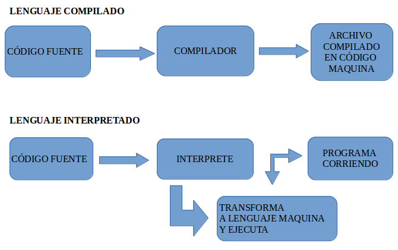

# TEORIA DE PROGRAMACIÓN
El presente archivo trata de dar una lección concisa, pero a la vez profunda, acerca de todo lo necesario sobre lógica de programación. Aquí se encontrarán los temas seccionados y explicados de forma precisa y práctica, intentando abarcar la mayoria de las areas importantes como son los operadores, los tipos de datos y la programación orientada a objetos.

Esperamos sea de mucha utilidad. 😃😃

---

## 1. DEFINICIONES
### **1.1. ¿Que es la programación?**
La "Programación" en su sentido más amplio es la acción de programar, que implica ***ordenar, estructurar o componer una serie de acciones cronológicas para cumplir un objetivo***. De esta definición tan amplia podemos decir que la programación se puede aplicar en ámbitos tan diversos como los eventos sociales, los medios de comunicación, la resolución de cualquier tipo de problemas y, por supuestro, el mundo informático y las computadoras.

Ya entrando en una definición más formal, y sobre todo más útil a lo que venimos a estudiar; aunque tambien mucho más acotada. Podemos decir que en informática ***la programación es el uso de lenguajes informáticos para darle instrucciones a un ordenador***. Estás instrucciones estarán enfocadas en lograr que la computadora realice distintas tareas por nosotros, como cálculos matemáticos, decisiones lógicas, almacenamiento de datos, etc. Luego el fin de la programación será generar al final un resultado útil para el hombre. Otra definición acerca de la programación deja esto bien en claro. El fin último de la programación resulta en ***crear soluciones informáticas a problemas del mundo real***.

Dejo esta pequeña definición a modo de resumen:
>“La Programación es la acción de dar órdenes a una máquina en pos de crear soluciones con software a problemas reales del hombre”.
>
>José De Obaldía

### **1.2. ¿Qué es un Algoritmo y un Programa?**
Como _algoritmo_ denominamos un conjunto ordenado y finito de operaciones simples a través del cual podemos hallar la solución a un problema. Los algoritmos nos permiten ejecutar una acción o resolver un problema mediante una serie de instrucciones definidas, ordenadas y finitas. Así, dado un estado inicial y una entrada, y siguiendo los sucesivos pasos indicados, se llega al estado final y se obtiene una solución.

El conjunto de algoritmos constituye un _programa_. En general la palabra programa tambien se suele usar para llamar al producto informático terminado y listo para usar.

### **1.3 Lenguajes de Programación**
Estas instrucciones no se pueden dar de cualquier manera a la máquina, se deben dar de manera que la misma pueda entenderlas y luego ejecutarlas. Con este fin se crearon los lenguajes de programación, para proporcionar una redacción (sintaxis) especifica de los comandos que le vamos a suminsitrar a la máquina.

Hay muchos lenguajes de programación dependiendo de quien los haya creado y el fin especifico para el que se quieran usar, en general, los más conocidos tienen una sintaxis bastante similar entre ellos.

La sintaxis de los programas se basa en una serie de palabras clave que indican ordenes para la coputadora. Estas palabras clave no se podrán usar para otra cosa que no sea el fin que se dispuso, por eso se llaman palabras reservadas.

Un ejemplo de esto podemos encontrarlo en el lenguaje "Java", donde para almacenar un dato debemos declarar el "espacio de guardado" con la palabra reservada `int`, asignarle un nombre y luego utilizar el símbolo `=` para asignarle a ese espacio el valor deseado. Finalmente debemos cerrar la instrucción con el símbolo `;`. No podemos utilizar ninguna de estas palabras o símbolos para otra cosa que no sea esta, caso contrario confundiriamos al ordenador.

```JAVA
int datoNumerico = 1;
```

Las instrucciones en general se dan por via de comandos de texto, todo texto que represente una instrucción se denomina _código_.

### **1.4 Compilación e Interpretación**
Otra cosa a tener en cuenta es que las máquinas por más que puedan realizar muchas tareas trabajan sobre la base [0,1] es decir solo entienden ceros y unos, por lo que todo el código que nosotros podamos escribir se deberá traducir a lenguaje máquina (lenguaje binario) para poder ser usado. A esta acción se la denomina _compilar_ y hay programas especializados en la compilación de cada lenguaje a código máquina. Son los _compiladores_.

Últimamente y gracias a los avances en rendimiento de los ordenadores se ha optado por otra alternativa a los lenguajes compilados, los lenguajes interpretados. Aquí el código se compila en tiempo real y se ejecuta inmediatamente y al mismo tiempo, eliminando así la necesidad de un archivo intermedio. 

Esto es una ventaja para el desarrollo de software y la simplicidad de uso, pero trae aparejado el problema de un mayor consumo de recursos. Además, la velocidad de ejecución del programa nunca será tan rápida como la de los lenguajes compilados.



### **1.5 Paradigmas de Programación**
Un paradigma de programación es una manera o estilo de programación de software. Los lenguajes de programación adoptan uno o varios paradigmas en función del tipo de órdenes que permiten implementar. Los hay muchos, pero en general solo dos son los más usados.

- **Paradigma imperativo:** Los programas consisten en una sucesión de instrucciones o conjunto de sentencias, como si el programador diera órdenes concretas. El desarrollador describe en el código paso por paso todo lo que hará su programa. El programa tiene un flujo de lectura en orden descendente y hay algunas sentencias que nos permiten controlar el flujo de este.

    Es el paradigma de programación más antiguo y en el se fundan todos los demás, casi toda la lógica que vamos a explicar en este artículo se fundamenta en este paradigma.

- **Programación orientada a objetos:** En este modelo se construyen funciones y métodos que realicen tareas específicas y luego se los va agrupando en colecciones afines las cuales se llamarán "objetos".
Permite separar los diferentes componentes de un programa (modularizar el código), simplificando así su creación, depuración y posteriores mejoras. La programación orientada a objetos disminuye los errores y promociona la reutilización del código. Es una manera especial de programar, que se acerca de alguna manera a cómo expresaríamos las cosas en la vida real.

    Podemos definir un objeto como una estructura abstracta que, de manera más fiable, describe un posible objeto del mundo real y su relación con el resto del mundo que lo rodea a través de interfaces (conjuntos de acciones que puede realizar).  Ejemplos de lenguajes de programación orientados a objetos serían Java, Python o C#.

---

## 2. VARIABLES Y TIPOS DE DATOS:

### **2.1. Variables**
Las **variables** son espacios reservados en la memoria de  nuestro ordenador que se utilizan para poder guardar datos de manera temporal y usarlos en el programa. Los datos pueden ser numeros, cadenas de texto, o incluso elementos mucho mas complejos, en general se debe aclarar de antemano que es lo que se va a almacenar.

### **2.2. Tipos de Datos**
Especificar que tipo de información se va a almacenar se denomina, _especificar el tipo de dato_, y se debe realizar con una palabra clave reservada. En general los lenguajes comparten algunas de las palabras clave que identifican cada tipo de dato. A continuación dejamos una lista de los más necesarios y universales:

|Tipo de Dato|Descripción
|:---:|:---|
|Integer| Almacena números enteros.|
|Float| Almacena números reales con coma flotante.|
|String| Almacena cadenas de texto y carácteres unicode|
|Boolean| Almacena valores booleanos, es decir `True` o `False`|
|Char| Almacena un caracter de texto|

### **2.3. Tipado Fuerte, debil y dinámico:**

---

## 3. ESTRUCTURAS DE DATOS
En ciencias de la computación, una estructura de datos1​ es una forma particular de organizar datos en una computadora para que puedan ser utilizados de manera eficiente. Diferentes tipos de estructuras de datos son adecuados para diferentes tipos de aplicaciones, y algunos son altamente especializados para tareas específicas.
ARRAY VECTOR Y MATRIZ
LISTAS TIPO PILA Y COLA
ARBOLES
JSON y BSON

https://es.wikipedia.org/wiki/Estructura_de_datos
https://en.wikipedia.org/wiki/List_of_data_structures#Linear_data_structures
https://medium.com/techwomenc/estructuras-de-datos-a29062de5483
https://openwebinars.net/blog/que-son-las-estructuras-de-datos-y-por-que-son-tan-utiles/

---

## 4. FUNCIONES Y PROCEDIMIENTOS:
las funciones: 
Son trozos de codigo que se pueden reutilizar al invocarlos. Su sintaxis es sencilla, se declaran con la palabra "function" y se les coloca un nombre, luego se le pasan parámetros a traves de un par de paréntesis y por último se escribe el código a reutilizar encerrado entre llaves. 
Tambien es posible hacer que la funcion retorne un valor utilizando la sentenia "return();", cabe aclarar que esta sentencia además finaliza la ejecucion de la funcion.
### **4.1. ¿Que son los procedimientos?:**
### **4.2. Las funciones, un caso especial de los procedimientos:**

---

## 5. OPERADORES:
Un operador es un signo o símbolo que especifica el tipo de cálculo que se realiza en una expresión. Hay operadores matemáticos, de comparación, lógicos y de referencia.

### **2.1. Operadores de Asignacion:** 
Un operador de asignacion asigna un valor al operando de la izquierda basado en el valor del operando de la derecha.
```javascript
let numero = 10;
numero = 5;     //Asignacion. Asignará el valor de 5.
numero += 5;    //Asignacion de Adicion. Sumará 5 unidades a la variable número. 
numero -= 5;    //Asignacion de Sustraccion. Restará 5 unidades a la variable número.
numero *= 5;    //Asignacion de multiplicacion. Multiplicará por 5 el valor de la variable número.
numero /= 5;    //Asignacion de division. Dividirá por 5 el valor de la variable número.
numero %= 5;    //Asignacion de resto. Hará un cociente donde el númerador será la variable número y el denominador 5. Devolverá el resto.
numero **= 5;   //Asignacion de exponenciacion. Realizará una potenciación de índice 5 a la variable número.
```

### **2.2. Operadores Aritmeticos:**
Son operadores que toman valores numericos (ya sean literales o variables) como sus operandos y retornan un valor numerico unico. Realizan las operaciones aritméticas básicas.

```javascript
let num1 = 10, num2 = 5;

num1--;      //sustraccion en una unidad
num2++;      //incremento en una unidad
num1 + num2; //suma de dos valores
num1 - num2; //resta de dos valores
num1 * num2; //producto de dos valores
num1 / num2; //division de dos valores
num1**num2;  //potencia de base num1
```

### **2.3. Operadores Lógicos o de Comparación:**
Los operadores de comparación se usan para comparar valores y devolver un resultado que sea True, False o Null. Es decir se usan para validaciones lógicas y retornan un valor Booleano. 

```javascript
let num1 = 23;
let num2 = "13";

//Con el operador == validamos si el valor de las dos variables es igual, independientemente del tipo de dato.
num1 == num2;

//Con el operador != validamos si el valor de las dos variables es desigual, independientemente del tipo de dato.
num1 != num2;

//Con los operadores === y !== validamos si son estrictamente iguales o desiguales respectivamente, es decir validamos la igualdad o desigualdad del valor y la igualdad o desigualdad del tipo de dato.
num1 === num2
num1 !== num2

//Con > validamos si num1 es mayor a num2. 
num1 > num2

//Con > validamos si num1 es menor a num2.
num1 < num2

//Con > validamos si num1 es mayor o igual a num2.
num1 >= num2

//Con > validamos si num1 es menor o igual a num2.
num1 <= num2

//Operador de Coalescencia nula. Devuelve el valor de la derecha si lo de la izquierda es null.
const foo = null ?? 'default string';
console.log(foo);
// salida esperada: "default string"
```
Notese que todos los operadores lógicos trabajan devolviendo valores booleanos, es decir valores de true o false. Luego, a los operadores `==` y `!=` se los llama operadores de "semejanza" y a los operadores `===` y `!==`, se los llama operadores de "equivalencia".

### **2.4. Otros operadores Lógicos:**
Estos operadores se utilizan en conjunto con los anteriores para realizar múltiples validaciones en una sola operación.

__Operador AND:__ Si todas las condiciones booleanas son verdaderas, devuelve _true_, caso contrario devuelve _false_.
```javascript
let num1 = 2, num2 = 4;

//Ambas condiciones son verdaderas, por lo que esta sentencia retornará true.
num1 < num2 && num1 != num2;
```
__Operador OR:__ Si al menos una de todas las afirmaciones es verdadera, devolvera _true_, sino devolvera _false_.
```javascript
num1 = 3; num2 = 6;

//La segunda condición no se cumple, pero se cumple al menos una, la primera, por lo que la sentencia retornará true.
num1 < num2 && num1 == num2;
```

__Operador NOT:__ Devuelve el valor opuesto, es decir que si la sentencia se cumple, retornará _false_ y caso contrario, retornará _true_.
```javascript
//La condicion se cumple, se retorna false.
!(num1 < num2);
```

Existen otros operadores basados en puertas lógicas, estos en general no están incluidos por defecto en los lenguajes, pero se pueden modelar a partir de los operadores anteriores. Un ejemplo de modelado es con el operador `xor`. El cual en una funcion javascript se vería de la siguiente manera:
```javascript
function xor(a,b) {
    return(a === !b);
}
```
Donde retornará verdadero solo si ámbas proposiciones booleanas, (`a` y `b`) son distintas. Su tabla de verdad sería la siguiente:


Tambien es importante aclarar la nocion de _"Cortocircuitar"_ en el operador `AND`, la cual es una palabra de la jerga condicional y que expresa que una expresion condicional, por más larga que sea, dejará de evaluarse si se dan determinados casos. Por ejemplo, basta con que en la siguiente expresión, la primer sentencia (`a == b`) retorne _false_, para que toda la expresion se deje de analizar.

`a == b && c !== (a + b) && d === ((c + b) - a)`

Entender esto resulta útil en la optimización de operaciones booleanas complejas o repetitivas, ya que siempre será más óptimo colocar la condición más sencilla de resolver al inicio.

---

## 6. PROGRAMACION IMPERATIVA:

### **6.1. Definiciones**
La **programación imperativa** es el paradigma de programación más antiguo. De acuerdo con este paradigma, un programa consiste en una secuencia claramente definida de instrucciones para un ordenador. 

Los lenguajes de programación imperativa son muy concretos y trabajan cerca del sistema. De esta forma, el código es, por un lado, fácilmente comprensible, pero, por el otro, requiere muchas líneas de texto fuente.

### **6.2. Flujo de un Programa:**
Todo programa tiene un orden de ejecución de las sentencias, esto se denomina _flujo de ejecucion del programa_. Por defecto el flujo es del tipo secuencial si no se especifica otra cosa. Esto significa que las sentencias se ejecutan en secuencia, una después de otra, en el orden en que se sitúan.

Para gestionar las instrucciones, se integran estructuras de control de flujo, que permiten cambiar el flujo normal a conveniencia. Entre las sentencias de control de flujo encontramos generalmente dos tipos:

1. **Sentencias Condicionales:** Ejecutan una porción de código si se cumple una condición booleana dada, estas son las siguientes:

    - Condicional _if-else_
    - Condicional _switch-case_

2. **Bucles:** Ejecutan un bloque de código de manera reiterada mientras se mantenga una condición booleana dada, son útiles para tareas repetitivas.

    - Bucle _for_
    - Bucle _while_
    - Bucle _do-while_

3. **Sentencia "try-catch-finally":** Para el manejo de excepciones se incluye la sentencia try-catch-finally. La cual nos permite especificar que hacer si se produce un error en la ejecución del programa.

Cuando estamos haciendo uso de otro paradigma de programación, como el orientado a objetos, este flujo normal no se cumple a rajatabla, pero debemos tener en claro que es la forma nativa de leer las instrucciones en la mayoria de los lenguajes, por no decir en todos.

### **6.3. Sentencia Condicional "if-else":**

Ninguna de las sentencias anteriores tiene en cuenta que se puedan producir errores en tiempo de ejecución de un programa y por tanto Java necesita de un conjunto de palabras nuevas para tener en cuenta que cualquier código puede fallar o ser mal interpretado en tiempo de ejecución.

Vamos a ver tres de las palabras reservadas para tratamiento de excepciones:

- Try.

- Catch.

- Finally.


### **6.2. Sentencia Condicional "switch-case":**
### **6.3. Bucle "for":**
### **6.4. Bucle "while":**
### **6.5. Bucle "do-while":**


---

## 7. POO EN PROFUNDIDAD:
## Conceptos de POO:
La programación orientada a objetos es un paradigma de programacion en donde se busca crear elementos funcionales de manera sencilla e intuitiva. Para ello creamos en primera instancia plantillas generales y genéricas (clases), que nos permitan luego crear objetos diversos pero con cualidades o atributos similares y luego utilizar funciones o métodos para que nuestro objeto adquiera funcionalidad. Su utilidad es que podemos resumir mucho código de forma intuitiva.

Otra forma de ver a la programación orientada a objetos es que con ella creamos distintas funciones (métodos) y las agupamos según afinidad en objetos. De este modo podemos reutilizar mucho código simplemente llamando al objeto y a la funcion que necesitemos en lugar de declararla nuevamente.

Notesé que para que este paradigma funcione de manera correcta debemos hacer funciones lo más genéricas (y por ende lo más reutilizables) posibles. En otras palabras, debemos trabajar por crear una lógica en las funciones que este completamente desacoplada de los distintos frameworks que utilicemos para desarrollar nuestro producto informático.


Veamos algunos conceptos importantes:
1. __Clase:__ Es una porción de código que contendra todas las características o atributos de nuestro objeto (las variables), y todas las cosas que puede hacer nuestro objeto (los métodos). Se utiliza como una base para objetos genéricos. Por ejemplo podemos crear una clase `Usuario`, la cual tendra los métodos `.notificar()`, `.consultarSaldo()`, `.modificarPerfil()` y `.verCompras()`.

2. __Objeto:__ Es el resultado de instanciar nuestra clase, es decir el elemento que surge cuando llamamos a una clase y la usamos. Este elemento nuevo es un objeto propiamente dicho. Los objetos no dejan de ser colecciones de elementos.

3. __Atributos:__ Son todas las caracteristicas que tendra nuestro objeto, es decir las variables. Estas se declaran en la "plantilla" clase, dentro de una funcion especial llamada contructor.

4. __Metodos:__ Los métodos son simplemente funciones clásicas, solo que tienen una sintaxis especial que unicamente se puede usar dentro de la clase.

5. __Constructor:__ Es una funcion especial y obligatoria que debe tener cualquier clase, aqui se inicializan las variables o atributos que tendrá nuestro objeto.

6. __Métodos estaticos:__ Son métodos que se pueden utilizar sin necesidad de definir ningún objeto. Se los puede llamar y usarlos sin antes crear al objeto.

7. __Polimorfismo:__ Es la capacidad de un objeto de comportarse de manera distinta dependiendo de los valores de las variables o atributos. Un ejemplo de ello es que podemos crear un método `notificar()` en una clase `User`, y hacer que este método envie un mail, un whatsapp o un mensaje de texto dependiendo de los atributos que tenga el objeto creado. Por ejemplo un usuario cuyos atributos nos digan que no tiene email o whatsapp pero si un numero de telefono, sera notificado de las novedades solo por mensajes de texto.

8. __Herencia:__ Es la capacidad de heredar metodos y atributos de otra clase, y usarlas en una nueva.

9. __Abstraccion:__ Es una forma de programar clases en donde se busca definir un objeto con las mínimas lineas de codigo, métodos y atributos posibles, y a su vez con la mayor generalidad posible.

10. __Encapsulamiento:__ Es declarar nuestras variables de maneras protegidas o privadas, para que los demás objetos no puedan acceder a ellos. Esto es por seguridad y para evitar conflictos.

11. __Setter y getter:__ Los setters son métodos para modificar los atributos de un objeto, con la sentencia "set" definimos o modificamos un atributo, y con la sentencia "get" retornamos el valor de un atributo.

Realizemos con lo anterior un ejemplo de clase genérica. Esta clase sera la "plantilla" para crear animales.
```javascript
//Declaramos una nueva clase de nombre "animal".
class animal {

    //Elemento constructor, donde declaramos las variables.
    constructor(especie, edad, color) {

        //Inicializamos variables a usar en la clase con this.nombreDeLaVariable = valor; esta sintaxis solo se usa dentro de las clases.
        this.especie = especie;
        this.edad = edad;
        this.color = color;

        this.info = null;
    }

    //Método o función para saludar, el objeto nos va a decir sus características.
    saludar() {
        info = `Soy un ${this.especie}, tengo ${this.edad} años y soy de color ${this.color}.`;
        document.write(this.info + "<br>");
    }

    //Método con polimorfismo. El método se comporta de manera distinta dependiendo de la especie.
    ladrar() {
        if(this.especie == perro) {
            document.write("<b>¡WaW!<b><br>");
        } else {
            document.write("El animal no puede ladrar ya que es un" + this.especie + "<br>");
        }
    }
    //Método estático de ejemplo.
    static buenosDias(){
        alert("Hola, buenos dias");
    }

    //Métodos setter y getter:
    set setModificarEspecie(newName){
        this.especie = newName;
    }
    get getEspecie() {
        return this.especie;
    }
}
```
Es importante resaltar que:
1. Las variables declaradas dentro de los paréntesis y que utilizamos para recibir los parámetros, son distintas a las variables que se inicializan en el constructor. Por esto debemos igualarlas.
2. Las "arrow-function" no funcionan dentro de las clases.
3. No podemos nombrar a ningún objeto con el mismo nombre de la clase utilizada.

Para utilizar la clase "animal" empleamos la siguiente sintaxis.
```javascript
//Instanciamos la clase animal y creamos tres objetos con sus atributos.
const perro = new animal("perro", "5 años", "marrón");
const gato = new animal("gato", "2 años", "negro");
const perico = new animal("perico", "1 año", "verde");

//Imprimimos el valor del atributo color, del objeto "perro".
document.write(perro.color);

//Imprimimos la información de los atributos del  objeto "perro".
document.write(perro.info + "<br>");

//Ejecutamos el método saludar para cada objeto animal.
perro.saludar();
gato.saludar();
perico.saludar();

//Llamamos al método que posee polimorfismo.
perro.ladrar();   //Si el objeto tiene la especie perro se imprimira ¡WaW!, caso contrario se dirá que el objeto no puede ladrar.
perico.ladrar();  //En el caso del perico, se dirá que este animal no puede ladrar.

//Uso de un método estatico, no hace falta llamar a ningún objeto, la funcion simplemente se ejecuta llamando al método e indicandole la clase que lo contiene.
animal.buenosDias();

//Uso del setter. Para usarlo lo hacemos como si fuera una propiedad más.
perico.setModificarEspecie = "canario";
//uso del getter.
document.write(perico.getEspecie);
```
Utilizemos ahora conceptos de Herencia en nuestras clases, para ello utilizamos la palabra reservada extends.
```javascript
//Creamos una clase "dog" que extienda a la clase "animal".
class dog extends animal {
    constructor(especie,edad,color,raza) {
        //Con la siguiente sentencia indicamos que los atributos especie, edad y color. Se heredan de la clase animal.
        super(especie,edad,color);

        //El nuevo atributo raza lo declaramos de la manera tradicional.
        this.raza = raza;
    }
}
```
Utilicemos nuestra clase "dog", recien creada:
```javascript
//Creamos un objeto perrito de la clase dog, vemos que podemos usar los métodos de la clase animal sin ningun problema.
const perrito = new dog("perro","2 años","gris","doberman");
perrito.saludar();
perrito.ladrar();
```
## Operador .this()
El operador this es una forma de llamar al objeto contexto de JavaScript en el cual se está ejecutando el código actual. Es decir hace referencia al elemento en el que se esta ejecutando.
Si this se usa en el contexto de ejecucion global (fuera de cualquier funcion u objeto), este operador se refiere al objeto global.

Ejemplos de uso de ``.this` en contextos locales o de funciones.
```javascript
//Un ejemplo
function f1(){
  return this;
}

f1() === window; // objeto global


//otro ejemplo.
var o = {
  prop: 37,
  f: function() {
    return this.prop;
  }
};

console.log(o.f()); // logs 37
```

Ejemplos de uso de `.this` en contextos globales.
```javascript
console.log(this.document === document); // true

// En los navegadores web, el objeto window también es un objeto global:
console.log(this === window); // true

this.a = 37;
console.log(window.a); // 37
```
El valor de this permanecera en el estado en el que se encuentre actualmente si se trabaja en modo estricto.
### **7.. Lenguajes Basados en Prototipos:**

## 8. NOCIONES DE "CLEAN CODE"


