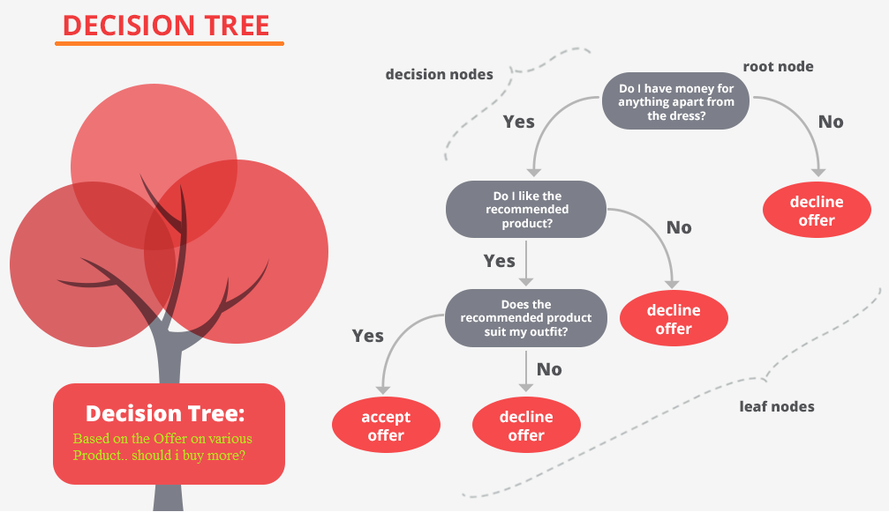
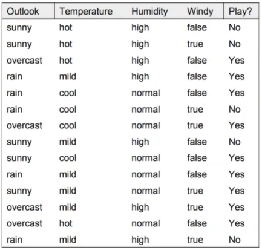
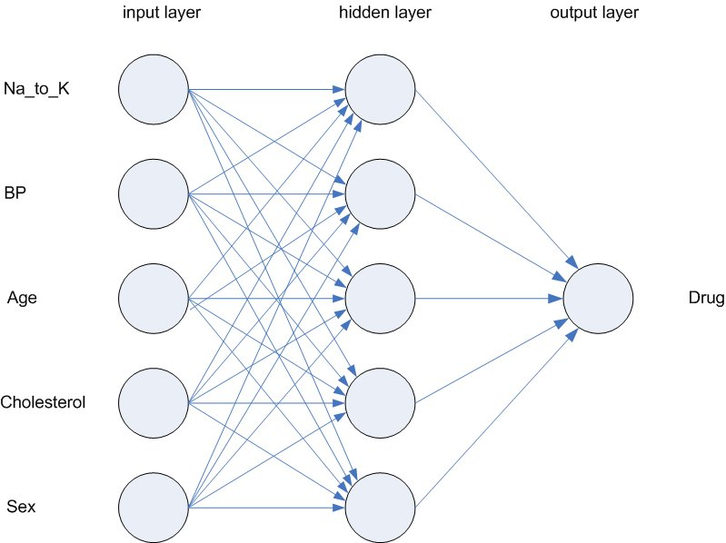

### 1. INTRODUCCION AL APRENDIZAJE SUPERVISADO
A continuación hablaremos del aprendizaje supervisado, recordemos que el mismo es un algoritmo que le permite a un ordenador el "aprendizaje" de patrones y su entrenamiento se caracteriza por un entorno donde los datos de entrada vienen etiquetados con sus correspondientes salidas.

Se llama supervisado porque simula que un tutor provee los resultados correctos. 

La meta es que el sistema pueda reproducir un modelo que produce salidas a través de entradas. Ej: Reconocimiento de fotos de animales.

A continuación veremos distintas técnicas de aprendizaje supervisado para el reconocimiento de patrones, orientados a la regresión y la clasificación.

---

## 2. ÁRBOLES DE DECISIÓN
Son modelos de predicción utilizados en diversas disciplinas para modelar la solución a un problema mediante sucesivas decisiones lógicas. Son modelos simples pero muy poderosos y su uso se extiende desde la Inteligencia Artificial hasta la Economía.

https://aprendeia.com/arboles-de-decision-regresion-teoria-machine-learning/

## **2.1. Definiciones**
Todos los Árboles poseen una serie de **nodos**, llamados "hojas" interconectados por **flechas**, llamadas comunmente "ramas". Todos los nodos y las ramas están etiquetado convenientemente para su fácil identificación y el nodo madre de todos se llama **nodo raíz**. Cada nodo indica el momento de la toma de una decisión lógica, y cada flecha indica una ramificación del arbol.

La **altura** del árbol será el numero de decisiones que se deben tomar para llegar al final del árbol. En el ejemplo anterior tendríamos un árbol de altura 3.

Entre sus ventajas tenemos que:
-	Son fáciles de entender e interpretar por personas.
-	Son capaces de manejar múltiples tipos de datos.
-	Su implementación utiliza una menor cantidad de suposiciones sobre los datos y estos requieren de menor preparación (preprocesamiento) que otros modelos.
-	Están estrechamente vinculados con las reglas de asociación, que a su vez son cercanas a modelos de razonamiento más complejo.

Luego, entre sus desventajas tenemos:
-	No alcanzan el mismo nivel de performance que otros modelos. En particular su desempeño cae cuando:
    - El problema depende de muchos atributos.
    - Existen dependencias lineales/simples de representar de manera no discreta.

Luego, los árboles de decisión tienen dos usos genéricos muy importantes. La _clasificación de información_ y la _regresion_ para el modelado predictivo, tanto para atributos discretos o continuos.

### **1.2.¿Cómo construir un Arbol de Decision?** 
El procedimiento básico para formar un árbol es sumamente sencillo y consiste en elegir de manera recursiva un criterio de partición, cada evaluación de este criterio creará un nodo del árbol y los distintos caminos a seguir serán las ramas del mismo.

Debemos tener cuidado al elegir el criterio de evaluación y la forma en la deberemos de evaluarlo, esto para evitar operaciones de decisión que sean innecesarias y prevenir “sobreramificar” el árbol.

Tambien es importante tener cuidado al construir los árboles de decisión porque en situaciones complejas, donde tengamos varias posibilidades de árbol, nos será imposible evaluar cual es el más eficiente. Esto debido a que los análisis de fuerza bruta no serán posibles computacionalmente, ya que para N atributos binarios tenemos:
-	N árboles con un test.
-	N x (N-1) árboles con dos test.
-	N x (N-1) x (N-1) árboles con tres test.

Luego, existe un algorítmo que generaliza el procedimiento anterior, llamado algoritmo TDIDT (Top Down Induction for Decision Trees). Este es el algoritmo básico para la construcción de árboles de regresión y clasificación, y es del cual partiremos para empezar a construirlos.

**Objetivo:** Se buscará clasificar los elementos de un conjunto de entrada "S", en distintas clases {k1, k2, ..., kn} y cada uno de los elementos estará determinado por un set de {a1, a2, a3, ..., an} atributos, los cuales poseerán un valor. Luego, los valores podrán ser discretos, por ejemplo _V = {v1, v2, v3, ..., vn}_ o continuos _V = {x / x<=0 && x>k}_.

Con lo anterior definimos un algoritmo que nos permita clasificar el conjunto S en distintas clases.

**Algoritmo:**
1. Comenzamos con todos los elementos del conjunto S asignados al nodo raíz, el conjunto será nuestro conjunto de prueba.
2. Si todos los elementos de S pertenecen a la misma clase K1, entonces solo deberemos rotular la raíz como K1.
3. Si esto no es cierto, realizaremos lo siguiente:
    1. Eligimos el mejor atributo “an” para particionar.
    2. Dividimos el conjunto S en “n” subconjuntos (S1, S2, …, Sn) según los valores (v1, v2, …, vn) del atributo "an".
    3. Recursivamente armar sub-arboles (T1, T2, …, Tn) para S1, S2, …, Sn.

https://www.cs.put.poznan.pl/jstefanowski/sed/DM-5-newtrees.pdf

### **1.3. ¿Cómo elegimos el mejor atributo?**
Será aquel que resulte más útil para clasificar los datos. Necesitaremos por lo tanto una función de “pureza”, que mida que tan bien un atributo separa a los datos según sus etiquetas asociadas.

Ejemplo de uso de los Árboles:
Calculemos los valores al comenzar (sin haber particionado). Algoritmo ID3

Poder de discernimiento de Árboles de Decision como función de su altura/profundidad:
Si nosotros solo permitimos una decisión en el árbol(altura = 1).
Él método de construcción solo considera un atributo a la vez, y la decisión solo tomará una porción de ese atributo. Por ejemplo para dos dimensiones a tomar (dos atributos a evaluar), la función solo podrá hacer cortes en forma de líneas horizontales o verticales.

### **1.4. Un ejemplo teórico**
Veamos un ejemplo:

Empezemos construyendo nuestro setup, y comencemos con un ejemplo para poder establecer el precio de una vivienda en función de su superficie construida. Esta será una función "f" que convierta de reales a reales F:A->B, es decir las variables son continuas.

Luego tomemos un conjunto de datos, "Dataset", de donde podamos construir un modelo para el precio de las viviendas.
Por ejemplo:

Creemos el siguiente dataset que nos indica las condiciones del clima y si podemos salir o no a jugar afuera. En base a el debemos crear un árbol de decision.

### **1.5. ¿Qué sigue luego de la construcción del Arbol?**
Una vez contruido el árbol, podemos traducir los caminos de las raíces en reglas. “Si el pronóstico es soleado y la humedad es baja, salga a jugar”.

### **1.6. Implementación de Árbol simple en Javascript**

---

## 3. REGRESIONES LINEALES Y POLINÓMICAS, DECENSO POR EL GRADIENTE Y REGRESIONES LOGÍSTICAS
A continuación veremos, entre otros, dos modelos muy importantes. El modelo de Regresion Lineal y el de Regresión Logística. Ambos algoritmos son bastante diferentes principalmente porque uno se utiliza para proyectos relacionados a regresión mientras que el otro es para proyectos de clasificación. Veamos de manera sencilla esto.

Empezemos construyendo nuestro setup, y comencemos con un ejemplo para poder establecer el precio de una vivienda en función de su superficie construida. Esta será una función "f" que convierta de reales a reales F:A->B, es decir las variables son continuas.

Luego tomemos un conjunto de datos, "Dataset", de donde podamos construir un modelo para el precio de las viviendas.
Por ejemplo:

|Size in feet^2 (x)| Price ($) in 1000's (y)| 
|:---:|:---:|
|2104|460|
|1416|232|
|1534|315|
|852|178|
|...|...|

Donde definiremos el valor m como el número de registros en el dataset, o el número de ejemplos de entrenamiento, ya que cada registro es un dato por el cual se puede ajustar el sistema. Las "x" serán las variables de entrada y las "y" las variables de salida o "target values".

### **Regresión Lineal**
La Regresión Lineal, se utiliza para proyectos de regresión, es decir cuando queremos predecir un valor numérico, por ejemplo, queremos predecir el precio de una casa o el sueldo de una persona de acuerdo a los años de experiencia.

**MODELO DE APRENDIZAJE (COMO AJUSTAR LA LINEA RECTA)**
Decenso por el gradiente, es un método iterativo que nos permite hallar el mínimo de una función

## **Decenso por el Gradiente**

### **Regresión Logística**
Por su parte el algoritmo de Regresión Logística se utiliza para proyectos de clasificación.

---

## REDES NEURONALES SIMPLES:
La estrategia para la resolución de problemas en los sistemas conexionistas, como las redes neuronales, es totalmente opuesta a los llamados sistemas expertos. En los sistemas expertos se programan soluciones de forma explícita y la computadora solo debe ejecutar las soluciones dadas. En contrapartida, en los sistemas de machine learning, no programamos la solución, sino que entrenamos un sistema con ejemplos hasta que logre "aprender" el o los patrones deseados.

Una de las ventajas de las redes neuronales es que sus soluciones son robustas al ruido en entornos borrosos, es decir funcionan muy bien en entornos similares a la vida real en donde los datos de entrada no son exactos.

Luego, se dice que los sistemas de machine learning están inspirados en la forma en la que el cerebro humano funciona. Ya que la inteligencia radica no en las neuronas en si, sino que lo hace en la sinapsis de las mismas y sus conexiones entre ellas.

### **1.1. Componentes de un sistema neuronal**
- Un conjunto de procesadores elementales (neuronas): Las neuronas son procesadores elementales que podriamos considerarlos elementalmente "tontos", y en donde sería deseable que no guarden ningún tipo de información (la información se guardará en los pesos sinápticos). Una ventaja de esto es que si se muere una neurona, el sistema seguirá funcionando.

- Un patrón de conectividad o arquitectura.
- Una dinámica de activaciones.
- Una regla o dinámica de aprendizaje.
- El entorno donde opera.

Veamos algunos conceptos:
- Peso Sináptico: Cero es desconectado

### La neurona artificial
Es un dispositivo no lineal, que recibirá un conjunto de entradas con sus pesos sinápticos. Posee una regla de propagación. Funcion de activación

Las redes neuronales son modelos simples del funcionamiento del sistema nervioso. Las unidades básicas son las neuronas, que generalmente se organizan en capas, como se muestra en la siguiente ilustración.

Estructura de una red neuronal
Una red neuronal es un modelo simplificado que emula el modo en que el cerebro humano procesa la información: Funciona simultaneando un número elevado de unidades de procesamiento interconectadas que parecen versiones abstractas de neuronas.

Las unidades de procesamiento se organizan en capas. Hay tres partes normalmente en una red neuronal : una capa de entrada, con unidades que representan los campos de entrada; una o varias capas ocultas; y una capa de salida, con una unidad o unidades que representa el campo o los campos de destino. Las unidades se conectan con fuerzas de conexión variables (o ponderaciones). Los datos de entrada se presentan en la primera capa, y los valores se propagan desde cada neurona hasta cada neurona de la capa siguiente. al final, se envía un resultado desde la capa de salida.

La red aprende examinando los registros individuales, generando una predicción para cada registro y realizando ajustes a las ponderaciones cuando realiza una predicción incorrecta. Este proceso se repite muchas veces y la red sigue mejorando sus predicciones hasta haber alcanzado uno o varios criterios de parada.

Al principio, todas las ponderaciones son aleatorias y las respuestas que resultan de la red son, posiblemente, disparatadas. La red aprende a través del entrenamiento. Continuamente se presentan a la red ejemplos para los que se conoce el resultado, y las respuestas que proporciona se comparan con los resultados conocidos. La información procedente de esta comparación se pasa hacia atrás a través de la red, cambiando las ponderaciones gradualmente. A medida que progresa el entrenamiento, la red se va haciendo cada vez más precisa en la replicación de resultados conocidos. Una vez entrenada, la red se puede aplicar a casos futuros en los que se desconoce el resultado.