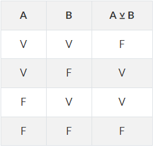

# CURSO DE JAVASCRIPT - NIVEL BASICO
Este es un curso completo de JavaScript, el lenguaje de programación más utilizado para el desarrollo web y soluciones online. Javascript es un lenguaje de programación interpretado (no compilado), que sigue los estándares ECMAScript. Se define como orientado a objetos, basado en prototipos, imperativo, débilmente tipado y dinámico.

Se utiliza principalmente del lado del cliente, aunque ultimamente aquirio un gran uso del lado de los servidores con la aparición de NodeJS. Luego, su uso en aplicaciones externas a la web, por ejemplo en documentos PDF, aplicaciones de escritorio (mayoritariamente widgets) es también significativo.

Para más información dejamos un enlace muy útil para profundizar en este lenguaje: [Ir al sitio](https://www.w3schools.com/js/)

---

## 1. VARIABLES
En Javascript el tipo de dato no se escribe, pero este se inicializa al declarar la variable (tipado debil) y se mapeará constantemente (tipado dinámico). 

### **1.1. Ámbito de Variables**
Existen tres formas de declarar variables en Javascript, cada una tendrá un alcance (scope), distinto.

1. `var`: Son las variables de ámbito global. Cuando declaramos una variable con var, el compilador automáticamente va a llevar esta variable e inicializarla al inicio del archivo, lo que se llama "hoisting". Esto nos permite utilizar las variables en cualquier lugar del archivo, incluso "antes de inicializarlas".

2. `let`: Son variables del tipo local y solo se pueden acceder a ellas cuando nos encontramos en el mismo bloque en el que han sido declaradas.

3. `const`: Es un espacio en memoria donde el valor declarado es constante. No podemos acceder a su valor antes de su declaración ni reasignarle un valor. Se deben inicializar obligatoriamente.

    Ejemplo:
    ```javascript
    //Scope Global
    var recipiente = 'papel';

    //Scope Local
    let variableLocal = 553;

    //Scope Local, dentro de una función.
    function name() { let variable = 5 }

    //Declaración de una constante.
    const numberPi = 3.141592653;
    ```
Si queremos inicializar una variable sin forzar un valor por defecto, podemos inicializarla con el valor `null`.

Ejemplo: `let variable = null;`

### **1.2. Typeoff**
El método `typeoff();` es un método que nos devuelve el tipo de dato de la variable que le damos por parámetros lo cual es sumamente útil durante el desarrollo.

---

## 2. OPERADORES
Un operador es un signo o símbolo que especifica el tipo de cálculo que se realiza en una expresión. Hay operadores matemáticos, de comparación, lógicos y de referencia.

### **2.1. Operadores de Asignacion:** 
Un operador de asignacion asigna un valor al operando de la izquierda basado en el valor del operando de la derecha.
```javascript
let numero = 10;
numero = 5;     //Asignacion. Asignará el valor de 5.
numero += 5;    //Asignacion de Adicion. Sumará 5 unidades a la variable número. 
numero -= 5;    //Asignacion de Sustraccion. Restará 5 unidades a la variable número.
numero *= 5;    //Asignacion de multiplicacion. Multiplicará por 5 el valor de la variable número.
numero /= 5;    //Asignacion de division. Dividirá por 5 el valor de la variable número.
numero %= 5;    //Asignacion de resto. Hará un cociente donde el númerador será la variable número y el denominador 5. Devolverá el resto.
numero **= 5;   //Asignacion de exponenciacion. Realizará una potenciación de índice 5 a la variable número.
```

### **2.2. Operadores Aritmeticos:**
Son operadores que toman valores numericos (ya sean literales o variables) como sus operandos y retornan un valor numerico unico. Realizan las operaciones aritméticas básicas.

```javascript
let num1 = 10, num2 = 5;

num1--;      //sustraccion en una unidad
num2++;      //incremento en una unidad
num1 + num2; //suma de dos valores
num1 - num2; //resta de dos valores
num1 * num2; //producto de dos valores
num1 / num2; //division de dos valores
num1**num2;  //potencia de base num1
```

### **2.3. Operadores Lógicos o de Comparación:**
Los operadores de comparación se usan para comparar valores y devolver un resultado que sea True, False o Null. Es decir se usan para validaciones lógicas y retornan un valor Booleano. 

```javascript
let num1 = 23;
let num2 = "13";

//Con el operador == validamos si el valor de las dos variables es igual, independientemente del tipo de dato.
num1 == num2;

//Con el operador != validamos si el valor de las dos variables es desigual, independientemente del tipo de dato.
num1 != num2;

//Con los operadores === y !== validamos si son estrictamente iguales o desiguales respectivamente, es decir validamos la igualdad o desigualdad del valor y la igualdad o desigualdad del tipo de dato.
num1 === num2
num1 !== num2

//Con > validamos si num1 es mayor a num2. 
num1 > num2

//Con > validamos si num1 es menor a num2.
num1 < num2

//Con > validamos si num1 es mayor o igual a num2.
num1 >= num2

//Con > validamos si num1 es menor o igual a num2.
num1 <= num2

//Operador de Coalescencia nula. Devuelve el valor de la derecha si lo de la izquierda es null.
const foo = null ?? 'default string';
console.log(foo);
// salida esperada: "default string"
```
Notese que todos los operadores lógicos trabajan devolviendo valores booleanos, es decir valores de true o false. Luego, a los operadores `==` y `!=` se los llama operadores de "semejanza" y a los operadores `===` y `!==`, se los llama operadores de "equivalencia".

### **2.4. Otros operadores Lógicos:**
Estos operadores se utilizan en conjunto con los anteriores para realizar múltiples validaciones en una sola operación.

__Operador AND:__ Si todas las condiciones booleanas son verdaderas, devuelve _true_, caso contrario devuelve _false_.
```javascript
let num1 = 2, num2 = 4;

//Ambas condiciones son verdaderas, por lo que esta sentencia retornará true.
num1 < num2 && num1 != num2;
```
__Operador OR:__ Si al menos una de todas las afirmaciones es verdadera, devolvera _true_, sino devolvera _false_.
```javascript
num1 = 3; num2 = 6;

//La segunda condición no se cumple, pero se cumple al menos una, la primera, por lo que la sentencia retornará true.
num1 < num2 && num1 == num2;
```

__Operador NOT:__ Devuelve el valor opuesto, es decir que si la sentencia se cumple, retornará _false_ y caso contrario, retornará _true_.
```javascript
//La condicion se cumple, se retorna false.
!(num1 < num2);
```

Existen otros operadores basados en puertas lógicas, estos en general no están incluidos por defecto en los lenguajes, pero se pueden modelar a partir de los operadores anteriores. Un ejemplo de modelado es con el operador `xor`. El cual en una funcion javascript se vería de la siguiente manera:
```javascript
function xor(a,b) {
    return(a === !b);
}
```
Donde retornará verdadero solo si ámbas proposiciones booleanas, (`a` y `b`) son distintas. Su tabla de verdad sería la siguiente:



Tambien es importante aclarar la nocion de _"Cortocircuitar"_ en el operador `AND`, la cual es una palabra de la jerga condicional y que expresa que una expresion condicional, por más larga que sea, dejará de evaluarse si se dan determinados casos. Por ejemplo, basta con que en la siguiente expresión, la primer sentencia (`a == b`) retorne _false_, para que toda la expresion se deje de analizar.

`a == b && c !== (a + b) && d === ((c + b) - a)`

Entender esto resulta útil en la optimización de operaciones booleanas complejas o repetitivas, ya que siempre será más óptimo colocar la condición más sencilla de resolver al inicio.

---

## 3. OBJETO MATH
Sin entrar aún en el paradigma de Programación Orientada a Objetos, podemos decir que el objeto math es una funcionalidad de javascript que posee una gran cantidad de procedimientos almacenados adosados a este. Estos procedimientos o métodos nos son muy útiles para realizar cálculos matemáticos.

Para poder usar estos procedimientos debemos llamar al objeto Math, y seguido a este, separado por un punto, indicar el método del que vamos a hacer uso. Ej: `Math.max();`. Entre paréntesis le pasaremos los datos que se necesiten para los cálculos.

```JS
let n1=10, n2=57, n3=15;

//Uso del objeto Math para devolver el valor máximo de una cantidad "n" de parámetros.
Math.max(n1, n2, n3); 
```

Algunos de los métodos mas usados del objeto Math(), son los siguientes.
|Método|¿Que es lo que hace?|
|:---:|:--- |
|`.sqrt()`| Devuelve la raíz cuadrada positiva de un número|
|`.cbrt()`| Devuelve la raíz cúbica real de un número|
|`.max()` | devuelve el valor máximo de "n" parámetros|
|`.min()` | devuelve el valor mínimo de "n" parámetros|
|`.random()` | devuelve un número pseudo-aleatorio entre 0 y 1|
|`.round()` | Redondea un número al entero más cercano|
|`.fround()` | devuelve la representacion flotante de precision simple más cercana de un número|
|`.floor()` | Devuelve el mayor entero menor que o igual a un número|
|`.trunc()` | Devuelve la parte entera del número x, y elimina los dígitos fraccionarios|
|`.PI` | Nos devuelve el valor de Pi|
|`.SQRT1_2` | Raiz cuadrada de un medio. a^(1/2)|
|`.SQRT2` | Raiz cuadrada de 2|
|`.E` | Constante de euler|
|`.LN2` | Logaritmo neperiano base 2|
|`.lN10` | Logaritmo natural base 10|
|`.LOG2E` | Logaritmo de E, base 2|
|`.LOG10E` | Logaritmo de E, base 10|

---

## 4. CONCATENACION y STRING TEMPLATES
A la hora de trabajar con strings y otros tipos de datos todos a la vez, surge la necesidad de poder combinarlos de una manera eficiente. 

### **4.1. Concatenación:**
Imaginemos que tenemos la siguiente situación, en donde queremos guardar en la variable mensaje el texto de "El valor es 5":
```JS
var n = 5; 
var str = "valor"; 

var mensaje;
```
Para hacerlo podemos realizar lo siguiente:
```JS
mensaje = "El " + str + " es: " + n;
```
Es decir, combinar los distintos tipos de datos y unirlos a todos en una sola cadena de texto que conforme nuestro mensaje, a esto se le llama concatenar y podemos unir texto, variables de tipo entero, variables tipo String, etc.

Esta sintaxis es de suma útilidad, solo hay que prestar atención a que el resultado final es forzadamente del tipo string. Notesé que debemos tambien agregar los espacios correspondientes.

### **4.2. Forzar un String:**
Aprovechando la propiedad de que en cualquier concatenación se obtiene en el resultado final un dato del tipo string, podemos usar esto para forzar el tipo de dato simplemente agregando un par de comillas vacias delante del mensaje.
```javascript
let num1 = 53, num2 = 8;
frase= "" + num1 + num2;
document.write(frase);
```

A la acción de cambiar de tipos de dato la llamamos "parsear".

### **4.3. String Templates:**
En javascript existen dos formas de concatenar, la primera consiste en utilizar el operador de adicion "+" como se hacia hasta ahora, y la otra posibilidad es hacerlo encerrando todo entre "backticks" y colocando a las variables dentro de estructuras como la siguiente: `${}`

Veamos un ejemplo, las variables _frase1_ y _frase2_ almacenan lo mismo.
```javascript
let nombre = "Juancito";
let frase1 = "Soy" + nombre + ", y estoy caminando";
let frase2 = `Soy ${nombre}, y estoy caminando`;

//Resultado: Soy Juancito, y estoy caminando
```

### **4.4. Escape de Comillas:** 
Supongamos que queremos imprimir una cadena de texto que contenga comillas dentro de ella, ya que esto generaria un problema de interpretación para la máquina se han generado dos reglas para sortearlo.
1. Si se desea usar comillas dobles "" en nuestra oracion, debemos encerrar el string con comillas simples.
2. Si queremos colocar comillas simples en nuestra oracion, debemos encerrar todo el string con comillas dobles.

Ejemplo:
```javascript
let frase1 = "Mi nombre es 'Lucas', ¿que tal todo?."
//Resultado: Mi nombre es 'Lucas', ¿que tal todo?.

let frase2 = 'Mi nombre es "Lucas", ¿que tal todo?.'
//Resultado: Mi nombre es "Lucas", ¿que tal todo?.

```
Ambas frases guardarán la informacion sin problemas

---

## 5. SENTENCIAS DE CONTROL DE FLUJO
Son aquellas sentencias que controlan el normal flujo del programa, las hay de dos tipos, las condicionales como el "if-else" y el "switch-case", o los bucles "for", "while" y "do-while"

### **5.1. Sentencia Condicional "if-else":**
Esta estructura engloba un bloque de codigo y lo ejecuta cuando se verifica la validez de una condicion booleana, en caso contrario pasará por alto el bloque y seguirá al siguiente.

Su sintaxis consiste en la palabra reservada `if`, seguido de la condición booleana encerrada entre paréntesis y un par de llaves, las mismas encierran dentro el código a ejecutar si la condición devuelve _true_. Si la condición no se cumple se ejecutará el bloque encerrado en el _else_, (si lo hubiera), y seguirá con el flujo normal del programa.

```javascript
str1 = "juancito";
str2 = "pedro";

//Condicional if.
if(str1 !== str2) {
    alert("los nombres no son idénticos.");
}

//Condicional if-else.
if (str1 === str2) {
    alert("Los nombres son idénticos");
} else {
    alert(`Los nombres: ${nombre1} y ${nombre2} son distintos`);
}
```

### **5.2. Operador Ternario:**
Javascript nos permite escribir la condicional `if` de una forma abreviada. La sintaxis de esta forma se compone de tres partes, en el inicio se usa una condición, luego separada de un signo de interrogacion se coloca el código o la respuesta satisfactoria. Por último separado por dos puntos se encontrará el código a ejecutar si la condición no se cumple.

Es decir: `condicion ? respuesta satisfactoria : respuesta negativa`

Ejemplo:
```javascript
const cantidad = 5;

cantidad === 0 ? console.log('No hay ningun elemento') : console.log(`Hay ${cantidad} elementos.`)}
```

La ultima sentencia de control de flujo es la sentencia try-catch que nos permite manejar errores.

### **5.3. Bucle While:**
Los bucles son estructuras sintácticas que nos permiten ejecutar porciones de codigo de manera iterada mientras se cumpla una condicion. La misma debe retornar valores booleanos.

Luego, una de estas sentencias es la sentencia "While" el cual es un bucle no definido que se ejecuta siempre que la condicion retorne "true", la sentencia break nos permite cortar la ejecucion del bucle y salir de el.
```javascript
numero = 0;
while (numero < 1000) {
    document.write(numero);
    numero++;

    if (numero == 10) {
        break;
    }
}
```

### **5.4. Sentencia do-while:**
Este bucle es una variacion del bucle while y nos garantiza que la iteracion se ejecute al menos una vez, ya que ejecuta las instrucciones y luego verifica que la condicion se siga cumpliendo.
```javascript
numero = 0;
do {
    document.write(numero + "<br>");
    numero++;
} while (numero > 6); 
```

### **5.5. Bucle For:**
Este es un bucle del tipo definido, es decir que se le asigna un numero de ejecuciones especifico. Para utilizarlo, en el apartado de la condicion se declara una variable contador que se llama "index" o "i", luego se escribe la condicion separada por comas y por último se escribe el incremento o decremento tambien separado por comas.
```javascript
for (let i = 0; i < 10; i++) {
    document-write(i + "<br>");

    if (i == 7) {
        break;
    }
    if (i == 4) {
        continue;
    }
}
```
La sentencia `break` tambien funciona aquí. Luego la sentencia `continue` tiene la funcionalidad de "saltarse" el bucle de instrucciones en el valor especificado de "i", y luego proseguir con la siguiente vuelta.

### **5.6. Sentencia Switch:**
Los switch son sentencias de control en donde se ejecutara una accion de una lista de acciones dependiendo de un parámetro. Por ejemplo:
```javascript
let name = prompt("¿Cual es tu nombre?");
let opcion = prompt(`¿Cual es tu país de origen?
Elige una opción:
1. Francia
2. España
3. Suiza
4. Argentina
`);

switch(opcion) {
    case `1`:  {
        console.log("Hola " + name + ", ¿que tal todo por Francia?");
    }
    case `2`:  {
        console.log("Hola " + name + ", ¿que tal todo por España?");
    }
    case `3`:  {
        console.log("Hola " + name + ", ¿que tal todo por Suiza?");
    }
    case `4`:  {
        console.log("Hola " + name + ", ¿que tal todo por Argentina?");
    }
}

```

### **5.7. Sentencia "try-catch-finally":**
Es una sentencia que nos permite manejar excepciones o errores en nuestro programa. 

En general se utiliza cuando al ejecutar nuestra app se genera un error y el programa se detiene. Para evitar esto encerramos nuestro código en una sentencia `try` y si el mismo nos arroja una excepcion, en vez de detenerse ejecutará otra porción de código encerrada en un `catch`.
Luego existe otra sentencia llamada `finally` que ejecutará una porción de código al final del programa de forma obligatoria.

Bajemos todo esto a un ejemplo:
```javascript
var estado = false;

try {
    let fecha = "8/marzo/2022";
    function imprimir() {
        console.log("Texto impreso en la consola el día: " + fecha);
    }
    imprimir();
}

catch(error) {
    alert('Lo siento ocurrio un error inesperado');
    estado = true;
}

finally {
    if (estado == false) {
        console.log("Programa finalizado con éxito");
    } else {
        console.log("Programa finalizado con errores");
    }
}
```
Luego la sentencia `throw` nos sirve para arrojar errores. El parámetro "error" en el `catch` recibe estos errores.

```javascript
try {
    throw ["errorTipo1", "errorTipo2"]
} catch (error) {
    console.log("Lo siento ocurrio un:" +
    e[0] + "en el programa");
}
//Esto nos arrojara por consola: "Lo siento ocurrio un errorTipo1 en el programa."
```

---

## 6. PROCEDIMIENTOS Y FUNCIONES:
### **6.1. Sintaxis tradicional:**
En javascript las funciones y los procedimientos tienen la misma sintaxis, tan solo basta con agregar la sentencia `return();` al final de la definición de la función para que esta efectivamente se convierta en una función.
Esta similitud en la sintaxis de funciones y ptocedimientos proviene de que en la jerga normal el límite entre ambos no es tan tajante. Es más, se puede hablar simplemente de funciones al hablar de ambas cosas.

Procedimiento:
```js
//Sintaxis básica.
function procedimiento(num1, num2) {
    resultado = num1 + num2;
}
```
Funcion:
```js
//Sintaxis básica.
function suma(num1, num2) {
    return(num1 + num2);
}
```

Algunas aclaraciones para el uso de funciones:
1. Las variables declaradas en los paréntesis (los parámetros), ya están inicializadas y tienen alcance un regional, por lo que solo existen en la función y no resulta necesario colocar `let`.
2. Las variables declaradas en el cuerpo de la funcion si necesitan inicializarse con la palabra reservada `let`.

Para llamar a la funcion y ejecutarla debemos simplemente invocar su nombre y pasarle los parámetros a través de los paréntesis.

```javascript
//Declarando la función
function funcionSuma(num1, num2) {
    return (num1 + num2);
}

funcionSuma (3, 2);                    //Llamando a la funcion.
let valorRetorno = funcionSuma (6,3);  //Llamando a la funcion y guardando el retorno en una variable.
```

### **6.2. Funciones Flecha:**


### **6.3. A considerar:**
Un par de cosas a considerar en las funciones convencionales de javascript son las siguientes.
Todas las funciones que nosotros declaremos con la palabra reservada de `function` pueden tener dos roles.
1. Cumplir su rol como funciones.
2. Pueden tener un contexto de `.this` y ser utilizadas para implementar herencia basada en prototipos en javascript, lo que seria cumplir el rol de una clase.

Es decir, las funciones convencionales en javascript, además de ser funcines son clases basadas en prototipos.

Con lo anterior es interesante aclarar que la palabra reservada `class` utilizada en versiones más actuales de ecmascript es simplemente un "embellecedor sintáctico", ya que de manera implicita se sigue trabajando con funciones.

Luego las funciones flecha o fat arrow function, ofrecen una forma condensada de expresar funciones, pero no pueden utilizar el contexto de `.this` o funcionar como clases. Es decir son lisa y llanamente funciones. Por último las arrow function declaradas en una linea ("sin las llaves"), tienen un return implicito.

Por úlimo las funciones declaradas con `function` son sensibles al hoisting.

Todo lo anterior se debe complementar con la sección de programación orientada a objetos para poder ser entendido.

---

## 7. ESTRUCTURAS DE DATOS
Las estructuras de datos que javascript acepta son los objetos, estos a su vez pueden ser listas o objetos literales.

### **7.1. Arrays:**
Son arreglos de datos donde se pueden almacenar muchas variables, en ellos no importa el tipo de variable ya que los espacios en memoria aceptan todo tipo de datos.
```javascript
arrayDeEjemplo = ["pedro", false, 24, "Buenos Aires", 1.90, "Manzana"];

document.write(arrayGenerico); //Imprimimos todo el array.
document.write(arrayGenerico[0]); //Imprimimos el primer elemento del array, es decir el elemento con la posicion cero.
```

### **7.2. Array Asociativo o Objeto Literal:**
Es un array que asocia cada dato con un identificador, este identificador reemplaza al numero de posicion. Al usar arrays asociativos tenemos la ventaja de que la toma de datos datos es mucho más intuitiva.
```javascript
//Generamos un array llamado "pc".
let pc = {
    nombre: "Juanito-PC",
    procesador: "Intel Core I7",
    ram: "16GB",
    almacenamiento: "1Tb",
    pantalla = "16 pulgadas",
    sistema: "Windows 10"
}

//Imprimimos el array, para ello debemos guardar los datos en una serie de varables que luego mandaremos a llamar, dentro de la funcion "document.write();".
let nombre = pc["nombre"], procesador = pc["procesador"], ram = pc["ram"], almacenamiento = pc["almacenamiento"], pantalla = pc["pantalla"], sistema = pc["sistema"];

frase = `El nombre de la PC es: ${nombre} <br>
         El procesador es: ${procesador} <br>
         La memoria RAM es: ${ram} <br>
         El almacenamiento en disco es: ${almacenamiento} <br>
         El tamaño de la pantalla es: ${pantalla} <br>
         El sistema operativo es: ${sistema} <br>`;

document.write(frase);
```

### **7.3. Datos estructurados JSON:**
JSON significa "javascript object notacion" y es la forma que tenemos con javascript para enviar datos. La notación de archivos JSON es similar a la de un array asociativo, solo que tanto los nombres de variables como los valores de las variables estan entre comillas. Esto es debido a que los servidores tienen problemas para leer strings que no esten encerrados entre comillas. No es propiamente una estructura de datos nativa de javascript, sino que es una convención en la notación.

```javascript
//Array Asociativo. Comillas no obligatorias en las key
const array = {
    nombre1: "pedro",
    nombre2: "juan",
    nombre3: "lucia"
}

//Notacion JSON.
const datos = {
    "nombre1": "pedro", 
    "nombre2": "juan",
    "nombre3": "lucia"
}
```

### **7.4. Sentencias "for in" y "for of":**
Son dos sentencias que nos permiten trabajar con arreglos. Con "for in" asignamos una variable contador que recorra el arreglo (en este caso el arreglo es animales), y luego devolvemos la posicion de cada elemento en el arreglo.
let animales = ["gato", "perro", "perico", "cobayo"];
```javascript
for (animal in animales) {
    document.write(animal + "<br>");            //Posicion de cada elemento en el arreglo.
    document.write(animales[animal] + "<br>");  //Valor de cada elemento en el arreglo.
}
```
Con "for of" podemos mostrar el valor de cada elemento de manera más directa.
```javascript
for (animal of animales) {
    document.write(animal + "<br>");
}
```

---

## 8.METODOS PARA STRINGS Y ARRAYS: 

### **8.1. Métodos de Cadenas.**
Son métodos para modificar las cadenas de texto o "string".

|Metodo|¿Que Hace?|
|:---:|:---|
| `.concat()` | junta dos o más cadenas y retorna una nueva |
| `.startWidth()` | si una cadena termina con los caracteres de otra cadena, devuelve true, sino devuelve false |
| `.includes()` | si una cadena puede encontrarse dentro de otra cadena, devuelve true, sino devuelve false |
|`.indexOf()` | evuelve el indice del primer caracter de la cadena que le pasamos por parámetro en la cadena principal, si no existe, devuelve -1. Lee desde izquierda a derecha |
|`.lastIndexof()` | devuelve el indice del primer caracter de la cadena que le pasamos por parámetro en la cadena principal, si no existe, devuelve -1. Lee desde derecha a izquierda |
|`.repeat()` | devuelve la misma cadena pero repetida la cantidad de veces especificada |
|`.split()` | divide la cadena como le pidamos. Nos devuelve un array |
|`.substring()` | Nos retorna un pedazo de la cadena que seleccionamos |
|`.toLowerCase()` | convierte una cadena a minuscula |
|`.toUpperCase()` | convierte una cadena a mayuscula |
|`.toString()` | convierte una cadena a string |
|`.trim()` | elimina espacios en blanco al principio y al final de una cadena |
|`.trimEnd()` | elimina los espacios al final de una cadena |
|`.trimStart()` | elimina los espacios en blanco al inicio de una cadena |
|`.valueOf()` | retorna el valor primitivo de un objeto string |

## Métodos de arrays
Al igual que los métodos de cadenas, estos son métodos para modificar los Arrays.
1. .pop() - elimina el ultimo elemento de un array y lo devuelve.
2. .shift() - elimina el primer elemento de un array y lo devuelve.
3. .push() - Agrega un elemento al array al final de la lista.
4. .reverse() - invierte el orden de los elementos en el array.
5. .unshift() - agrega uno o más elementos al inicio del array y devuelve la nueva longitud del array.
6. .sort() - ordena los elementos de un array localmente y devuelve el arreglo ordenado alfabeticamente.
7. .splice() - cambia el contenido de un array eliminando elementos existentes y/o agregando nuevos elementos.
8. .join() - une todos los elementos de una matriz en una cadena y la devuelve.
9. .slice() - devuelve una parte del array dentro de un nueo array empezando por inicio hasta fin (fin no incluido).
10. .filter() - ejecuta la funcion indicada por parámetros, una vez por cada elemento del array, y nos genera un nuevo array. Se pueden filtrar los elementos con operadores logicos.
11. .forEach() - ejecuta la funcion indicada, una vez por cada elemento del array. Nos devuelve un nuevo array.

---


## Conceptos de POO:
La programación orientada a objetos es un paradigma de programacion en donde se busca crear elementos funcionales de manera sencilla e intuitiva. Para ello creamos en primera instancia clases o plantillas generales, que nos permitan objetos diversos pero con cualidades o atributos similares y luego utilizar funciones o métodos para que nuestro objeto adquiera funcionalidad. 
Su utilidad es que podemos resumir mucho código de forma intuitiva.

1. Clase: Es una porción de código que contendra todas las características o atributos de nuestro objeto (las variables), y todas las cosas que puede hacer nuestro objeto (los métodos). Se utiliza como una base para objetos genéricos. Por ejemplo podemos crear una clase "usuario();" la cual tendra los métodos "notificar();", "consultarSaldo();", "modificar¨Perfil();" y "verCompras();".
2. Objeto: Es el resultado de instanciar nuestra clase, es decir el elemento que surge cuando llamamos a una clase y la usamos. Este elemento nuevo es un objeto propiamente dicho. Los objetos no dejan de ser colecciones de elementos.
3. Atributos: Son todas las caracteristicas que tendra nuestro objeto, es decir las variables. Estas se declaran en la "plantilla" clase, dentro de una funcion especial llamada contructor.
4. Metodos: Los métodos son simplemente funciones clásicas, solo que tienen una sintaxis especial que unicamente se puede usar dentro de la clase.
5. Constructor: Es una funcion especial y obligatoria que debe tener cualquier clase, aqui se inicializan las variables o atributos que tendrá nuestro objeto.
6. Métodos estaticos, son métodos que se pueden utilizar sin necesidad de definir ningún objeto. Se los puede llamar y usarlos sin antes crear al objeto.
7. Polimorfismo: Es la capacidad de un objeto de comportarse de manera distinta dependiendo de los valores de las variables o atributos.
De esta manera podemos crear un método "notificar();" en una clase "user();" y hacer que este método envie un mail, un whatsapp o un mensaje de texto dependiendo de los atributos que tenga el objeto creado. Por ejemplo un usuario cuyos atributos nos digan que no tiene email o whatsapp pero si un numero de telefono, sera notificado de las novedades solo por mensajes de texto.
8. Herencia: Es la capacidad de heredar metodos y atributos de otra clase, y usarlas en la nuestra.
9. Abstraccion: Es una forma de programar clases en donde se busca definir un objeto con las mínimas lineas de codigo, métodos y atributos posibles.
10. Encapsulamiento: Es declarar nuestras variables de maneras protegidas o privadas, para que los demás objetos o los usuarios inclusive, no puedan acceder a ellos. Esto es por seguridad y para evitar conflictos.
11. Setter y getter: Los setters son métodos para modificar los atributos de un objeto, con la sentencia "set" definimos o modificamos un atributo, y con la sentencia "get" retornamos el valor de un atributo.


Realizemos con lo anterior un ejemplo de clase genérica. Esta clase sera la "plantilla" para crear animales.
```javascript
//Declaramos una nueva clase de nombre "animal".
class animal {

    //Elemento constructor, donde declaramos las variables.
    constructor(especie, edad, color) {

        //Inicializamos variables a usar en la clase con this.nombreDeLaVariable = valor; esta sintaxis solo se usa dentro de las clases.
        this.especie = especie;
        this.edad = edad;
        this.color = color;

        this.info = null;
    }

    //Método o función para saludar, el objeto nos va a decir sus características.
    saludar() {
        info = `Soy un ${this.especie}, tengo ${this.edad} años y soy de color ${this.color}.`;
        document.write(this.info + "<br>");
    }

    //Método con polimorfismo. El método se comporta de manera distinta dependiendo de la especie.
    ladrar() {
        if(this.especie == perro) {
            document.write("<b>¡WaW!<b><br>");
        } else {
            document.write("El animal no puede ladrar ya que es un" + this.especie + "<br>");
        }
    }
    //Método estático de ejemplo.
    static buenosDias(){
        alert("Hola, buenos dias");
    }

    //Métodos setter y getter:
    set setModificarEspecie(newName){
        this.especie = newName;
    }
    get getEspecie() {
        return this.especie;
    }
}
```
Es importante resaltar que:
1. Las variables declaradas dentro de los paréntesis y que utilizamos para recibir los parámetros, son distintas a las variables que se inicializan en el constructor. Por esto debemos igualarlas.
2. Las "arrow-function" no funcionan dentro de las clases.
3. No podemos nombrar a ningún objeto con el mismo nombre de la clase utilizada.

Para utilizar la clase "animal" empleamos la siguiente sintaxis.
```javascript
//Instanciamos la clase animal y creamos tres objetos con sus atributos.
const perro = new animal("perro", "5 años", "marrón");
const gato = new animal("gato", "2 años", "negro");
const perico = new animal("perico", "1 año", "verde");

//Imprimimos el valor del atributo color, del objeto "perro".
document.write(perro.color);

//Imprimimos la información de los atributos del  objeto "perro".
document.write(perro.info + "<br>");

//Ejecutamos el método saludar para cada objeto animal.
perro.saludar();
gato.saludar();
perico.saludar();

//Llamamos al método que posee polimorfismo.
perro.ladrar();   //Si el objeto tiene la especie perro se imprimira ¡WaW!, caso contrario se dirá que el objeto no puede ladrar.
perico.ladrar();  //En el caso del perico, se dirá que este animal no puede ladrar.

//Uso de un método estatico, no hace falta llamar a ningún objeto, la funcion simplemente se ejecuta llamando al método e indicandole la clase que lo contiene.
animal.buenosDias();

//Uso del setter. Para usarlo lo hacemos como si fuera una propiedad más.
perico.setModificarEspecie = "canario";
//uso del getter.
document.write(perico.getEspecie);
```
Utilizemos ahora conceptos de Herencia en nuestras clases, para ello utilizamos la palabra reservada extends.
```javascript
//Creamos una clase "dog" que extienda a la clase "animal".
class dog extends animal {
    constructor(especie,edad,color,raza) {
        //Con la siguiente sentencia indicamos que los atributos especie, edad y color. Se heredan de la clase animal.
        super(especie,edad,color);

        //El nuevo atributo raza lo declaramos de la manera tradicional.
        this.raza = raza;
    }
}
```
Utilicemos nuestra clase "dog", recien creada:
```javascript
//Creamos un objeto perrito de la clase dog, vemos que podemos usar los métodos de la clase animal sin ningun problema.
const perrito = new dog("perro","2 años","gris","doberman");
perrito.saludar();
perrito.ladrar();
```
## Operador .this()
El operador this es una forma de llamar al objeto contexto de JavaScript en el cual se está ejecutando el código actual. Es decir hace referencia al elemento en el que se esta ejecutando.
Si this se usa en el contexto de ejecucion global (fuera de cualquier funcion u objeto), este operador se refiere al objeto global.

Ejemplos de uso de ``.this` en contextos locales o de funciones.
```javascript
//Un ejemplo
function f1(){
  return this;
}

f1() === window; // objeto global


//otro ejemplo.
var o = {
  prop: 37,
  f: function() {
    return this.prop;
  }
};

console.log(o.f()); // logs 37
```

Ejemplos de uso de `.this` en contextos globales.
```javascript
console.log(this.document === document); // true

// En los navegadores web, el objeto window también es un objeto global:
console.log(this === window); // true

this.a = 37;
console.log(window.a); // 37
```
El valor de this permanecera en el estado en el que se encuentre actualmente si se trabaja en modo estricto.


---

## 9. USO Y FUNCIONES DE LA CONSOLA 
El uso de la consola es fundamental para los desarrolladores, en la consola se puede escribir codigo javascript que se ejecutará con el código normal, se pueden retornar valores, mostrar errores y warnings entre muchas otras cosas. Aquí enumeramos algunos métodos muy útiles.

1. .console.assert() - Nos da un mensaje de error si la condicion intorducida es falsa. No se utiliza más.
2. .console.clear() - Limpia la consola.
3. .console.error("Error") - Muesta un mensaje de error. 
4. .console.info("Mensaje Informativo") - Muestra un mensaje informativo.
5. .console.log("Mensaje Depurativo") - Muestra un mensaje depurativo.
6. console.table(array) - Toma un argumento obligatorio "data", que debe ser un array o un objeto, y un parámetro adicional: "columns". Y nos muestra una tabla en consola.
7. .console.warn("Mensaje de Advertencia") - Nos da un mensaje de advertencia. No se usa más.
8. .console.dir(objeto) - Despliega una lista interactiva de las propiedades del objeto javascript especificado. No es estandar.
9. .console.count(Math.PI) - Nos dice cuantas veces se ejecuto la funcion que le pasamos por parámetros.
10. .console.countReset() - Resetea el contador.
11. .console.group("grupo1") - Crea un grupo en la consola, donde podemos escribir pedazos de código.
12. .console.groupEnd() - Elimina el grupo seleccionado.
13. .console.groupCollapsed() - Nos muestra el grupo de instrucciones sin colapsarlo, es decir cerrado.
14. .console.time() - Inicia un temporizador.
15. .console.timeLog() - Registra el valor actual de un temporizador.
16. .console.timeEnd() - Detiene un temporizador y nos devuelve el tiempo que paso.

## alert(); y prompt();
Son funciones para mostrar alertas. Con "alert();" generamos alertas emergentes en la pagina web y con "prompt();" mostramos una alerta emergente que además cuente una casilla de texto dentro. Esto último nos permite pedirle datos al usuario.
```javascript
var nombre = prompt("Hola, ¿como te llamas?");
alert("Hola" + nombre) + "¿Que tal tu dia?";
```

## document.write();
La funcion "document.write();" es una funcion simple para imprimir texto con o sin codigo HTML en la pantalla.

---


## Objetos Literales:
Los objetos en javascript no son más que colecciones de atributos con sus valores y pueden inicializarse sin llamar a una clase con su constructor. En el caso de hacer esto y crear un objeto de la nada, se dice que este objeto es un "objeto literal".
Veamos como se construye un objeto literal:
```javascript
//creamos un objeto
const mascota = {
    nombre: 'tom',
    edad: 10,
    vivo: true,
    razas: ['borderCollie', 'beagle', 'pastorAlemán']
}

//leemos las propiedades del objeto
console.log(mascota);        //objeto completo.
console.log(mascota.nombre); //tom 
console.log(mascota.edad);   //10
console.log(mascota.vivo);   //true


//Agregar un nuevo atributo.
mascota.id = 1

//Visualizar el valor de este nuevo atributo.
console.log(mascota.id);
```

## Destructuring Javascript Object:
Los destructuring objects son una sentencia con la cual podemos crear muchas variables de una vez e indicarles que lean las distintas propiedades del objeto literal.

Lo anterior nos ahorrará muchas lineas de código. Veamos como funciona.
```javascript
//Objeto literal.
const mascota = {
    nombre: 'tom',
    edad: 10,
    vivo: true,
    razas: ['borderCollie', 'beagle', 'pastorAleman']
};

//creamos una variable llamada edad que leerá el campo edad en el objeto mascota.
let {edad} = mascota;
//imprimimos el valor de esa variable.
console.log(edad);

//Para crear más de una variable y llamar a más de un campo.
let {nombre,edad,razas} = mascota;

console.log(nombre);
console.log(edad);
console.log(razas);
```
Con el adecuado uso de destructuring objects podemos acceder a datos de manera intuitiva y con pocas lineas de código. En el caso de objetos anidados, esta nueva sintaxis es una gran aliada, veamos un nuevo ejemplo con esto:
```javascript
//Objeto literal con elementos anidados.
const web = {
    nombre: 'bluuweb',
    links: {
        enlace: 'www.bluuweb.cl'
    },
    redesSociales: {
        youtube: {
            enlace: 'youtube.com/bluuweb',
            nombre: 'bluuweb yt'
        }
        facebook: {
            enlace: 'facebook.com/bluuweb',
            nombre: 'bluuweb fb'
        }
    }
}

//Llamando a un campo dentro de los objetos anidados. Notesé que se forma una suerte de ruta al concatenar los elementos separados por puntos.
console.log(web.redesSociales.youtube.enlace);

//haciendo lo anterior con destructuring objects y leyendo dos campos.
const {enlace, nombre} = web.redesSociales.youtube;
console.log(enlace + " | " + nombre);
```

## Export e Import:
Cuando surge la necesidad de modularizar el código javascript se vuelve interesante la posibilidad de importar y exportar código entre distintos scripts.

Existen varias formas de realizar importaciones, para ejemplificarlas veremos la semántica necesaria usando dos archivos javascript. Uno será el archivo de donde tomaremos el código, "exportando.js". Y el otro será el archivo donde introduciremos el código, "importando.js":

- exportando.js
```javascript
//Declaramos tres arreglos y dos funciones. Los cuales vamos a exportar de distintas maneras.
const valores1 = ['valor1.1', 'valor1.2', 'valor1.3'];
const valores2 = ['valor2.1', 'valor2.2', 'valor2.3'];
const valores3 = ['valor3.1', 'valor3.2', 'valor3.3'];

function fn1 () { alert('Soy la funcion nro 1'); }
const fn2 = () =>  alert('Soy la funcion nro 2');

//Para exportar un elemento.
module.exports = valores1;

//Para exportar varios elementos debemos encerrarlos dentro de un objeto literal.
module.exports = {
    valores1,
    valores2,
    valores3
}
```

- importando.js
```javascript
//Para importar un elemento.
const elemento = require('./exportando.js');
console.log(elemento);

//Para importar varios elementos, la sintaxis es la misma.
const elementos = require('./exportando.js');
console.log(elementos);
```
Notesé que esta forma de importar código es problemática, ya que en el archivo de importando.js el compilador no puede hacer diferencia de que archivos importar, simplemente importará todos los archivos que esten declarados en el export.js dentro de un `module.exports`.

Existe una manera más moderna de hacer esto, y es utilizando las palabras reservadas de `import` y `export`, usar esta nueva sintaxis es realizar las importaciones de manera muchos más intuitiva y ordenada. El único inconveniente es, que el uso de estas palabras solo se puede hacer cuando exportamos un módulo, por lo que los archivos deberán ser declarados con la extension ".mjs", una forma de paliar esto es utilizar un archivo ".json" de modulos.

- exportando.mjs
```javascript
//Declaramos tres arreglos y dos funciones. Los cuales vamos a exportar de distintas maneras.
const valores1 = ['valor1.1', 'valor1.2', 'valor1.3'];
const valores2 = ['valor2.1', 'valor2.2', 'valor2.3'];
const valores3 = ['valor3.1', 'valor3.2', 'valor3.3'];

function fn1 () { alert('Soy la funcion nro 1'); }
const fn2 = () =>  alert('Soy la funcion nro 2');

//Exportar un elemento por default.
export default fn1;

//exportar un elemento al declararlo
export const otrosvalores = ['extra1','extra2'];

//Exportar varios elementos.
export {
    valores1,
    valores2,
    valores3,
    fn2
}
```

- importando.mjs
```javascript
//importando un elemento por default.
import fn1 from 'exportando.mjs';

// importando un objeto literal con varios elementos.
import {valores1, valores2, valores3} from 'exportando.mjs';

//importando todos los elementos, lo hacemos de una forma hibrida.
import fn1, {valores1 ,valores2, valores3, fn2, otrosValores} from 'exportando.mjs';

//Ejecutando las importaciones:
console.log(valores1);
console.log(valores2);
console.log(valores3);
fn1();
fn2();
```
De este modo se realizan las importaciones y exportaciones, podemos hacerlo con el código que queramos, variables, constantes, funciones, clases, etc. Lo anterior nos permite crear código reutilizable.

## Clases:
Las clases definidas con `class` poseen unas diferencias con las clases definidas con `function`.
- Las clases definidas con function obedecen al hoisting, por lo que se pueden declarar luego de ser usadas. Con las clases declaradas con class.
- Luego al instanciar una clase con class debemos usar la palabra de `new`, esto no es necesario con function.
- Ambas formas de declarar las clases, admiten valores de parámetros por defecto.

## Propiedades privadas:
Una nueva funcionalidad que se introdujeron en las clases de javascript es el de las propiedades privadas. Estas propiedades se declaran con una almohadilla delante y es obligatorio declararlas antes de usarlas. Las propiedades privadas solo pueden ser accedidas por los métodos de esa misma clase, y nosotros no tenemos posibilidad alguna de acceder a ellas.
Veamos un ejemplo de propiedades privadas con POO.

```javascript
//creamos una clase Chancho.
class Chancho {
    //le pasamos una propiedad privada.
    #hambre;
    constructor(estado = 'feliz', hambre = false) {
        this.estado = estado;
        this.#hambre = hambre;
    }

    //damos un método que imprima en pantalla.
    hablar() {
        console.log(`Soy un chancho ${this.estado}, y estoy ${this.#hambre ? 'con mucha hambre!' : 'satisfecho!'}`);
    }
}

//instanciamos la clase Chancho y llamamos al métod hablar. Se mantienen los valores por defecto.
const feliz = new Chancho();
feliz.hablar();

//hacemos lo mismo pero enviando parámetros con valores.
const triste = new Chancho("triste", true);
triste.hablar();
```

## Métodos estáticos:
Se pueden crear métodos estáticos dentro de las clases de javascript. A estos se puede acceder directamente a traves de la clase y no necesitan ser usados dentro de una instancia de la clase. 
Del mismo modo los métodos estáticos no pueden acceder a las propiedades de la clase, ya que los valores de las propiedades dependen de las instancias. No obstante los métodos estaticos si pueden acceder a propiedades estáticas.

```javascript
//creamos una clase Chancho.
class Chancho {
    //le pasamos una propiedad privada.
    #hambre;
    //le pasamos una propiedad estática.
    static estatico = 42;

    constructor(estado = 'feliz', hambre = false) {
        this.estado = estado;
        this.#hambre = hambre;
    }

    //damos un método que imprima en pantalla.
    hablar() {
        console.log(`Soy un chancho ${this.estado}, y estoy ${this.#hambre ? 'con mucha hambre!' : 'satisfecho!'}`);
    }

    //damos un método estatico.
    static comer() {
        console.log(this.estático + ' estoy comiendo!')
    }
}

//llamamos al método estático.
Chancho.comer();
```

## Spread Operator:
El spread operator es un operador que nos permite tomar datos de arreglos o funciones, de manera más intuitiva.
Su sintaxis es de tres puntos, seguido del nombre del arreglo o objeto. Y su funcionamiento es que el spread operator devuelve todos los valores del arreglo llamado, de manera ordenada.
```javascript
//declaramos una funcion que sume tres numeros.
const fn = (a,b,c) => { console.log(a + b + c); }
//colocamos un arreglo de cuatro valores.
const arr = [1,2,3,4];

//para pasarle los valores del arreglo y sumarlos podemos escribir lo siguiente.
fn(arr[0], arr[1], arr[2]);

//usando spread operator se devuelven todos los valores del arreglo, y en este caso los mismos se van a mapear de manera ordenada con cada valor del parámetro.
fn(...arr);
```
Notesé que no es necesario que coincidan el número de elementos del array con el número de parámetros, siempre que existan al menos la misma cantidad de elementos que de parámetros.

Si deseamos juntar dos arrays, usando el spread operator podemos hacer lo siguiente.

```javascript
const arr1 = [0,1,2,3];
const arr2 = [4,5];

const arr = [...arr1, .arr2];
```
Algo importante de aclarar, es que spread operator genera una copia del array que mapea, por lo que si modificamos los valores del o los array-base en un código siguiente. Los spread anteriores no se modifican dinámicamente.

Todo lo anterior es aplicable a los objetos literales en javascript.

## Rest Operator:
Es un operador similar al spread, pero se utiliza en un contexto distinto y muy especifico. En cuanto a sintaxis, es prácticamente la misma que la del operador spread.

Ejemplo de uso: Si deseamos enviar como argumento a una funcion, los valores de un array u objeto inicial. Podemos indicarle que envie todos los argumentos usando rest. Hasta aqui la funcionalidad es la misma que spread, la diferencia radica es que además podemos controlar manualmente que variables del arreglo enviar.
Con rest, controlamos manualmente el envio de las variables que queramos, y al resto las enviamos como un objeto.
```javascript
//creamos un objeto con 4 elementos,
const obj = {
    a: 1, b: 2, c: 3, d: 4
}

//usamos rest operator con "...nombreDelRest"
const arr = (a,b, ...argumentos) => {
    console.log(a,b);
    console.log(argumentos);
}

//Con esto pasamos por parámetros el valor de "a" y "b", los cuales se envian como variables normales. Luego el RESTO de valores, que en general no soy tan importantes, se envian como objeto.
```
Luego el rest operator debe utilizarse siempre como último parámetro en una función. Ya que define que hacer con los parámetros de resto que nos quedan.
Notese que la sintaxis de rest es simplemente tres puntos y luego el nombre que queramos darle al operador. Esto nos puede decir que la sentencia "...spread" podria ser un caso particular de rest.

## Métodos de Arreglos:
Repasemos algunos métodos de arreglos importantes.

#### Filter:
Filter es un método de arreglo que evaluea los elementos de un arreglo y devuelve solo aquellos que cumplan una condicion. La condicion se la enviamos como arrow function.
```javascript
//array a evaluar.
const arr = [ 0, 1, 2, 3, 4];

//Nuevo array. Filter evalua los "el", elementos, cuyo valor sea solo mayor a dos.
const r = arr.filter(el => el > 2);
console.log(r);

//Nuevo array. Filter evalua los "i", indices, cuyo valor sea solo mayor a dos. "i" es el segundo parámetro.
const r = arr.filter((el,i) => i > 2);
console.log(r);
```
Esto es aplicable a objetos literales de la misma manera,

#### Map:
Map es un método que toma todos los elementos que se encuentran dentro de un arreglo, y les aplica a todos ellos una función. Finalmente lo que map devuelve es otro arrelgo de la misma longitud, pero con todos sus elementos aplicados a una funcion.

```javascript
//array a modificar
const arr = [ 5, 2, 3, 1, 4]

//nuevo array donde todos los elementos fueron multiplicados por dos.
const mapped = arr.map((el) => el*2);
console.log(mapped);
```
Tanto en map como en filter los nombres de los parámetros li y i son solo por convencion, ya que se puede colocar cualquier nombre a ese parámetro. Solo debemos tener en cuenta que en filter el primer parámetro lee los elementos y el segundo lee el index. Asimismo el único parámetro de map, lee los elementos.

#### Reduce:
Reduce es un método que tomará todos los elementos de un arreglo y en base a esto, devolver lo que necesitemos o queramos.