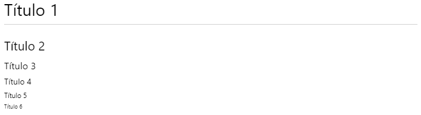
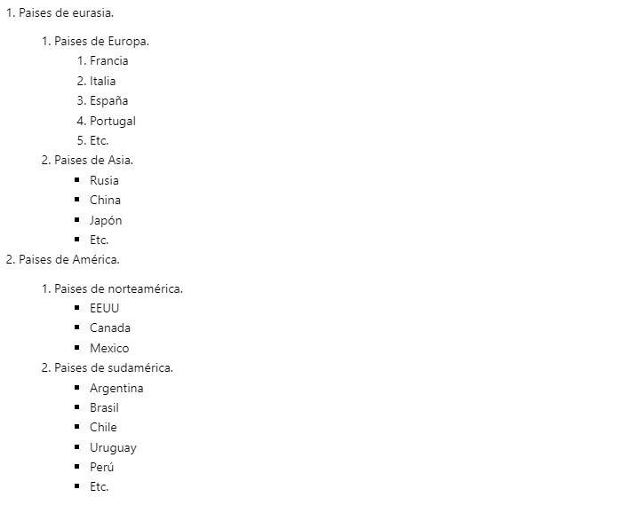
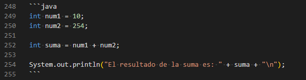
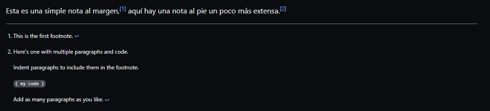

# CURSO DE MARKDOWN

Markdown es un **lenguaje de marcado** que facilita la aplicación de formato a un texto empleando una serie de caracteres de una forma especial.

En principio, fue pensado para elaborar textos para la web con más rapidez y sencillez que si estuviésemos empleando directamente HTML. Y si bien ese suele ser el mejor uso que podemos darle, también podemos emplearlo para cualquier tipo de texto, independientemente de cual vaya a ser su destino. Otro uso muy importante de markdown es para añadir  archivos _readme.md_ a nuestros repositorios de código.

En definitiva es un lenguaje que nos permite *escribir* y *editar* texto plano de manera sencilla y sin herramientas extra innecesarias. Sin más, empecemos a aprender sobre markdown.

---

## 1. DECORADO DE TEXTOS
En markdown podemos decorar palabras o porciones de texto con las clásicas letras en **negritas**, letras en _itálicas_ y letras ~~tachadas~~. Esto es muy útil cuando escribimos textos donde debemos resaltar ideas claves, señalar palabras en otros idiomas o remarcar aquello que no debemos hacer. Veamos como realizar cada uno de estos decorados.

- **Negritas:** Si deseamos convertir el texto en negritas podemos encerrar la, o las palabras, entre dos pares de asteríscos `**` o dos pares de guiones bajos `__`:

    Opción 1:
    - Codigo: `**Lorem**`
    - Resultado: **Lorem**

    Opción 2: 
    - Código: `__Lorem__`
    - Resultado: __Lorem__

- **Itálicas:** Si deseamos convertir el texto en itálicas tambien tenemos dos opciones. Un par de asteríscos o un par de guiones bajos.

    Opción 1: 
    - Código: `*Lorem*`
    - Resultado: *Lorem*

    Opción 2: 
    - Código: `_Lorem_`
    - Resultado: _Lorem_

- **Tachado:** Por último si deseamos convertir el texto en ~~tachados~~ utilizaremos un par de virgulillas.

    - Código: `~~Lorem~~`
    - Resultado ~~Lorem~~

- **Negritas e Itálicas:** Si deseamos convertir el texto en negritas y a la vez en itálicas deberemos encerrar la cadena de texto entre tres pares de asteríscos o tres pares de guiones bajos.
 
    - Código: `***Lorem***` y `___Lorem___`
    - Resultado: ***Lorem*** y ___Lorem___

---

## 2. TÍTULOS
En markdown podemos agregar textos de distintos tamaños, a modo de títulos, para estructurar nuestro archivo. Estos se agregan utilizando el símbolo de almohadilla o "hashtag" `#`.

Si queremos utilizar un título de primer nivel (lo más grande posible), colocaremos una almohadilla seguida de un espacio y luego el texto del título. Luego si agregamos mas símbolos de almohadilla a la cadena "bajaremos el nivel del título", esto es lo que nos permitira estructurar en niveles el texto. El uso reiterado de simbolos de almohadillas solo es permitido hasta una longitud de seis caracteres, es decir existen solo seis niveles de título. Veamos ahora un ejemplo:

Codigo:
```md
# Título 1
## Título 2
### Título 3
#### Título 4
##### Título 5
###### Título 6
```
Resultado:



---

## 3. REGLA HORIZONTAL
Si dejamos una linea de nuestro archivo con tres o mas guiones medios, obtendremos una regla horizontal en nuestro formato de salida. Esta funcionalidad es útil cuando queremos utilizar separadores. Se recomienda utilizar un salto de linea tanto antes como despues de los tres guiones medios.

El código es tan solo el siguiente, pruébalo: `---`

---

## 4. LINKS
Podemos realizar links a páginas web o recursos externos de varias maneras:

- **Linkear de manera básica:** Solo es necesario escribir el enlace.
    - Código: `https://www.instagram.com`
    - Resultado: https://www.instagram.com

- **Linkear una web sin que se vea la url:** Debemos escribir el texto que será visible entre corchetes (hará las veces de la propiedad Alt), y luego escribir entre paréntesis el recurso a visitar. Si querémos agregar un texto en la propiedad title (para que se vea cuando el ratón este sobre el enlace), colocaremos este texto entre comillas, inmediatamente luego de la escritura del enlace.
    - Código: `[Ir a Instagram](https://www.instagram.com "Ingresa a Instagram")`
    - Resultado: [Ir a Instagram](https://www.instagram.com "Ingresa a instagram")

- **Linkear por índices:** Podemos realizar links con índices en el caso de que debamos agregar una gran cantidad de enlaces. La sintaxis de estos links posee dos partes. La escritura del link y el link propiamente dicho. Veamos esto:

    ```md
    //Escritura del link.
    [Ir a youtube][1]

    //Link propiamente dicho.
    [1]: https://www.youtube.com
    ```

    Resultado: [Ir a youtube][1]
    
    [1]: https://www.youtube.com

    Podemos agregar cuantos links se consideren necesarios. Esta forma de utilizar links es facil de administrar y actualizar y se utiliza cuando se deben manejar muchos links.

---

## 5. IMÁGENES
Agregar imágenes en Markdown es bastante parecido a agregar links. Su sintaxis es la siguiente:

``

Tambien se puede agregar un atributo **title**, que es el que se mostrará cuando se coloque el ratón sobre la imagen. La sintaxis sería la siguiente:

` "Atributo title"`

Como verán linkear imágenes en markdown es bastante sencillo de hecho, sobretodo si se ha comprendido a colocar links.

---

## 6. LISTAS:
En markdown podemos crear listas ordenadas u desordenadas.

Para crear **listas desordenadas** podemos usar asteríscos `*`, signos de más `+` o signos de menos `-` delante de cada itém. Cualquiera de ellos nos permitirá crear la lista e incluso podemos combinarlos.

Código:
```md
+ Una taza de crema de leche.
+ Un vaso de agua.
* Una cucharada de aceite.
- Orégano (una pizca).
- Sal a gusto.
Harina Leudante
```
Salida:
+ Una taza de crema de leche.
+ Un vaso de agua.
* Una cucharada de aceite.
- Orégano (una pizca).
- Sal a gusto.
- Harina Leudante.

Notesé que si se usan distintos símbolos en una lista (combinamos una lista con asteriscos, signos de suma y signos de guion medio). Se generarán mayores espacios entre los items, mientras que si se utilizan los mismos simbolos la lista es más compacta.

Luego, para crear **listas ordenadas** tan solo debemos colocar un número seguido de un punto o un medio paréntesis. 

Por ejemplo:
```md
1. Verter la pasta en una olla con agua.
4. Condimentar a gusto.
9. Condimentar los champigñones.
0. Saltear los champigñones en una sarten con el aceite.
11. Esperar 10 minutos.
654. Servir.

1) Verter la pasta en una olla con agua.
2) Condimentar a gusto.
3) Condimentar los champigñones.
4) Saltear los champigñones en una sarten con el aceite.
5) Esperar 10 minutos.
6) Servir.
```
Sálida:
1. Verter la pasta en una olla con agua.
4. Condimentar a gusto.
9. Condimentar los champigñones.
0. Saltear los champigñones en una sarten con el aceite.
11. Esperar 10 minutos.
654. Servir.

1) Verter la pasta en una olla con agua.
2) Condimentar a gusto.
3) Condimentar los champigñones.
4) Saltear los champigñones en una sarten con el aceite.
5) Esperar 10 minutos.
6) Servir.


La magia de las listas ordenadas en markdown es que no necesitamos seguir el orden lógico de la progresión de los números para que la lista se ordene, sino que podemos colocar cualquier "n" maor que cero y la lista funcionará igualmente. Esto es útil cuando debemos agregar o reordenar elementos en las listas.

Así como ocurre en las listas desordenadas, nosotros podemos combinar los simbolos en nuestra escritura aunque esto no es recomendable ya que producirá errores en la numeración automática. De todos modos la forma más recomendable de escribir listas es con un número seguido de un punto.

Otra funcionalidad que tienen las listas en markdown es la posibilidad de **anidar listas**. No hay límite para los niveles o la cantidad de listas a anidar. Veamos un ejemplo.

Código:
```md
1. Paises de eurasia.
    1. Paises de Europa.
        1) Francia
        2) Italia
        3) España
        4) Portugal
        5) Etc.
    2. Paises de Asia.
        + Rusia
        + China
        + Japón
        + Etc.

2. Paises de América.
    1. Paises de norteamérica.
        - EEUU
        - Canada
        - Mexico
    2. Paises de sudamérica.
        * Argentina
        * Brasil
        * Chile
        * Uruguay
        * Perú
        * Etc.
```

Resultado:



---

## 7. CITAS
El citar textos de autores en markdown no posee la mayor ciencia, para realizarlo utilizamos los símbolos de mayor que `>` delante de cada linea a escribir. Veamos un ejemplo:

Código:
```md
[//]: <> (Primera cita)
>“La ciencia sin religión está coja y la religión sin ciencia está ciega”.
>
>Albert, Einstein

[//]: <> (Segunda cita)
>“Siempre he sentido que hay algo en Buenos Aires que me gusta. Me gusta tanto que no me gusta que le guste a otras personas. Es un amor así, celoso”.
>
>Jorge Luis Borges
```

Resultado:

[//]: <> (Primera cita)
>“La ciencia sin religión está coja y la religión sin ciencia está ciega”.
>
>Albert, Einstein

[//]: <> (Segunda cita)
>“Siempre he sentido que hay algo en Buenos Aires que me gusta. Me gusta tanto que no me gusta que le guste a otras personas. Es un amor así, celoso”.
>
>Jorge Luis Borges

---

## 8. BLOQUES DE CÓDIGO:
En markdown podemos incorporar bloques de código. La manera más sencilla de hacerlo es indentar la linea de código con cuatro espacios. El  aqui es que markdown no reconoce de que lenguaje estamos hablando y por ende no podrá darle a nuestro código el formato correcto.

Otra forma de hacerlo es utilizando backticks. Colocando tres de ellos al inicio y al final del bloque de código se generará el mismo efecto que indentar todas las lineas con cuatro espacios. Ademas, podemos colocar el nombre del lenguaje a utilizar en el bloque de código escribiendo sus iniciales al lado de los primeros tres backticks.

Esta es una solución mucho más óptima, veamos un ejemplo.

Implementación:



Resultado:

```java
int num1 = 10;
int num2 = 254;

int suma = num1 + num2;

System.out.println("El resultado de la suma es: " + suma + "\n");
```

---

## 9. COMENTARIOS
Luego tambien en markdown podemos colocar comentarios para dejarnos pequeñas pistas o recordatorios en nuestro archivo para uso futuro. Los comentarios no se muestran en el código final. 

La sintaxis de un comentario es la siguiente. El resultado no existe porque los comentarios no se imprimen en pantalla:
```md
[//]: <> (Este es un comentario)
```

---

## 10. TABLAS
Las tablas en markdown son un poco más complejas de entender, pero no es nada imposible. Veamos como se realizan.

Para crear una tabla debemos agregar una "pleca" `|` en cada uno de los elementos que va a contener la misma. Seguido a esto debemos agregar un separador entre los elementos del encabezado y los datos de la tabla. El separador estará conformado por al menos tres guiones medios separados por plecas `|---|` y debemos agregar un separador por cada una de las columnas de la tabla.

Realizando lo anterior en el siguiente ejemplo podemos ver como es el formato de salida de la tabla.

Código:
```md
|Ingredientes|Valor Energético|
|---|---|
|Chocolate|300 cal.|
|Escencia de Vainilla|100 cal.|
|Dulce de Leche|250 cal.|
|Harina|20 cal.|
|Manteca|150 cal.|
```

Salida:
|Ingredientes|Valor Energético|
|---|---|
|Chocolate|300 cal.|
|Escencia de Vainilla|100 cal.|
|Dulce de Leche|250 cal.|
|Harina|20 cal.|
|Manteca|150 cal.|


Luego, lo que podemos realizar es una alineación entre los elementos de la tabla. Si colocamos el caracter de dos puntos `:` al lado izquierdo de un separador `|:---:|`, los elementos de esa columna se alinearán a la izquierda, si realizamos esta operación en el lado derecho `|:---:|`, la alineación será a la derecha. Por último si lo hacemos a ambos lados del separador `|:---:|`, la columna se alineará de manera centrada.

Esto se puede ver en el siguiente ejemplo:

Código:
```md
|Ingredientes|Valor Energético|
|---:|:---:|
|Chocolate|300 cal.|
|Escencia de Vainilla|100 cal.|
|Dulce de Leche|250 cal.|
|Harina|20 cal.|
|Manteca|150 cal.|
```

Salida:
|Ingredientes|Valor Energético|
|---:|:---:|
|Chocolate|300 cal.|
|Escencia de Vainilla|100 cal.|
|Dulce de Leche|250 cal.|
|Harina|20 cal.|
|Manteca|150 cal.|

---

## 11. FLAVORED MARKDOWN
Todas las características anteriores que hemos visto son componentes que son parte de la versión estable de markdown. Existen sin embargo otras plataformas que le han agregado funcionalidades una de ellas es github, y veremos algunas de sus actualizaciónes.

### **1.1. Checkbox:**
Podemos agregar casillas de verificación en _Github flavored mardown._
- Código:
    ```md
    - [x] Write the press release
    - [ ] Update the website
    - [ ] Contact the media
    ```
    Resultado:
    - [x] Write the press release
    - [ ] Update the website
    - [ ] Contact the media

### **1.2. Footnotes:**
Podemos agregar notas al pie con la siguiente sintaxis:


```md
Esta es una simple nota al margen,[^1] aquí hay una nota al pie un poco más extensa.[^bignote]

[^1]: This is the first footnote.

[^bignote]: Here's one with multiple paragraphs and code.

    Indent paragraphs to include them in the footnote.

    `{ my code }`

    Add as many paragraphs as you like.
```

Resultado: 



### **1.3. Diff:**
Podemos generar diffs en github (esto es marcar las diferencias entre versiones de archivos). Para poder entender esto veamos el siguiente ejemplo:

```diff
{
    var x = null;
+   var x = 10;
-   var x = 15;
    console.log(x);
}
```
Colocando un signo menos marcaremos que esta linea se ha eliminado de la versión actual del archivo. Con un signo más indicamos que esta linea se ha añadido a la versión actual del archivo. 

Esto es útil para realizar aclaraciónes sobre algún archivo en un repositorio. Estas aclaraciones en general se realizan en el archivo *readme.md*.

### **1.4. Emojis:**
Podemos agregar emojis en markdown simplemente copiandolos o utilizando un *shortcode*. 

Un ejemplo de *shortcode*: `:tent:`. Resultado: :tent:

Podemos visitar la lista completa de *shortcodes* en el siguiente link:
[Shortcodes](https://gist.github.com/rxaviers/7360908)

---
Fin del curso. Gracias por visitarlo y espero haya sido de tu ayuda. :wave:
