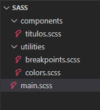
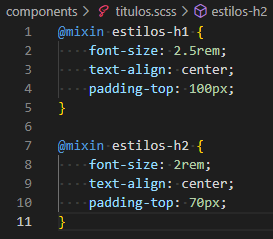

cd

# CURSO DE SASS
SASS es un **lenguaje de hojas de estilo** que simplemente mejora el lenguaje CSS agregandole caracteristicas de lenguaje de programación. En este breve archivo resaltaremos las mejoras mas usadas que este nuevo lenguaje le añade a CSS.

Cabe aclarar que al escribir código CSS se necesita de un compilador que transpile de SASS a CSS, ya que el navegador solo lee CSS puro.

A continuación adjuntamos la documentación oficial correspondiente al lenguaje SASS. Es bueno visitarla en caso de dudas y para completar lo explicado aquí. 

[Ir a Documentación](https://sass-lang.com/documentation/)

---

## 1. VARIABLES
Sirven para guardar datos que vayan a ser recurrentes, no se debe declarar el tipo de dato, solo su nombre y valor. Veamos un pequeño ejemplo de declaración de variables, las mismas se declaran con un signo de dolar `$` y el nombre de la variable, luego a continuación, su valor.

```SCSS
//Variable de color primario.
$primary-color: #0511ac;

//Variable de tamaño de texto.
$font-size-1: 1rem;
```

Cuando se trabaja SASS o CSS y frameworks como Bootstrap, es usual que haya conflictos con las clases, por ello se puede utilizar la variable "brand" y darle el valor de la marca o el nombre de la empresa. De este modo al declarar clases podemos agregarle el nombre de la variable al nombre de la clase.

```SCSS
// Variable brand.
$brand: 'companyName';

//Declarando clases con brand.
.#{$brand}__p {
    color: $primary-color;
}
```
Llamamos a la variable _brand_ para darle a la clase un nombre mas personalizado, el resultado en CSS será la nueva clase: `.companyName__p`. Luego llamamos a la variable $primary-color y le asignamos su valor al atributo color.

Resultado CSS:
```CSS
.companyName__p {
    color: #0511ac;
}
```

---

## 2. NESTING
El nesting es una funcionalidad de SASS que sirve para anidar selectores y la misma resulta muy útil para que el código sea legible. Ojo, no debemos pasarnos con las anidaciones, la limitacion que SASS nos impone es de anidar hasta tres selectores. Caso contrario el código obtendrá errores.

Veamos un ejemplo del mismo código escrito con CSS sin nesting y con SASS usando nesting:

```CSS
/*Codigo con CSS*/
.card {
    background-color: lightgrey;
    width: 300px;
    height: 250px;
    border-radius: 5px;
    border-color: black;
    border-style: solid;
    border-width: 1px;
    display: flex;
    flex-direction: column;
    flex-wrap: nowrap;
    align-items: center;
    justify-content: flex-start;
}
.card__title, .card__paragraph, .card__paragraph2 {
    text-align: justify;
    margin: 10px;
}
.card__title {
    color: black;
}
.card__paragraph {
    color: black;
}
.card__paragraph2 {
    color: grey;
}
```
```SCSS
/*Codigo con Nesting de SASS:*/
.card {
    background-color: lightgrey;
    width: 300px;
    height: 250px;
    display: flex;
    align-items: center;
    justify-content: flex-start;

    /*Tambien se pueden anidar propiedades con prefijos iguales.*/
    border: {
        radius: 5px;
        color: black;
        style: solid;
        width: 1px;
    }
    flex: {
        direction: column;
        wrap: nowrap;
    }
    .card__title, .card__paragraph, .card__paragraph2 {
        text-align: justify;
        margin: 10px;
    }
    .card__title {color: black;}
    .card__paragraph {color: black;}
    .card__paragraph2 {color: grey;}
}
```

---

## 3. PLACEHOLDER
Otra utilidad importante es el uso del selector placeholder `%`, el cual nos evita sobreescribir propiedades para muchos elementos parecidos, por ejemplo supongamos que tenemos 4 botones que solo cambian su color:

```scss
//Código en SASS.
//codigo genérico para los botones.
%boton-generico {
    height: 40px;
    min-width: 100px;
    border: none;
    border-radius: 5px;
    color: #fff;
    font-size: 16px;
    margin: 5px 0px;
    box-shadow: 2px 2px 6px 2px rgba(0, 0, 0, 0.2);

    /*el & nos ayuda a seleccionar clases internas, sin tener que escribir de nuevo el selector*/
    &:hover {
        cursor: pointer;
    }
}
//creamos los botones cambiando solo las propiedades necesarias.
.btn {
    &__primary, &__home, &__login {
        @extend %boton-generico;
    }
    &-primary {
        background-color: green;
    }
    &-home {
        background-color: red;   
    }
    &-login {
        background-color: blue; 
    }
}
```

---

## 4. IMPORT
Con `@import` podemos añadir estilos de otras hojas de estilo, ya sean CSS o SASS, al documento actual.

Importar mixins con `@import`
```SCSS
@import 'componentes/botones.css',
        'componentes/header.scss',
        'componentes/footer.scss';
```
Esta sentencia no es tan utilizada actualmente debido a problemas de conflictos y rendimiento. El reemplazo actual es la sentencia `@use`. _Use_ es una evolución de la sentencia _import_ y es conveniente usarla.

---

## 5. SENTENCIA USE y FORWARD
Tanto con `@use` como con `@import` podemos realizar importaciones pero el inconveniente de utilizar`@import` es que las variables funciones y mixins se quedarán en el scope global. Por lo que en proyectos grandes no sabremos de donde se están importando las utilidades. Además en proyectos grandes el tiempo de compilación con `@import` tiende a ser enorme.

Por todo esto actualmente el equipo de SASS está recomendando dejar de utilizar la sentencia import y migrar a use. De hecho se prevee que en un futuro cercano la sentencia import deje de tener soporte.

Veamos como se utiliza `@use`:

Supongamos que tenemos el siguiente arbol de archivos y que el archivo _components/titulos.scss_ posee el siguiente código:




Si deseamos importar en la hoja de estilos principal  (main), los estilos de los demás archivos, deberiamos hacer lo siguiente.

```SCSS
//En el archivo main.scss

@use 'components/titulos.scss';
@use 'utilities/breakpoints.scss';
@use 'utilities/colors.scss';
```
Luego, para llamarlas podemos utilizar la sentencia a continuación.

```SCSS
//En el archivo main.scss

.tituloDeLaSeccion {
    @include titulos.estilos-h1;
}
.subtituloDeLaSeccion {
    @include titulos.estilos-h2;
}
```
Estamos utilizando el nombre del archivo para llamar a los elementos (en este caso mixins) que se encuentran dentro.

Tambien podemos utilizar otra forma un poco más comoda en el caso de trabajar con archivos grandes. Aqui llamamos a la importación desde el nombre que le hayamos asignado.

```SCSS
//En el archivo main.scss

@use 'components/titulos.scss' as t;

.tituloDeLaSeccion {
    @include t.estilos-h1;
}
.subtituloDeLaSeccion {
    @include t.estilos-h2;
}
```
Luego, podemos utilizar la sentencia `@forward` para llamar a las paletas de colores dentro del archivo _titulos.scss_. Con lo anterior vamos a poder usar las paletas en el _main.scss_ como si se hubieran definido en el archivo _titulos.scss_. Eso es modularizar el código de una manera muy eficiente.

Archivo _colors.scss_:
```SCSS
$primary-color: #0511ac;
$background-color: #000;
$light-color: #FFF;
```

Archivo _titulos.scss_:
```SCSS
@forward '../utilities/colors.scss';

@mixin estilos-h1 {
    font-size: 2.5rem;
    text-align: center;
    padding-top: 100px;
}

@mixin estilos-h2 {
    font-size: 2rem;
    text-align: center;
    padding-top: 70px;
}
```

Archivo _main.scss_:
```SCSS
@use 'components/titulos.scss';

.tituloDeLaSeccion {
    @include titulos.estilos-h1;
    color: titulos.$primary-color;
}
```
El buen uso de estas sentencias lograran que nuestro código sea en extremo modularizable y reutilizable.

Debido a que esta sección es compleja de entender por si sola, recomiendo ver el siguiente video si aún surgen dudas: https://www.youtube.com/watch?v=9tmfuGsu99o

---

## 6. MIXINS
Los mixins son un preámbulo a las funciones y nos ayudan a reducir nuestro código. Su semántica es la siguiente, escribimos la palabra reservada `@mixin`, luego colocaremos el nombre que en este caso será "*boton*" y por último colocamos entre paréntesis los parámetros que vamos a utilizar. Seguido a esto se encierra entre llaves todo el código.
```scss
//Creamos el mixin y le pasamos dos parámetros.
@mixin boton($fondo, $letra) {
    background: $fondo;
    color: $letra;

    padding: 8px 15px;
    height: 30px;
    margin: 25px 0;
    display: flex;
    justify-content: center;
    align-items: center;
    font-size: 18px;
    text-transform: uppercase;
    font-weight: 800;
    border-radius: 10px;
}

//Incluimos el mixin en cada botón que queremos crear.
.btn-turquesa{
    @include boton(turquoise,black)
}
.btn-gris {
    @include boton(grey, black)
}
```

Con esto configuramos un botón genérico al que invocaremos cada vez que queramos.
Notesé que se utiliza `@include` cuando se hereda especificamente de un mixin, y se utiliza `@extend` cuando se hereda de otro selector.

---

## 7. LISTAS Y MAPAS
Son arrays que se utilizan para agrupar muchos valores de variables. Su sintaxis es intuitiva por lo que las veremos con ejemplos.

### **7.1. Uso de Listas:**
```scss
/*CÓDIGO SASS*/
//Declaracion de variable sin listas.
$primary-color: #0511ac;
$light-color: #ffffff;
$soft-color: #b6b9e9;
$strong-color: #0b1052;
$dark-color: #000;
$orange-color: #e0960c;
$blue-color: #0000ff;

//Declaracion de variables con listas.
$colors: $primary-color, $light-color, $soft-color, $strong-color, $dark-color, $orange-color, $blue-color;

//Llamando a propiedades de una lista.
.text {
    color: nth($colors, 2);
}
```
```CSS
/*CSS GENERADO*/
.text {
    color: #ffffff;
}
```

### **7.2. Uso de Mapas:**
Una forma más avanzada de guardar variables es usando maps. Veamos como se utilizan.

```scss
//Declaración de un mapa de variables.
$palette: (
    'primary-color': #0511ac,
    'light-color': #ffffff,
    'soft-color': #b6b9e9,
    'strong-color': #0b1052,
    'dark-color': #000,
    'orange-color': #e0960c,
    'blue-color': #0000ff
);
```
Los mapas se pueden escribir con varias propiedades por cada espacio según sea conveniente. Para poder utilizar esta sintaxis deberemos necesariamente separar cada valor, por lo general se utilizan sentencias _each_ para lograrlo.
```scss
//Ejemplo con varias propiedades por cada espacio.
$button_size: (
    "small": 16px 20px,
    "medium": 20px 500,
    "large": 24px 600,
    "extra-large": 32px 800
);
```

Luego, para acceder a los datos en los mapas de SASS se deben usar funciones especificas. Veamos cuales son:

1. `map-get($map, $key)` - Devuelve el valor de una clave dada.
2. `map-has-key($map, $key)` - Comprueba si existe una clave determinada dentro del map.
3. `map-keys($map)` - Devuelve una lista con todas las claves del map.
4. `map-values($map)` - Devuelve una lista con todos los valores del map.
5. `map-merge(map1, map2)` - Permite fusionar dos mapas.
6. `map-remove($map, $keys…)` - Elimina elementos dentro del map. Devuelve un nuevo mapa sin los elementos especificados en $keys.

Veamos un ejemplo recuperando datos del mapa.
```scss
//Mapa.
$text_size: (
    "small": 16px,
    "medium": 20px,
    "large": 24px,
    "extra-large": 32px
);

//Forma más extensa.
.title {
    font-size: map-get($map: $text_size, $key: "small");
}
//Forma un poco más abreviada.
.title {
    font-size: map-get($text_size, "small");
}
```

Uno de los usos más extendidos de maps es con el framework de Bootstrap, usandolo por ejemplo en un trozo de código que nos ayude con las interrupciones de tamaño:
```scss
//Mapa
$breakpoints: (
  xs: 0,
  sm: 576px,
  md: 768px,
  lg: 992px,
  xl: 1200px
);

//Mixin al cual le pasaremos el parámetro "$size" cuyos valores pueden ser: "xs", "sm", "md", "lg" o "xl".
@mixin breakpoint($size) {

    //Comprobamos que la clave exista.
    @if map-has-key($breakpoints, $size) {

        //Generamos un media query.
        @media (min-width: map-get($breakpoints, $size)) {

            /*El contenido que coloquemos en dentro de nuestro mixin al llamarlo se incluirá aquí.*/
            @content;
        }
    }
}

//Llamando a nuestro mixin
.textos{
    @include breakpoint (xl){
        font-size: 1.5rem;
    }
}
.imagenes {
    @include breakpoint (lg){
        width: 500px;
        height: 500px;
  }
}
```
```CSS
//Resultado en CSS.
@media (min-width: 1200px) {
  .textos {font-size: 1.5rem;}
}

@media (min-width: 992px) {
  .imágenes {
    width: 500px;
    heignt: 500px;
  }
}
```
El anteriór código es un uso avanzado del lenguaje SASS y solo tiene sentido de uso al modularizar el código.

---

## 8. FUNCIONES
Las funciones son otra de las utilidades que nos incluye SASS. Cuando estas se compilan nos dan solo selectores CSS y se diferencian de los mixins porque nos permiten retornar valores. En general se utilizan para manipular los datos dinamicamente mientras que los mixins son usados para importar bloques de código importantes.

Función simple en SASS.
```scss
@function funcionSimple($num: 1000px) {
    @return $num/2;
}

/*Llamamos a la función.*/
.btn {
    width: funcionSimple(750px);
}
```

Resultado en CSS:
```CSS
.btn {
    width: 375px;
}
```

---

## 9. SENTENCIA CONDICIONAL IF-ELSE
Con SASS podemos añadir sentencias de control del tipo if-else a los mixins y las funciones. Veamos un ejemplo de esto:

Sentencia condicional if-else:
```scss
//Variables con scope global.
$light-background: #f2ece4;
$light-text: #036;
$dark-background: #6b717f;
$dark-text: #d2e1dd;

//Mixin con if-else.
@mixin theme-colors($light-theme: true) {
  @if $light-theme == true {
    background-color: $light-background;
    color: $light-text;
  } @else {
    background-color: $dark-background;
    color: $dark-text;
  }
}

//Uso del Mixin.
.banner {
  @include theme-colors($light-theme: true);
  .dark & {
    @include theme-colors($light-theme: false);
  }
}
```

---

## 10. SENTENCIA EACH
`@each` nos sirve para iterar estilos de una lista, la semántica de la sentencia each es la siguiente: `@each $variable in $list`, lo que significaria leer cada valor de la variable en la lista de elementos. Luego la sentencia each generara tantos selectores como elementos haya en la lista.

Código SASS:
```scss
//Lista de tamaños de fuente para los títulos.
$size-titles: 16, 20, 24, 32;

//Con each creamos un selector para cada tamaño de fuente.
@each $size-letter in $size-titles {
    .title-#{$size-letter} {
        font-size: $size-letter * 1px;
    }
}
```

Código generado en CSS:
```CSS
.title-16 { font-size: 16px; }
.title-20 { font-size: 20px; }
.title-24 { font-size: 24px; }
.title-32 { font-size: 32px; }
```
Tambien se pueden iterar mapas, para hacerlo veamos el código siguiente que nos permite lograr 4 selectores, según el nombre del título. Y todo esto con la propiedad de font-size con su valor correspondiente.

Código en SASS:
```scss
//Tamaños de títulos.
$size-titles: (
    "xs": 16px,
    "md": 20px,
    "lg": 24px,
    "xl": 32px
);

//creando los selectores en bucle.
@each $name, $size in $size-titles {
    .title-#{$name} {
        font-size: $size;
    }
}
```

Salida en CSS:
```CSS
.title-xs { font-size: 16px; }
.title-md { font-size: 20px; }
.title-lg { font-size: 24px; }
.title-xl { font-size: 32px; }
```

Por último podemos realizar each más complejos donde se modifican varias propiedades leyendo un mapa. Para ello retomemos el mapa de "$size-titles" visto anteriormente.

Código SASS:
```SCSS
//Mapa con varias propiedades.
$size-titles: (
    "small": 16px 400,
    "medium": 20px 500,
    "large": 24px 600,
    "extra-large": 32px 800
);

//Sentencia each para extraer los datos.
@each $name, $size, $font-weight in $size-titles {
    .title-#{$name} {
        font-size: $size;
        font-weight: $font-weight;
    }
}
```
Salida CSS:
```CSS
.title-small { font-size: 16px 400; }
.title-medium { font-size: 20px 500; }
.title-large { font-size: 24px 600; }
.title-extra-large { font-size: 32px 800; }
```

---

## 11. BUCLE FOR:
El bucle _for_ nos permite iterar elementos, esto es útil para casos especificos como degradados en una lista de botones, labels, etc. Veamos un ejemplo práctico.

Código SASS:
```scss
$base-color: #036;

@for $i from 1 through 3 {
  ul:nth-child(3n + #{$i}) {
    background-color: lighten($base-color, $i * 5%);
  }
}
```
Salida en CSS:
```CSS
ul:nth-child(3n+1) {
  background-color: #004080;
}
ul:nth-child(3n+2) {
  background-color: #004d99;
}
ul:nth-child(3n+3) {
  background-color: #0059b3;
}
```

Otro ejemplo. Código en SASS:
```scss
@function isMultiple10($i){    // Función que comprueba si un numero es multiplo de 10
    @return ($i % 10 == 0);    // Si el resto es 0, lo es.
}
@for $i from 10 through 100{   // Bucle que va de 10 a 100
    @if(isMultiple10($i)){     // y por cada numero comprobará si "i" es multiplo de 10,
        .spacer-#{$i}{         // en caso afirmativo creara la clase .spacer-"xx"
            height: 0px + $i;  // con un tamaño relativo al numero por el que avanza el bucle.
        }
    }
}
```
Salida CSS:
```CSS
.spacer-10 { height: 10px; }
.spacer-20 { height: 20px; }
.spacer-30 { height: 30px; }
.spacer-40 { height: 40px; }
.spacer-50 { height: 50px; }
.spacer-60 { height: 60px; }
.spacer-70 { height: 70px; }
.spacer-80 { height: 80px; }
.spacer-90 { height: 90px; }
.spacer-100 { height: 100px; }
```
El uso que se le puede dar a lo anterior es cualquiera, desde objetivos sencillos como el anterior, a cosas más elaboradas usando escalas de colores por ejemplo. Lo que sea que necesite una iteración.

---

Fin del curso de SASS, espero sea de tu ayuda... :wave: