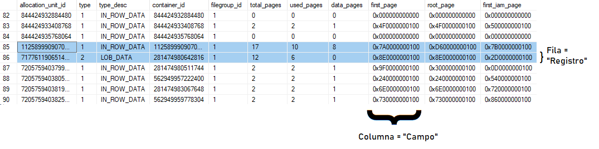
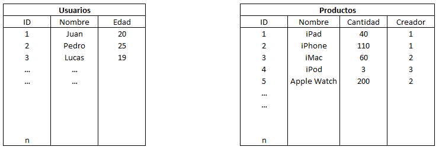
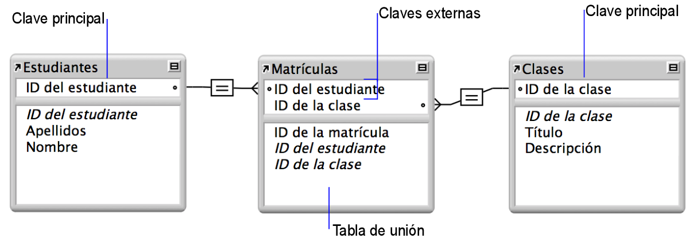

# CURSO DE SQL
SQL es un acrónimo en inglés para **Structured Query Language**, es decir, **lenguaje de consulta estructurado**. El Lenguaje de Consulta Estructurada SQL es un lenguaje gestor para el manejo de información en bases de datos relacionales. Es utilizado en la mayoría de empresas que almacenan datos en una base de datos y ha sido y sigue siendo el lenguaje de programación más usado para bases de datos de este tipo.

Este tipo de lenguaje de programación permite comunicarse con la base de datos y realizar operaciones de acceso y manipulación de la información almacenada. Sin embargo no solo se limita a ello sino que tambien permite realizar operaciones administrativas sobre las bases de datos y realizar cálculos avanzados y álgebra. Por tanto, se trata de un lenguaje completo de bases de datos que va más allá de la recuperación de la información.

---

## 1. INTRODUCCIÓN A BASES DE DATOS
Una base de datos es cualquier forma de almacenar información de forma que esta tenga sentido.

### **1.1. SQL vs No-SQL Databases:**
En general existen dos tipos de bases de datos, las primeras se basan en tablas y las segundas en documentos:

- **Bases de datos relacionales:** Son una colección de datos organizados en un conjunto de tablas formalmente descritas, desde donde se puede acceder a los datos o volver a montarlos de muchas maneras diferentes sin tener que reorganizar las tablas. Esta base de datos se basa en las relaciones entre los datos de la tabla El estándar aqui son las bases de datos basadas en SQL.

- **Bases de datos no relacionales:** O tambien llamadas No-SQL, porque no ocupan este lenguaje. La información se organiza normalmente mediante documentos y es muy útil cuando no tenemos un esquema exacto de lo que se va a almacenar.

### **1.2. RDBMS:**
Para poder comunicar los datos de nuestra base de datos con nuestra API, y de ahí con nuestras aplicaciones, deberemos utilizar un softawe que gestione nuestra base de datos.

En el caso de las bases de datos del tipo relacional los software que se encargan de esto se llaman, **RDBMS** o __Relational DataBase Management System__. Algunos ejemplos de estos softwares son: MySQL, Postgres, Oracle, MariaDB, etc.

La funcion de ellos es que entregarnos un acceso facil a una base de datos. Ellos se encargarán de la seguridad y la integridad de los datos. Además de otras operaciones como manejar la concurrencia, efectuar respaldos, alterar los datos, etc.

### **1.3. CRUD:**
Las operaciones más comunes con las que nos vamos a encontrar en los softwares de gestión de bases de datos son las *"Operaciones CRUD"*.

CRUD es una memotécnica que significa:
- CREATE
- READ
- UPDATE
- DELETE

Estas son las principales operaciones que necesita un sistema de gestión de base de datos.

### **1.4. Consultas - Query:**
Para que nosotros podamos acceder a los registros o realizar cualquiera de las operaciónes anteriores vamos a tener que escribir una consulta (Query en inglés). Las consultas son los fragmentos de código o comandos que le enviamos a nuestro sistema gestor de bases de datos.

### **1.5. Campos y registros:**
En una tabla de una base de datos las filas o items pasan a llamarse _"registros"_, mientras que cada columna es un _"campo"_. Luego cada valor almacenado en una celda es un _"dato"_.



Las tablas deberán tener un nombre propio para poder darle un sentido a los datos. Así en cualquier base de datos podemos tener la tabla de usuarios, la de productos, la de administradores, etc.

---

## 2. RELACIONES ENTRE TABLAS:
Las tablas de nuestra base de datos podrán luego relacionarse entre si para poder entonces trabajar con datos de varias tablas a la vez.

Una base de datos relacional consta de una o varias tablas relacionadas que, cuando se utilizan de forma conjunta, contienen la información que necesita. Cada instancia de los datos se guarda en una única tabla en cada momento, pero se puede tener acceso a los datos, que se pueden mostrar desde cualquier tabla relacional.

Una relación se establece cuando el valor de un campo, denominado "campo de coincidencia", (a veces tambien campo de clave) en un lado de la relación, se compara con éxito con un valor en el campo de coincidencia en el otro lado de la relación. Todo esto de acuerdo con los criterios que especifique en la relación.

Veamos un ejemplo de esto:

_Tenemos una base de datos con dos tablas, una de usuarios y otra de productos, como la siguiente:_



_Podemos relacionar ambas tablas colocando en la tabla Productos y en el campo de "Creador", el ID del usuario que lo creo, esto es muy útil para llevar un control de los usuarios que realizan tareas. Esta relacion entre tablas se llaman relacion de "1 a n" o "uno a muchos". Porque un usuario puede crear muchos productos, pero un producto puede ser creado por un solo usuario._

### **2.1. CARDINALIDAD:**
La cardinalidad se refiere a los tipos de relaciones que pueden darse entre tablas. Existen varias posibilidades de relación entre tablas.

- **Relaciones uno a uno:** Se usan con frecuencia para indicar relaciones críticas para que se pueda acceder a los datos, es decir como clave.

    Una relación uno a uno es un vínculo entre la información de dos tablas, donde cada registro en cada tabla solo aparece una vez. Por ejemplo, puede haber una relación uno a uno entre los empleados y los coches que conducen. Cada empleado solo aparece una vez en la tabla "Empleados" y cada coche aparece solo una vez en la tabla "Automóviles de la Empresa".

- **Relacion 1 a "n":** En una relación de uno a muchos, un registro de una tabla se puede asociar a uno o varios registros de otra tabla. Por ejemplo, cada cliente puede tener varios pedidos de ventas.

    Es el caso típico donde un usuario puede crear muchos productos, pero un producto solo puede ser creado por un usuario.

 - **Relaciones de muchos a muchos:**
Una relación de muchos a muchos o "n" a "n", se produce cuando varios registros de una tabla se asocian a varios registros de otra tabla. Por ejemplo, existe una relación de muchos a muchos entre los clientes y los productos: _los clientes pueden comprar varios productos y los productos pueden ser comprados por muchos clientes._

    Por lo general, los sistemas de bases de datos relacionales no permiten implementar una relación directa de muchos a muchos entre dos tablas. Ya que de hacerlo así no existe un identificador exclusivo o _primary key_ a cada elemento.

    Para evitar este problema, puede dividir la relación de muchos a muchos en dos relaciones de uno a muchos mediante el uso de una tercera tabla denominada tabla de unión.

    Un ejemplo típico de una relación de muchos a muchos es aquella entre los estudiantes y las clases. Un estudiante puede matricularse en muchas clases y una clase puede incluir muchos estudiantes.

    

    En el siguiente ejemplo, se incluye una tabla "Alumnos", que contiene un registro para cada estudiante, y una tabla "Clases", que contiene un registro para cada clase. Una tabla de unión, "Matrículas", crea una relación de uno a muchos, una entre cada una de las dos tablas.

    La clave principal ID de estudiante identifica de forma exclusiva a cada estudiante de la tabla Alumnos. La clave principal ID de clase identifica de forma exclusiva cada clase de la tabla Clases. La tabla Matrículas contiene las claves externas ID de estudiante e ID de clase.

### **2.2. Diagramas Entidad-Relación:**

Un diagrama entidad-relación, también conocido como modelo entidad relación o ERD, es un tipo de diagrama de flujo que ilustra cómo las "entidades", como personas, objetos o conceptos, se relacionan entre sí dentro de un sistema. Los diagramas ER se usan a menudo para diseñar bases de datos relacionales.

## 3. CONSULTAS SIMPLES:

## 4. CONSULTAS MAS AVANZADAS:

## 5. JOINS:

---

## 3. CREACIÓN DE BASES DE DATOS Y TABLAS:
Para crear una base de datos debemos utilizar el comando:
`CREATE DATABASE miBaseDeDatos;`

Para ver las bases de datos:
`show databases;`

Para empezar a usar una base de datos:
`use miBaseDeDatos;`

```SQL
CREATE TABLE usuarios (
    id int,
    nombre varchar(255),
    apellido varchar(255),
    edad int,
    PRIMARY KEY (id)
);```

```SQL
insert into


```

## 3. CONSULTAS SIMPLES:

## 4. CONSULTAS MAS AVANZADAS:

## 5. JOINS:
