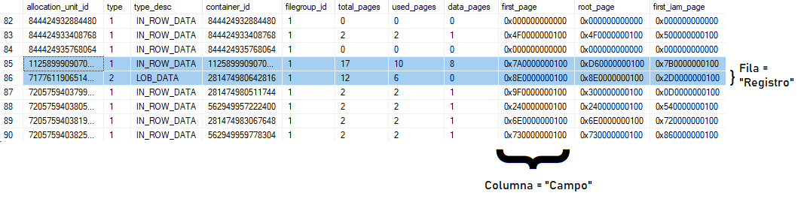
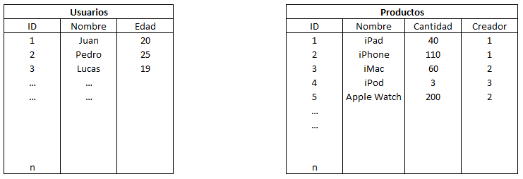
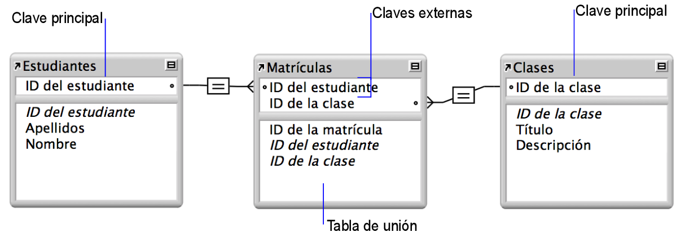

# CURSO DE SQL
SQL es un acrónimo en inglés para **Structured Query Language**, es decir, **lenguaje de consulta estructurado**. El Lenguaje de Consulta Estructurada SQL es un lenguaje gestor para el manejo de información en bases de datos relacionales. Es utilizado en la mayoría de empresas que almacenan datos en una base de datos y ha sido y sigue siendo el lenguaje de programación más usado para bases de datos de este tipo.

Este tipo de lenguaje de programación permite comunicarse con la base de datos y realizar operaciones de acceso y manipulación de la información almacenada. Sin embargo no solo se limita a ello sino que tambien permite realizar operaciones administrativas sobre las bases de datos y realizar cálculos avanzados y álgebra. Por tanto, se trata de un lenguaje completo de bases de datos que va más allá de la recuperación de la información.

Para aprender más sobre SQL y corroborar la información de este curso puede visitar cualquiera de los siguientes links:
- [Curso de MYSQL](https://conclase.net/mysql/curso/ "Ir al curso")
- [Curso de SQL](https://www.w3schools.com/sql/default.asp "Ir al curso").

---

## 1. INTRODUCCIÓN A BASES DE DATOS
Una base de datos es cualquier forma de almacenar información de forma que esta tenga sentido.

### **1.1. SQL vs No-SQL Databases**
En general existen dos tipos de bases de datos, las primeras se basan en tablas y las segundas en documentos:

- **Bases de datos relacionales:** Son una colección de datos organizados en un conjunto de tablas formalmente descritas, desde donde se puede acceder a los datos o volver a montarlos de muchas maneras diferentes sin tener que reorganizar las tablas. Esta base de datos se basa en las relaciones entre los datos de la tabla El estándar aqui son las bases de datos basadas en SQL.

- **Bases de datos no relacionales:** O tambien llamadas No-SQL, porque no ocupan este lenguaje. La información se organiza normalmente mediante documentos y es muy útil cuando no tenemos un esquema exacto de lo que se va a almacenar.

### **1.2. RDBMS**
Para poder comunicar los datos de nuestra base de datos con nuestra API, y de ahí con nuestras aplicaciones, deberemos utilizar un softawe que gestione nuestra base de datos.

En el caso de las bases de datos del tipo relacional los software que se encargan de esto se llaman, **RDBMS** o __Relational DataBase Management System__. Algunos ejemplos de estos softwares son: MySQL, Postgres, Oracle, MariaDB, etc.

La funcion de ellos es que entregarnos un acceso facil a una base de datos. Ellos se encargarán de la seguridad y la integridad de los datos. Además de otras operaciones como manejar la concurrencia, efectuar respaldos, alterar los datos, etc.

### **1.3. CRUD**
Las operaciones más comunes con las que nos vamos a encontrar en los softwares de gestión de bases de datos son las *"Operaciones CRUD"*.

CRUD es una memotécnica que significa:
- CREATE
- READ
- UPDATE
- DELETE

Estas son las principales operaciones que necesita un sistema de gestión de base de datos.

### **1.4. Consultas - Query**
Para que nosotros podamos acceder a los registros o realizar cualquiera de las operaciónes anteriores vamos a tener que escribir una consulta (Query en inglés). Las consultas son los fragmentos de código o comandos que le enviamos a nuestro sistema gestor de bases de datos.

### **1.5. Campos y registros**
En una tabla de una base de datos las filas o items pasan a llamarse _"registros"_, mientras que cada columna es un _"campo"_. Luego cada valor almacenado en una celda es un _"dato"_.



Las tablas deberán tener un nombre propio para poder darle un sentido a los datos. Así en cualquier base de datos podemos tener la tabla de usuarios, la de productos, la de administradores, etc.

---

## 2. RELACIONES ENTRE TABLAS (CARDINALIDAD)
Las tablas de nuestra base de datos podrán luego relacionarse entre si para poder entonces trabajar con datos de varias tablas a la vez.

Una base de datos relacional consta de una o varias tablas relacionadas que, cuando se utilizan de forma conjunta, contienen la información que necesita. Cada instancia de los datos se guarda en una única tabla en cada momento, pero se puede tener acceso a los datos, que se pueden mostrar desde cualquier tabla relacional.

Una relación se establece cuando el valor de un campo, denominado "campo de coincidencia", (a veces tambien campo de clave) en un lado de la relación, se compara con éxito con un valor en el campo de coincidencia en el otro lado de la relación. Todo esto de acuerdo con los criterios que especifique en la relación.

Veamos un ejemplo de esto:

_Tenemos una base de datos con dos tablas, una de usuarios y otra de productos, como la siguiente:_



_Podemos relacionar ambas tablas colocando en la tabla Productos y en el campo de "Creador", el ID del usuario que lo creo, esto es muy útil para llevar un control de los usuarios que realizan tareas. Esta relacion entre tablas se llaman relacion de "1 a n" o "uno a muchos". Porque un usuario puede crear muchos productos, pero un producto puede ser creado por un solo usuario._

### **2.1. Tipos de Relaciones**
Pueden darse varios tipos de relación entre tablas.

- **Relaciones uno a uno:** Se usan con frecuencia para indicar relaciones críticas para que se pueda acceder a los datos, es decir como clave.

    Una relación uno a uno es un vínculo entre la información de dos tablas, donde cada registro en cada tabla solo aparece una vez. Por ejemplo, puede haber una relación uno a uno entre los empleados y los coches que conducen. Cada empleado solo aparece una vez en la tabla "Empleados" y cada coche aparece solo una vez en la tabla "Automóviles de la Empresa".

- **Relacion 1 a "n":** En una relación de uno a muchos, un registro de una tabla se puede asociar a uno o varios registros de otra tabla. Por ejemplo, cada cliente puede tener varios pedidos de ventas.

    Es el caso típico donde un usuario puede crear muchos productos, pero un producto solo puede ser creado por un usuario.

 - **Relaciones de muchos a muchos:**
Una relación de muchos a muchos o "n" a "n", se produce cuando varios registros de una tabla se asocian a varios registros de otra tabla. Por ejemplo, existe una relación de muchos a muchos entre los clientes y los productos: _los clientes pueden comprar varios productos y los productos pueden ser comprados por muchos clientes._

    Por lo general, los sistemas de bases de datos relacionales no permiten implementar una relación directa de muchos a muchos entre dos tablas. Ya que de hacerlo así no existe un identificador exclusivo o _primary key_ a cada elemento.

    Para evitar este problema, puede dividir la relación de muchos a muchos en dos relaciones de uno a muchos mediante el uso de una tercera tabla denominada tabla de unión.

    Un ejemplo típico de una relación de muchos a muchos es aquella entre los estudiantes y las clases. Un estudiante puede matricularse en muchas clases y una clase puede incluir muchos estudiantes.

    

    En el siguiente ejemplo, se incluye una tabla "Alumnos", que contiene un registro para cada estudiante, y una tabla "Clases", que contiene un registro para cada clase. Una tabla de unión, "Matrículas", crea una relación de uno a muchos, una entre cada una de las dos tablas.

    La clave principal ID de estudiante identifica de forma exclusiva a cada estudiante de la tabla Alumnos. La clave principal ID de clase identifica de forma exclusiva cada clase de la tabla Clases. La tabla Matrículas contiene las claves externas ID de estudiante e ID de clase.

### **2.2. Diagramas Entidad-Relación**
En esencia, el modelo entidad-relación (en adelante E-R), consiste en buscar las entidades que describan los objetos que intervienen en el problema y las relaciones entre esas entidades.

- Entidad: es una representación de un objeto individual concreto del mundo real. Si hablamos de personas, tu y yo somos entidades, como individuos. Si hablamos de vehículos, se tratará de ejemplares concretos de vehículos, identificables por su matrícula, el número de chasis o el de bastidor.

Todo esto se plasma en un esquema gráfico que tiene por objeto, por una parte, ayudar al programador durante la codificación y por otra, al usuario a comprender el problema y el funcionamiento del programa.

Un diagrama entidad-relación, también conocido como modelo entidad relación o ERD, es un tipo de diagrama de flujo que ilustra cómo las "entidades", como personas, objetos o conceptos, se relacionan entre sí dentro de un sistema. Los diagramas ER se usan a menudo para diseñar bases de datos relacionales.

---

## 3. TIPOS DE DATOS EN SQL
Vamos a ver ahora los tipos de datos que podemos utilizar en SQL y MySQL, ya que en bases de datos cobra especial importancia saber que se puede almacenar y como es la forma correcta de hacerlo, así podemos asegurarnos de crear una base de datos, útil, escalable y sin errores.

En este lenguaje nos encontramos con numerosos tipos de datos, tanto así que recomendamos realizar una investigación por su cuenta si desea saber acerca de todos. Abarcaremos en este apartado varios de ellos, más no todos.

En SQL los tipos de datos se agrupan según las siguientes categorias:
- Exact numerics
- Unicode character strings
- Approximate numerics
- Binary strings
- Date and time
- Other data types
- Character strings

Veremos en detalle los más usados y daremos casos de uso.

### **3.1. Datos numéricos exactos**
|Tipo de Dato|Rango|Espacio en Disco|
|:---:|---|:---:|
|bigint|-2^63 (-9,223,372,036,854,775,808) to 2^63-1 (9,223,372,036,854,775,807)|8 Bytes|
|int|-2^31 (-2,147,483,648) to 2^31-1 (2,147,483,647)|4 Bytes|
|smallint|-2^15 (-32,768) to 2^15-1 (32,767)|2 Bytes|
|tinyint|0 to 255|1 Byte|
||||

|money|-922,337,203,685,477.5808 to 922,337,203,685,477.5807 (-922,337,203,685,477.58
to 922,337,203,685,477.58 for Informatica. Informatica only supports two decimals, not four.)|8 bytes|
|smallmoney|-214,748.3648 to 214,748.3647|4 bytes|


SQL posee distintos tipos de datos a asignar en cada campo, aquí dejamos una lista con algunos de ellos:

|Nombre|Descripción|
|:---:|---|
|`Bit`|Valor booleano [0,1].|
|`Char`|Carácteres individuales.|
|`DateTime`|Almacena fecha y hora, su formato es "YYYY-MM-DD HH:MM:SS".|
|`Decimal`|Número con decimales|
|`Int`|Números enteros, desde -2^31 hasta +2^31.|
|`Money`|Un valor monetario.|
|`Real`|Números Reales.|
|`VarChar`|Cadenas de texto.|

---

## 4. MANEJO DE BASES DE DATOS

### **4.1. Creación y eliminación de bases de datos:**
Para poder proceder a la creación de una base de datos en SQL deberemos escribir el siguiente comando. `CREATE DATABASE nombreDeLaBaseDeDatos;`. Donde se utilizan las palabras reservadas CREATE DATABASE y luego se especifica el nombre de nuestra nueva base de datos.

Luego, para borrar la base de datos utilizamos el comando: `DROP DATABASE nombreDeLaBaseDeDatos;`. Notesé la sintaxis con punto y coma al final de cada instrucción.

### **4.2. `use database` y `show databases`:**
Para poder empezar a trabajar en una base de datos deberemos seleccionarla de todas las existentes y "ponerla en uso". Esto se logra con el comando `USE nombreDeLaBaseDeDatos;`. Si queremos ver un listado de todas las bases de datos que tenemos, debemos usar el comando: `SHOW DATABASES;`.

### **4.3. Realizar Backups:**
Para realizar una copia completa de la base de datos con SQL Server, se utiliza la siguiente instrucción: 

`BACKUP DATABASE databasename TO DISK = 'filepath';`

Luego, si realizamos sucesivos backups podemos solo guardar los datos que hayan variado, es decir una copia de "solo los diferentes" usando: 

`BACKUP DATABASE databasename TO DISK = 'filepath' WITH DIFFERENTIAL;`

---

## 5. CREACIÓN Y ELIMINACIÓN DE TABLAS
Crear bases de datos es solo la punta del iceberg en el lenguaje SQL, ahora veremos como añadir tablas a nuestra base. Por convención las tablas deben escribirse con su nombre en singular, así tendremos la tabla de usuarios definida como _user_ y no como ~~users~~. Para proceder con la creación de una tabla se escribirá lo siguiente:

`CREATE TABLE nombreDeLaTabla ( estructuraDeLaTabla );`

Es decir se utilizan las palabras reservadas CREATE TABLE para indicar la creación de la misma, luego se especifica el nombre de la tabla y a continuación su formato entre paréntesis como un argumento.

En el formato de la tabla especificaremos cada campo separado por comas. De este modo tendremos el campo "id", luego el campo "name" y él campo "age" descriptos de la siguiente manera.

```SQL
-- Hasta ahora tenemos lo siguiente.
CREATE TABLE IF NOT EXISTS user (
    id,
    name,
    age
);
```
La tabla así descrita no puede funcionar, ya que se debe especificar el tipo de dato que corresponda a cada campo y cual es la llave primaria de la tabla.
```SQL
-- Ejemplo Completo
CREATE TABLE usuarios (
    id int not null auto_increment,
    nombre varchar(255) not null,
    apellido varchar(255) not null,
    edad int not null,
    PRIMARY KEY (id)
);
```
Aquí hemos agregado el tipo de dato (int para los enteros y varchar con una longitud de 255 caracterés para los textos) y el atributo NOT NULL, además de especificar que la llave primaria de nuestra tabla es el campo de "id". Notesé la instrucción de *auto_increment* al definir el campo de id. Toda llave primaria debe cumplir con el atributo de ser autoincremental, si bien sería interesante que SQL lo reconozca por defecto, debemos agregarlo obligadamente y de forma manual.

La sintaxis mínima que debe cumplir todo campo en SQL es **nombre + tipoDeDato**.

`describe nombreDeLaTabla;` Nos muestra 

Por último, con el comando `DROP TABLE table_name;` podemos eliminar una tabla en SQL y con el comando `RENAME TABLE actual_name TO new_name;` podemos renombrar una tabla.

---

## 6. ALTER TABLE
Con lo anterior ya sabemos crear tablas en SQL, ahora veamos como alterar las columnas o "campos" en una tabla ya creada. Para hacerlo la sintaxis a utilizar será: `ALTER TABLE nombreDeLaTabla` y seguido a esto la operación a realizar con sus parámetros. Las operaciones posibles pueden ser "ADD" para añadir columnas, "DROP" para eliminar la columna y "ALTER" o "MODIFY", según corresponda, para modificar algún atributo según el lenguaje.

### **6.1. Sentencia "ADD"** 
Para añadir una columna la sintaxis a usar sería la siguiente: 

`ALTER TABLE table_name ADD column_name datatype ... ;`. 

Donde en el espacio de los puntos suspensivos podemos agregar más atributos a nuestro campo. Un ejemplo típico sería agregar un campo de "cantidad" en nuestra base.
```SQL
-- Creamos la tabla.
create table productos(
    id int not null auto_increment,
    nombre varchar(50),
    precio int,
    primary key(id)
);
describe productos;

-- Alteramos la Tabla
alter table productos add cantidad smallint not null;

describe productos;
```
Al ejecutar la query anterior, primero se creará la tabla descrita y se mostrará una descripción de la misma. La cual es la siguiente:

|Field|Type|Null|Key|Extra|
|---|---|---|---|---|
|id|int|No|Primary|auto-increment|
|nombre|varchar(50)|Yes|||
|precio|int|Yes|||

Luego se modificará la tabla y se agregará una columna, se deberia obtener una descripción como la siguiente:
|Field|Type|Null|Key|Extra|
|---|---|---|---|---|
|id|int|No|Primary|auto-increment|
|nombre|varchar(50)|Yes|||
|precio|int|Yes|||
|cantidad|smallint(5)|No|||


### **6.2. Sentencia "DROP"
Para eliminar una columna usamos: 

`ALTER TABLE table_name DROP COLUMN column_name;`

Algunos RDBMS no permiten eliminar campos de forma directa, esto por una razon de seguridad ante posibles equivocaciones del desarrollador. En una suerte de "modo seguro". Un ejemplo de `drop` sería el siguiente.

```SQL
-- Creamos la tabla.
create table productos(
    id int not null auto_increment,
    nombre varchar(50),
    precio int,
    stock smallint unsigned,
    descripción varchar(255) default "no hay ninguna descripción",
    primary key(id)
);

-- Alteramos la Tabla borrando el campo "descripción".
alter table productos drop descripción;

-- Alteramos la tabla borrando dos campos, "stock" y "precio".
alter table productos drop precio, drop cantidad;
```
Luego si nosotros intentamos borrar un campo que no existe en una tabla, tendremos un error, lo mismo si borramos un campo que posee un índice se borrará tambien el índice. En el primer caso es útil utilizar la sentencia `if exists`, por ejemplo:

`alter table productos drop stock if exists;`

### 6.3. Sentencias "alter" y "modify"
Para modificar algún atributo de un campo deberemos recurrir a la siguiente sintaxis en el caso de usar SQL Server:

`ALTER TABLE table_name ALTER COLUMN column_nlame ... ;`

Luego, si usamos MySQL como es usual, tendremos que escribir: 

`ALTER TABLE table_name MODIFY COLUMN column_name ... ;`

Por conveniencia en la escritura utilizaremos la sintaxis de MySQL para el siguiente ejemplo.

```SQL
-- Creamos la tabla.
create table productos(
    id int not null auto_increment,
    nombre varchar(50),
    precio int,
    stock smallint unsigned,
    descripción varchar(255) default "no hay ninguna descripción",
    primary key(id)
);

-- Alteramos la Tabla modificando el campo "precio" y le agregamos el valor not null.
alter table productos modify precio not null;
```
Notesé que para modificar un campo debemos redefinirlo completamente.

### 6.4. Sentencia "change"
Con change podemos renombrar un campo de nuestra tabla, la sintaxis de esta sentencia sería la siguiente:

`ALTER TABLE productos CHANGE nombreAntiguo, nombreNuevo;`

Donde especificamos en "nombreAntiguo", el campo a renombrar y en "nombreNuevo" el nombre que se va a aplicar. Adicionalmente podemos redefinir el campo y agregarle todos los atributos que sean necesarios, estos se escribirán al lado de "nombreNuevo"

### 6.5. Sentencia "primary"
Con esta sentencia vamos a cambiar una clave primaria de una tabla.

```SQL
-- Creamos la tabla sin una primary key.
create table productos(
    id int,
    nombre varchar(50),
    precio int,
    stock smallint unsigned,
    descripción varchar(255) default "no hay ninguna descripción",
);

-- Alteramos la Tabla agregandole una llave primaria con sus respectivos atributos.
alter table productos add primary key(id);
alter table productos modify id int not null auto_increment
```

### 6.6. Sentencia "index"
Con esta sentencia modificamos los índices de una tabla. El tema de índices lo veremos a continuación, por ahora es interesante saber como modificarlos una vez que la tabla ya está creada.

```SQL
-- Creamos la tabla.
create table productos(
    id int not null auto_increment,
    nombre varchar(50),
    precio int,
);
describe productos;

-- Alteramos la Tabla agregando un índice "i_precio"
alter table productos add index i_precio (precio);
describe productos;

-- Alteramos la tabla borrando el índice "i_precio"
alter table productos add index i_precio (precio);
describe productos;
```

En las siguientes tablas podemos ver la evolución de "productos" con cada modificación.
1. Creamos la tabla.
    |Field|Type|Null|Key|Extra|
    |---|---|---|---|---|
    |id|int|No|PRI|auto-increment|
    |nombre|varchar(50)|Yes|||
    |precio|int|Yes|||

1. Agregamos un índice.
    |Field|Type|Null|Key|Extra|
    |---|---|---|---|---|
    |id|int|No|PRI|auto-increment|
    |nombre|varchar(50)|Yes|||
    |precio|int|Yes|MUL||

1. Eliminamos el índice (volvemos al estado original).
    |Field|Type|Null|Key|Extra|
    |---|---|---|---|---|
    |id|int|No|PRI|auto-increment|
    |nombre|varchar(50)|Yes|||
    |precio|int|Yes|||

El valor "mul" en el campo key, indica que ese campo es un índice de la tabla.

### 6.7. Sentencia "rename"
Otro modo de renombrar a las tablas puede ser utilizando la sintaxis siguiente, donde renombramos nuestra tabla para respetar la convención de nombrado de tablas.

`ALTER TABLE productos RENAME product`

---

## 7. ATRIBUTOS
Como se vio en los ejemplos de tablas anteriores, todo campo puede traer aparejado con él, uno o más atributos si se requiere. Veremos algunos de ellos:

- __NOT NULL:__ Todos los tipos de datos en SQL pueden contenter valores nulos o `NULL`, a menos que se haya especificado de antemano con la sentencia `NOT NULL`. Ejemplo:

    ```SQL
    CREATE TABLE user (
        id int not null auto_increment,
        lastname varchar(255) not null,
        PRIMARY KEY (id)
    );
    ```
- **DEFAULT:** En las tablas podemos asignar valores por defecto a un campo, esto lo hacemos con la sentencia `DEFAULT` seguido del valor por defecto. Un ejemplo de esto es si tenemos una tabla que almacena los libros de una biblioteca.

    ```SQL
    create table if not exists books(
        id int not null auto_increment,
        title varchar(50) not null,
        publisher varchar(50),
        autor varchar(100) default 'Unknown Author'

        primary key(id)
    );
    ```
    De este modo en la tabla podremos asignar que en el caso de no especificar un autor, este será desconocido.

- **ZEROFILL:** Es un atributo que trabaja solo con los tipos de datos numéricos y nos rellena de ceros a la izquierda, cualquier valor numérico que insertemos en nuestra tabla. Por ejemplo si tenemos un campo con un tipo de dato `mediumint`, y no especificamos un valor cuando insertamos un registro, este campo tendra el valor "00000000", en cambio si colocamos el valor 512, el campo tendrá un valor "00000512". Esto es útil cuando tenemos que realizar facturaciones o operaciones contables.

    Veamos un ejemplo
    ```SQL
    create table if not exists client(
        id int not null auto_increment,
        username varchar(50) not null,
        lastname varchar(50),
        amount mediumint zerofill not null,

        primary key(id)
    );
    ```
    Aquí el atributo amount (cantidad), será rellenado con los ceros a la izquierda que sean necesarios cada vez que se realiza una inserción.

- **AUTO_INCREMENT:** El incremento automático es un atributo que permite generar automáticamente un número único cuando se inserta un nuevo registro en una tabla, inicia desde el valor uno y se incrementará en una unidad cada vez que se inserte un nuevo registro. Si deseamos inicializar el incremento automático con otro valor de base, podemos usar la sentencia:

    `ALTER TABLE Persons AUTO_INCREMENT=100;`

    A menudo, el campo con este atributo es la clave principal de nuestra tabla, y la que nos gustaría que se creara automáticamente cada vez que se inserta un nuevo registro.

---

## 8. ÍNDICES
Un índice es una estructura de disco asociada con una tabla o una vista que acelera la recuperación de filas de la tabla o de la vista. Contiene claves generadas a partir de una o varias columnas de la tabla o la vista. Dichas claves están almacenadas en una estructura de árbol que permite que SQL busque de forma rápida y eficiente la fila o filas asociadas a los valores de cada clave. Su función se asemeja mucho a un índice en un libro de texto.

No es recomendable utilizar índices de manera arbitraria, sino solo implementarlos en los campos donde se realicen operaciones de búsqueda con gran frecuencia.

Para crear un índice en una tabla podemos hacerlo tanto al declarar la tabla como a posteriori. Veamos esto:
```SQL
-- Creando una tabla y asignando un índice al campo "author", el nombre del índice es "i_author".
create table if not exists book(
    id int unsigned auto_increment not null,
    title varchar(100),
    author varchar(50),
    comments text,
    publisher varchar(30) default 'Unknown Author',
    
    primary key (id),
    index i_author (author)
);

-- Creando un índice luego de declarar la tabla
create index i_publisher on book (publisher));
```
Tambien podemos crear varios índices en una sola sentencia, por ejemplo podriamos crear la siguiente instrucción, la cual nos ejecutaria dos índices con el mismo nombre, cada uno referido a uno de los dos campos asignados.

```SQL
create index i_authorpublisher on book (author, publisher);
```
El tipo de índice visto anteriormente es el índice más sencillo, admite valores nulos y repetidos entre los registros de los campos, además puede haber varios de ellos como en el caso anterior donde teniamos dos índices "i_authorpublisher" referenciados uno a cada campo. Existen otros tipos de índices más restrictivos y para usos especificos.

Otro tipo de índice conocido es el índice de tipo "primary", el cual se utiliza para definir claves primarias en una tabla. No admite que hayan valores repetidos entre los registros de ese campo, es por eso que en general se utiliza con la sentencia `auto_increment`, para lograr la únicidad de valores. Asimismo solo puede haber un solo índice del tipo primary en cada tabla, o lo que es lo mismo, solo un campo puede ser un índice del tipo primario.

Un tercer tipo de índice es el de tipo "unique", el cual tampoco admite campos con valores iguales, pero si admite que haya varios campos asociados a él. Veamos como se declara este índice:
```SQL
-- Crear un índice "unique" junto con la tabla.
create table if not exists book(
    id int unsigned auto_increment not null,
    title varchar(100),
    author varchar(50),
    comments text,
    publisher varchar(30) default 'Unknown Author',
    
    primary key (id),
    index i_author (author),
    unique uq_title (title)
);

-- Crear un índice "unique" fuera de la tabla.
create unique uq_author on book(author);
```

Otro comando interesante para utilizar es el de `show index`, que nos permite ver los índices que existen en una tabla.
```SQL
-- Ver los índices de una tabla.
show index from libros;
```

Por último podemos utilizar la sentencia `drop index` para eliminar un índice.
```SQL
-- Eliminar un índice "index"
drop index nombre_del_indice on nombre_de_la_tabla;

-- Eliminar un índice "unique"
drop index nombre_del_indice on nombre_de_la_tabla;
```
Para eliminar un índice del tipo primary recomendamos utilizar las sentencias de alter table mostradas anteriormente.

---

## 9. Operadores en SQL:
Los operadores SQL al igual que en otros lenguajes de programación, se utilizan para especificar comparaciones entre expresiones. La diferencia esta en que los operadores aquí no se utilizan para realizar evaluaciones booleanas, sino que son usados para, dado un conjunto de datos a buscar, traer solo aquellos que cumplan las condiciones dadas.

### **9.1. WHERE**
El operador `where` evalua y devuelve solo los campos que correspondan con la condicion especificada a continuación de este. Por ejemplo, seleccionar todos los usuarios de la tabla donde (where), la edad sea mayor o igual a dieciocho:
```SQL
select * from usuarios where edad >= 18;
```
Luego el operador where acepta más de una condicion como argumento, por lo que podemos utilizar otros operadores lógicos como `AND`, `OR` o `NOT`, para efectuar búsquedas más especificas.

### **9.2. AND**

### **9.3. OR**
### **9.4. NOT**
### **9.5. BETWEEN**

### **9.6. LIKE**
Este operador determina si un valor coincide con toda una cadena o con parte de ésta. Se suele utilizar con caracteres comodín para indicar cualquier coincidencia de cadenas de caracteres de cero o varios caracteres (%) o cualquier coincidencia de carácter único (_).

Por ejemplo si deseamos extraer de una tabla de productos, aquellos cuyo nombre sea parecido a la palabra "prod", seguida de algo más. Podemos utilizar el operador `like`, con la expresion `prod%`.

```SQL
"PRODUCTS"."PROD_NAME" LIKE 'prod%'
```

El caracter "%" se puede utilizar tanto al inicio como al final de la cadena que deseamos evaluar, a continuación vemos dos ejemplos típicos al trabajar con campos de email.
```SQL
-- Traer todos los campos cuyo valor sea igual a una cadena de texto que en su interior contenga "gmail".
select * from user where email like '%gmail%';

-- Traer todos los campos cuyo valor sea igual a una cadena de texto que finalice con "@hotmail.com".
select * from user where email like '%@hotmail.com';
```

---

## 10. MANEJO DE REGISTROS:
Una vez que hemos realizado toda la configuración de la base de datos y creado sus respectivas tablas, nos toca empezar a realizar inserciones, actualizaciones y búsquedas en ellas. Es decir, nos toca aprender sobre el manejo de registros.

### **10.1. CREATE: Cargando Registros en una Tabla:**
Para poder insertar un nuevo registro en una tabla debemos escribir el comando `insert into`, seguido del nombre de la tabla y de los campos que vamos a rellenar con sus valores. Los campos que no se rellenen quedarán con su configuración por defecto.
```SQL
-- Ejemplo de inserciones de tres registros en una tabla user.
insert into user (name, lastname, age) values ('Juan', 'Perez', 65);
insert into user (name, lastname, age) values ('Lucas', 'Gomez', 20);
insert into user (name, lastname, age) values ('Dani', 'Alvez', 5);
```
Luego, notesé que cada comando rellenara tres campos de la tabla, ellos serán "name", "lastname" y "age", si en la tabla existen más campos, estos no serán alterados.

### **9.2. UPDATE: Actualizar datos de un registro.**
Para actualizar los campos de un registro en cualquier base de datos debemos seleccionar la tabla que vamos a editar (en este caso la tabla "usuarios"), y el campo a modificar con su nuevo valor (aquí es el campo "estado" con el valor "feliz"). Por último debemos utilizar el operador condicional `where` para indicar de manera única cual es el registo a editar, en general el operador where se utiliza para realizar una búsqueda por ID.
```SQL
-- update. actualizar datos de un registro
update usuarios set estado = 'feliz' where id = 3;
```

### **9.2. DELETE: Eliminar un registro.**
```SQL
-- delete.

delete from usuarios where nombre = 'Juan';
-- SQL en sus versiones más modernas viene con un "safe mode" en donde las operaciones de delete y update deben llevar un ID en el where. esto para evitar borrar todos los valores de algún campo.
delete from usuarios where id = 20;

-- esta consulta no sería válida en "safe mode". Arroja error 1175.
update animales set estado = 'triste' where tipo = 'dragon';
```

### **9.3. READ: Leer un registro**
Llegamos a la sección más extensa de este curso de SQL y es cuando nos dedicamos a extraer datos de la base de datos. Los datos se pueden extraer de infinidad de maneras e incluso de varias tablas y campos a la vez, por lo que es interesante abordar este tema de a poco.

```SQL
-- Seleccionar datos: Leer datos "operacion de read".
select * from usuarios;
select * from usuarios where id = 1;
select * from usuarios where edad = 19 and apellido = 'gomez';
```

```SQL
-- traer toda la tabla.
select * from usuarios;

-- limit. Trae todos los registros que encuentre hasta el limite especificado.
select * from usuarios limit 1;
```

Luego, como aprendimos en la sección de operadores, podemos realizar comparaciones entre expresiones para realizar consultas especificas.
```SQL
-- WHERE.
select * from user where age > 15;
select * from user where age >= 15;

-- AND
select * from user where age > 20 and email = 'nico@gmail.com';

-- OR
select * from user where age > 20 or email = 'layla@gmail.com';

-- NOT
select * from user where != 'layla@gmail.com';

-- BETWEEN
select * from user where age between 15 and 30;

-- LIKE
select * from user where email like '%gmail%';
select * from user where email like '%@gmail.com';
```

Luego, notesé que hemos estado utilizando para todas las búsquedas el selector `*`, el cual nos devolverá todos los valores que coincidan con las condiciones dadas.

Otra forma de realizar consultas, y que es útil en aplicaciones concretas, es utilizando funciones SQL

---

## 8. FUNCIONES SQL
https://diego.com.es/principales-funciones-en-sql

El lenguaje SQL tiene funciones incorporadas para hacer cálculos sobre los datos y realizar consultas concretas. Las funciones se pueden dividir en dos grupos (existen muchas mas, que dependen del sistema de bases de datos que se utilice):

Para la explicación de las funciones, una de las tablas con las que vamos a trabajar es __Productos__:

|ProductoID|NombreProducto|Descripcion|Precio|Stock|
|:---:|---|---|:---:|:---:|
|1|Camiseta|Camiseta negra simple de talla única|10|16|
|2|Pantalón|Pantalón largo azul tipo chino|20|24|
|3|Gorra|Gorra azul con el logo de los Yankees|15|32|
|4|Zapatillas|Zapatillas de running de color blanco y verde|35|13|

Funciones agregadas SQL, devuelven un sólo valor, calculado con los valores de una columna.

### **8.1. Función de average `AVG()`**
Devuelve la media de los valores que le pasemos, su sintaxis es la siguiente.
```SQL
SELECT AVG (nombreColumna) FROM nombreTabla;
```
La siguiente sentencia SQL devuelve la media del stock que hay en el almacén:
```SQL
SELECT AVG (Stock) FROM Productos;
```
La siguiente sentencia muestra el NombreProducto y el Precio de los registros que tienen un Precio por encima de la media:
```SQL
SELECT NombreProducto, Precio FROM Productos WHERE Precio > (SELECT AVG (Precio) FROM Productos);
```

### **8.1. Función de contar`COUNT()`**
El número de filas
### **8.1. Función de Máximo`MAX()`**
El valor más grande
### **8.1. Función de average `AVG()`**`MIN()` - El valor más pequeño
### **8.1. Función de average `AVG()`**`SUM()` - La suma de los valores
### **8.1. Función de average `AVG()`**`GROUP BY` - Es una sentencia que va muy ligada a las funciones agregadas

Funciones escalares SQL, devuelven un sólo valor basándose en el valor de entrada.

1. `UCASE()` - Convierte un campo a mayúsculas
1. `LCASE()` - Convierte un campo a minúsculas
1. `MID()` - Extrae caracteres de un campo de texto
1. `LEN()` - Devuelve la longitud de un campo de texto
1. `NOW()` - Devuelve la hora y fecha actuales del sistema
1. `FORMAT()` - Da formato a un formato para mostrarlo

## 9. JOINS


```SQL
-- buscar registros y ordenarlos en ascendente y descendente.
select * from user order by edad asc;
select * from user order by edad desc;

-- seleccionando COLUMNAS "CAMPOS"
-- que lo muestre como "la mayor edad" y "la menor edad".
select max(edad) as LaMayorEdad from user;
select min(edad) as LaMenorEdad from user;

select id, name from user;
select id, name as nombre from user;

-- crear tabla con llave foranea.
CREATE TABLE product (
    id int not null auto_increment,
    name varchar(50) not null,
    created_by int not null,
    marca varchar(50) not null,

    PRIMARY KEY(id),
    FOREIGN KEY(created_by) REFERENCES user(id)
);

-- cargar datos en una tabla relacionada.
insert into product (name, created_by, marca)
values
    ('ipad', 1, 'apple'),
    ('iphone', 1, 'apple'),
    ('watch', 2, 'apple'),
    ('macbook', 1, 'apple'),
    ('imac', 3, 'apple'),
    ('ipad mini', 2, 'apple');

-- JOINS. Unir una tabla con otra.
select u.id, u.email, p.name from user u left join product p on u.id = p.created_by;

```